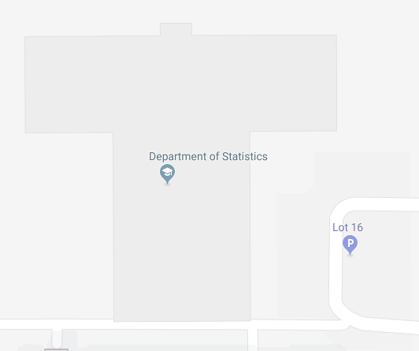
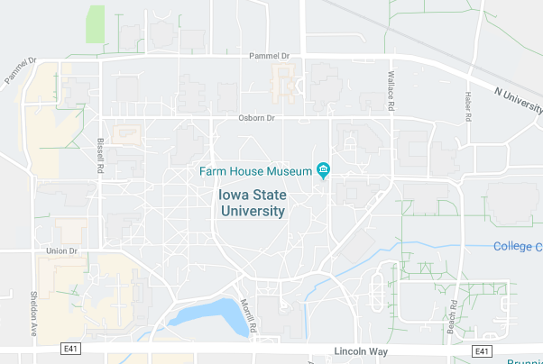
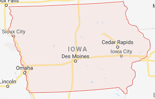
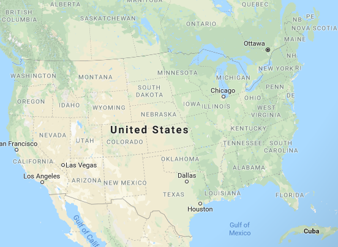

```{r, load_refs, echo=FALSE, cache=FALSE}
library(RefManageR)
BibOptions(check.entries = FALSE, 
           bib.style = "authoryear", 
           cite.style = 'alphabetic', 
           style = "markdown",
           hyperlink = FALSE, 
           dashed = FALSE)
bb <- ReadBib("./refs.bib", check = FALSE)
```

class:primary
## Outline

- Defining the Problem
- Identifying features in shoes
- Convolutional Neural Networks

---
class:inverse
<h1><br/>What is the probability I made this shoeprint?</h1>

---
class:primary
## What is the probability I made this shoeprint?

1. Define the comparison population
2. Obtain data on the distribution of shoes in the comparison population
3. Identify shoes in the comparison population which could have produced the shoeprint
4. Establish whether I have any matching shoes

---
class:primary
## Comparison Population

Geographic Area: 






Time window: 
- weekday, weekend, morning, evening, overnight
- season

---
class:primary
## Comparison Population Shoes

- No 100% complete database of all shoes (manufacturer, model, size, tread molds)
    <!-- - Too many manufacturers, import/export, online sales, custom shoes, knockoffs -->
    <!-- - New shoes released all the time -->
- Shoe purchase data vs. frequency of wear
    <!-- - shoes purchased outside the defined geographic area or from non-participating retailers -->
    <!-- - frequency of wear -->
- Local populations may differ wildly in shoe models
    <!-- - Styles and trends -->
    <!-- - Occupational differences -->
    <!-- - Retailer options -->
    

<!-- https://pixnio.com/free-images/2017/05/03/2017-05-03-07-35-18-900x456.jpg -->

---
class:primary
## Identify Candidate Shoes

Use features other than make/model to characterize shoes

- Knockoffs often have very similar tread patterns to the original
- Similar styles of shoe may have similar tread patterns across brands
- Unknown shoes can still be classified


---
class:primary
## Identify Candidate Shoes

Class Characteristics
- Make, Model, Tread pattern, Size, Type of shoe
- Cannot be used to identify an individual match
- Used for exclusion

Geometric Elements
- Class characteristics
- Can be used to narrow shoe prints down to make/model with high levels of accuracy `r Citep(bb, 'gross_variability_2013')`
<!-- TODO: Cite class char studies -->