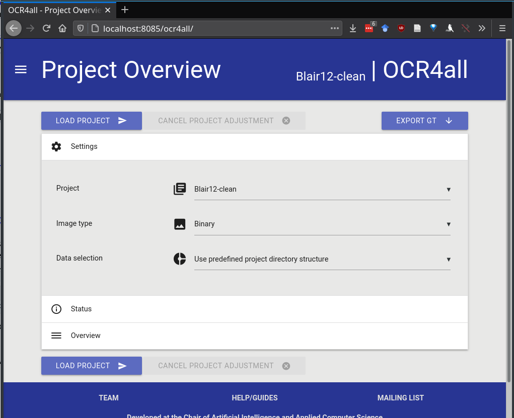
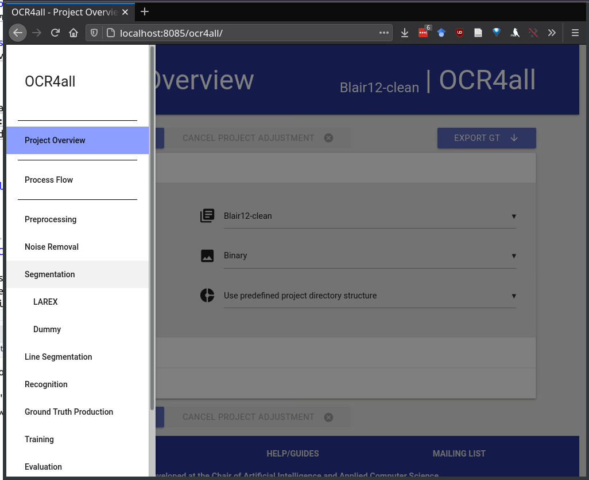

class: inverse-blue, center, middle
# Overview

---
class: primary-blue
## Project goals
.pull-left[
1. Amass a large database of trial transcripts

2. Locate portions of each trial concerned with forensics testimony

3. Analyze testimony for effectiveness, common phrases, problems, etc.

4. Use this to shape testimony going forward
].pull-right[

This is a lot of work unless we get the computer to do it for us

]

---
class: secondary-blue
# General Steps

- Split PDF into pages and convert to JPG

- Clean images
    - Rotate pages
    
    - Remove speckles, shading, stains, etc.
    
    - Convert to binary images (black/white instead of grayscale or color)
    
- Segment images into paragraphs

- Segment paragraphs into lines

- Segment lines into words/letters

- OCR: optical character recognition

---
class: primary-red
# Software options

- pdfsandwich - removes some artifacts, converts, and OCRs. Adds text behind the images in the PDF so that you see the original image but can highlight text.
    - not great on speckled or fuzzy scans
    - older program and not well supported

- [ocrmypdf](https://github.com/jbarlow83/OCRmyPDF) - uses similar steps to pdfsandwich, but has current support
    - runs on all platforms (python program)
    - command line interface

- [OCR4all](https://github.com/OCR4all) - Docker image that includes a web-based GUI monitoring system and the ability to customize input by page
    - Includes customizable/trainable neural network text recognition models for task-specific character recognition
    - Requires some manual input when things go wrong
    
???

Most of these tools are built on the same underlying programs - tesseract for OCR, unpaper for some of the image cleaning, imagemagick for some other image cleaning functions.

---
class:primary-grey

---
class:primary-grey

---
class:primary-cyan
## Cyan slide

Here's a pretty cyan slide

---
class:inverse-green, center
# A green inverse slide
## With centering