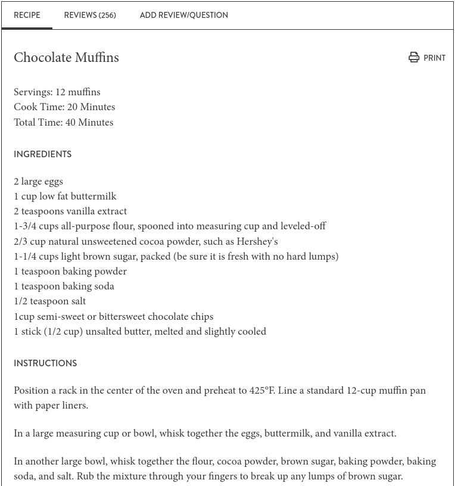
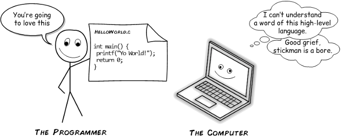
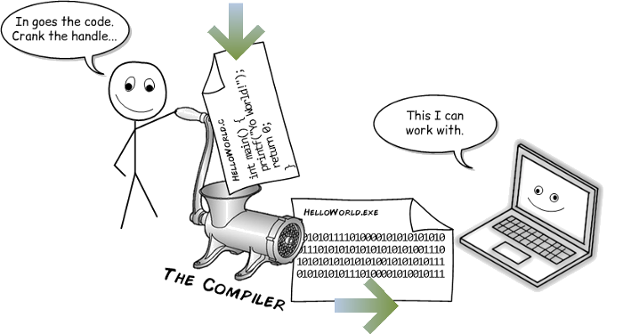
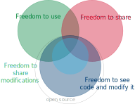

```{r setup, echo = F, include = F}
knitr::opts_chunk$set(echo = F)
```

class: primary-blue
## Software is not 

.right-column[
- Volkswagen's [pollution-control system used hidden code to circumvent EPA testing](https://www.nytimes.com/2015/09/23/nyregion/volkswagens-diesel-fraud-makes-critic-of-secret-code-a-prophet.html)

- Proprietary, probabilistic genotyping software has been [protected in court](https://www.courtlistener.com/opinion/2768743/people-v-chubbs-ca24/), even though [errors have been identified during criminal trials](www.couriermail.com.au/news/queensland/queensland-authorities-confirm-miscode-affects-dna-evidence-in-criminal-cases/news-story/833c580d3f1c59039efd1a2ef55af92b)

- Breathalyzer software challenges:
    - [Unreliable calibration and environmental detection components](https://casetext.com/case/in-re-source-code-evidentiary-hearings-in-implied-consent-matters?page=542) resulted in breathalyzer evidence being barred from a Minnesota court
    - [Source code audits confirmed the reliability of a different breathalyzer](https://caselaw.findlaw.com/nj-supreme-court/1094905.html) in a New Jersey supreme court case
]
.left-column[
 


]

???

This issue comes up in regulatory and legal circles fairly regularly. For instance, VW circumvented EPA testing with hidden source code - if they were required to submit the source code for the vehicle along with the vehicle, it would have been much more difficult to perpetrate fraud.

We've also seen challenges with probabilistic genotyping software such as STRmix and TrueAllele. Several different courts have refused to allow the defense to examine the source code - instead, they're limited to cross-examination of the forensic examiner using the software. In our analogy, that's like interrogating someone else who bought the same muffin about whether or not it is gluten-free, kosher, contains eggs, etc - it really doesn't help that much, because they're not the one who made the muffin.

This often works against the defense, but not always - source code examination was used by the NJ supreme court to validate a breathalyzer's reliability; it was also used by a Minnesota court to throw out evidence from an unreliable breathalyzer.

---
class: inverse-center-blue,center,middle
## What is Source Code?<br/><br/> Software?

---
class: primary-cyan
## Source and Software

Source Code | Software
----------- |  --------
 | 

???

I'm a pretty food-motivated person, so lets take this into a more familiar area: recipes. 
I've decided I'm hungry and I want to eat a muffin. So I walk down to my local coffee shop and I buy a muffin. So far, so good.

In my analogy, source code is like the muffin recipe, and the software I use is like the muffin I bought - the source code is the "recipe" the computer uses to create the graphical interface I interact with.
In this case, I have the muffin - the end result - but I don't have the recipe or know what went into that muffin. Most of the time, that's fine, but sometimes, it's a problem. 

---
class:secondary-cyan

**Source code** is the directions the programmer gives the computer.



.footer[Cartoon from [Young Coder](https://medium.com/young-coder/the-difference-between-compiled-and-interpreted-languages-d54f66aa71f0) guest post on medium.com]


---
class:secondary-cyan

To be used by the computer, .b[Source code] must be turned into computer code.



Computer code is not human-readable, but it is usually what is distributed as **software**.

.footer[Cartoon from [Young Coder](https://medium.com/young-coder/the-difference-between-compiled-and-interpreted-languages-d54f66aa71f0) guest post on medium.com]

---
class: primary-cyan
## Source and Software

In a legal setting, the software doesn't help us much: we can provide inputs and outputs, but we can't see the inner logic. We only see the surface, and even then, we might not find problem(s) that exist.

```{r out.width = "75%", fig.align="center"}

```
.footer[Image [source](https://www.huffingtonpost.co.uk/2015/12/30/coffee-bean-illusion_n_6105952.html)]

---
class: primary-cyan
## Source and Software

In a legal setting, the software doesn't help us much: we can provide inputs and outputs, but we can't see the inner logic. We only see the surface, and even then, we might not find problem(s) that exist.

```{r out.width = "75%", fig.align="center"}

```
.footer[Image [source](https://www.huffingtonpost.co.uk/2015/12/30/coffee-bean-illusion_n_6105952.html)]

---
class:primary-cyan

## Source and Software

So how do we make sure our software is doing what it says it is doing?

<table>
<thead>
<tr>
<th>Source Code</th>
<th>Software</th>
<th>Published paper Description</th>
<th>Source + Documentation + Paper + How To</th>
</tr>
</thead>
<tbody>
<tr>
<td></td>
<td></td>
<td></td>
<td></td>
</tr>
</tbody>
</table>

???

Generally speaking, peer review of methods is required. So we publish a paper showing how our method works, but this is not as informative as the source code, because the only thing precise enough to describe exactly how an algorithm is implemented is the source code. However, the paper is a very useful step in the process - just like a series of how-to steps is important for determining if you're making a recipe correctly.

If we have the paper, the source code, any documentation, and a user manual, though, we are in very good shape - we can recreate our muffin from scratch, and identify exactly what went into it.


---
class: secondary-cyan
## The Perfect Combination

.move-down[.move-down[
1. Method description (conceptual) - from the research paper/presentation

2. Source code

3. Source code documentation

4. Written instructions for installation and use
]]


---
class: inverse-center-grey,middle,center
# So what do we mean by open source?


---
class:primary-red
## "Free and Open Source Software"

.pull-left[
4 freedoms:

1. Use the software for any purpose
2. See the code and modify it
3. Share copies of the software
4. Share copies of modified software

\#2 and \#4 require access to the source ("open source")

"Free" here refers to your rights, not to the price of the software

**Open Source** software is any software that allows the user to see the source code.
].pull-right[

]

---
class:primary-red
## Open Source in Forensics

The use of open-source code is essential to maintaining public faith in the judicial process. 

- Evidence is interpreted by algorithms

- Algorithms provide a (hopefully unbiased) "score"

- The defendant has been "accused" by the algorithm and should be able to examine it

Additional advantages:

- **Linus's Law**: "given enough eyeballs, all bugs are shallow"    
Open-source code is more likely to have fixes for identified bugs (and bugs are more likely to be found)


---
class:primary-red
## Open Source in Science
There are other advantages, too:

- Ability to reproduce results in papers

- Efficient scientific progress

- Easy comparisons between competing methods

- Outsource some software validation and testing to the community

- Gain a wider user base (more citations!)

- "Inheritance" of projects once you no longer want to maintain them


---
class:primary-red
## Why Not Open Source?

1. **Pride** - Code is ugly and awkward, and making it "presentable" can be a lot of extra work.

2. **Competition** - Force your competitors to reinvent the wheel to slow them down

3. **There's no reward** - Why put in the extra effort for no good reason?

4. **I'm not allowed** - It's too much of a hassle to navigate the release process at my organization


---
class:secondary-red
## Why Open Source?

1. **Pride**    
*Making the code presentable makes it easier for you to reuse later, and ensures you get credit for your work*

2. **Competition**    
*Force your competitors to understand and fix your code! Become the standard option that everyone uses!*

3. **There's no reward**    
*You can release the code as a package, with another separate publication!*

4. **I'm not allowed**    
Government agencies have a responsibility to release their developments to the general public.    
.small[[NIST](https://github.com/usnistgov), [Los Alamos](https://github.com/lanl), [Pacific Northwest](https://github.com/pnnl), [US DOJ](https://github.com/usdoj), [US Naval Research Lab](https://github.com/USNavalResearchLaboratory), [UK Ministry of Justice](https://github.com/ministryofjustice), [Canada DOJ](https://github.com/justicecanada)]    
Many private organizations maintain open-source libraries to improve their software and contribute to the community's development.    
.small[[Google](https://github.com/google), [Microsoft](https://github.com/microsoft), [Facebook](https://github.com/facebook), [Apple](https://github.com/apple)]

---
class:inverse-center-blue,middle
# Baby Steps

---
class:primary-green
## Steps toward Reproducible, Open-source Science


0. Describe the methodology in the published paper, release uncurated code on request

1. Describe the methodology in the published paper, provide reproducible code in a repository and link to it in the paper

2. Describe the methodology in the published paper, provide reproducible code **and data** in a repository

3. Archive the code, data, and paper in a curated repository on e.g. figshare

---
class:primary-green
## Writing Reproducible Code

- Make the code modular, so that each step is encapsulated in a reusable function

- Make a habit of documenting each step in the code explicitly (Documentation-driven development)

- Use unit and integration tests to document each function and record the output (to provide a log of how function results change over time)

- Release your code as a package, with documentation, to make it easier for others to use (and cite) your work

