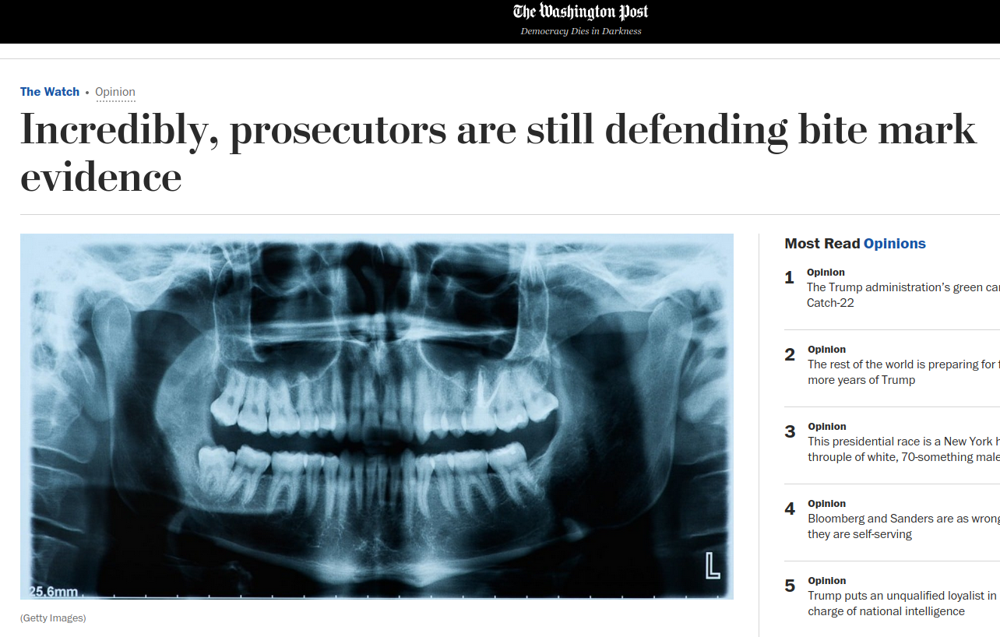
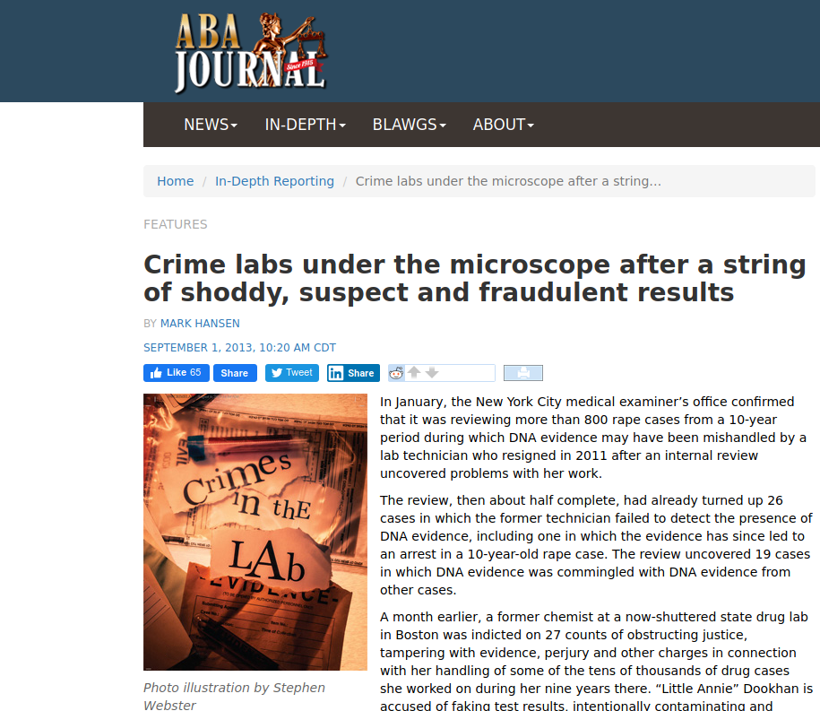
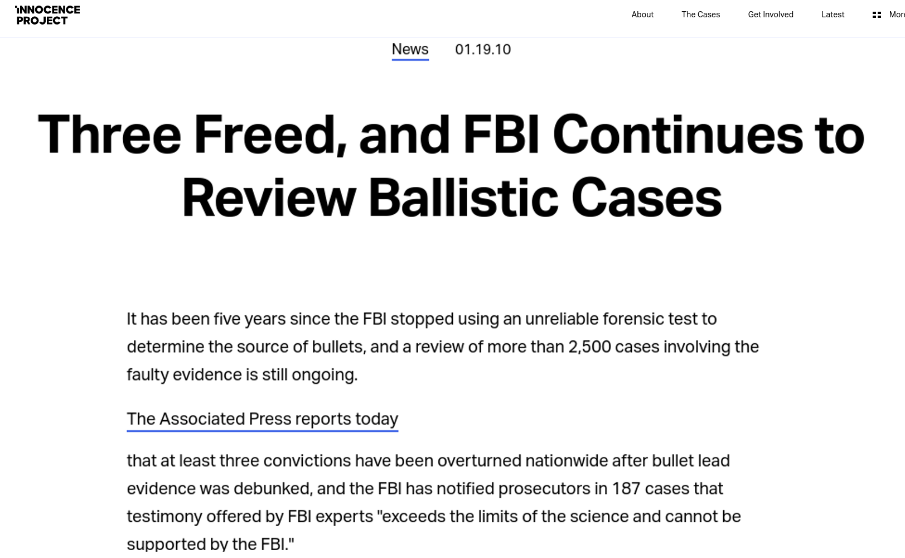
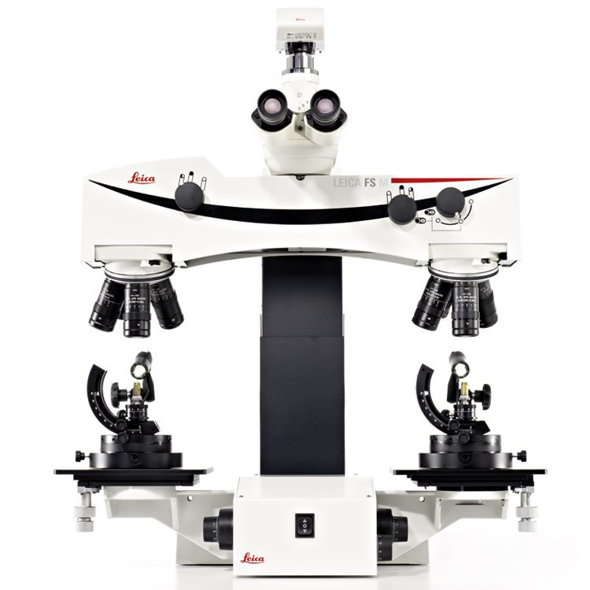
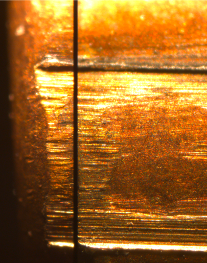
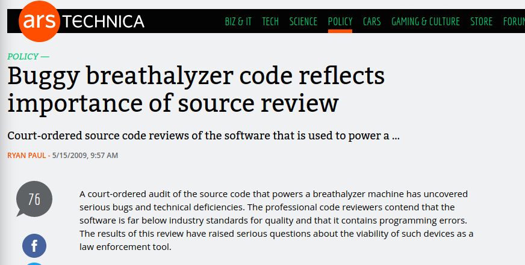

class: secondary

```{r, include = F, eval = T}
knitr::opts_chunk$set(echo=F, dpi=300)
library(tidyverse)
clean_file_name <- function(x) {
  basename(x) %>% str_remove("\\..*?$") %>% str_remove_all("[^[A-z0-9_]]")
}

img_modal <- function(src, alt = "", id = clean_file_name(src), other = "") {
  
  other_arg <- paste0("'", as.character(other), "'") %>%
    paste(names(other), ., sep = "=") %>%
    paste(collapse = " ")
  
  js <- glue::glue("<script>
        /* Get the modal*/
          var modal{id} = document.getElementById('modal{id}');
        /* Get the image and insert it inside the modal - use its 'alt' text as a caption*/
          var img{id} = document.getElementById('img{id}');
          var modalImg{id} = document.getElementById('imgmodal{id}');
          var captionText{id} = document.getElementById('caption{id}');
          img{id}.onclick = function(){{
            modal{id}.style.display = 'block';
            modalImg{id}.src = this.src;
            captionText{id}.innerHTML = this.alt;
          }}
          /* When the user clicks on the modalImg, close it*/
          modalImg{id}.onclick = function() {{
            modal{id}.style.display = 'none';
          }}
</script>")
  
  html <- glue::glue(
     " <!-- Trigger the Modal -->


<!-- The Modal -->
<div id='modal{id}' class='modal'>

  <!-- Modal Content (The Image) -->
  

  <!-- Modal Caption (Image Text) -->
  <div id='caption{id}' class='modal-caption'></div>
</div>
"
  )
  write(js, file = "js-addins.html", append = T)
  return(html)
}

# Clean the file out at the start of the compilation
write("", file = "js-addins.html")
```

.move-up-more[

]

---
class: secondary

.move-up-more[

]

---
class: secondary

.move-up-more[

]

---
class: primary

## Challenges to Forensic<br/>Analysis

- 2009 National Academy of Sciences Report - [*Strengthening Forensic Science in the United States: A Path Forward*](https://www.ncjrs.gov/pdffiles1/nij/grants/228091.pdf)

- 2016 President's Council of Advisors on Science and Technology (PCAST) report - [*Forensic Science in Criminal Courts: Ensuring Scientific Validity of Feature Comparison Methods*](https://obamawhitehouse.archives.gov/sites/default/files/microsites/ostp/PCAST/pcast_forensic_science_report_final.pdf)

#### Fundamental Conclusions: Problems with 

- Science - Poor or nonexistent scientific foundations for specific analyses

- Subjectivity - Conclusions are based off of subjective evaluations

- Screw ups - Estimates of error rates are nonexistent, not credible, or based on poorly designed studies


???

Over the past 15 years or so, there was a bit of a revolution in forensics; starting with DNA. It became possible to revisit old cases and examine evidence from these cases using new DNA techniques, which has led to the overturning of at least 365 different verdicts. As a result of these cases, some of the errors in the forensic sciences became much more obvious; generally, the falsely accused were convicted through a combination of shoddy science, false confessions, and poor legal representation. 

There have been two major reports which analyzed the state of forensic science in the US: the National Academy of Science report in 2009 and the PCAST report in 2016. These reports highlight a number of problems in forensics, but primarily focus on the "pattern" disciplines - disciplines that involve the analysis of evidence that is usually stored in image form. 

The reports note that the scientific foundations of these disciplines is poor - we do not know enough about the mechanisms that generate the evidence (tooling marks on a rifle barrel, how fingerprints are formed, the distribution of shoes in the population) to be able to characterize the process of leaving pattern evidence at a crime scene in a scientific way. More specifically, in most cases, we do not know what the distribution of these characteristics looks like, so we cannot estimate the random match probability properly - we can't say how likely the evidence is to occur by random chance. In DNA, we can at least estimate that probability.

In addition, at the moment, most pattern evidence is evaluated subjectively. Examiners will compare the crime scene evidence to evidence generated using a test object (a recovered gun, a pair of the suspect's shoes, etc.) visually, with little or no quantitative evidence to back that up. This makes it very hard to assess the strength of any particular match - examiners will testify based on their experience as an examiner, it is extremely unlikely that a match that good would come from two different sources, but there isn't any scientific foundation there or any objective method for evaluation. 

Finally, the reports found that error rate quantification in the forensic sciences is poor. During training, examiners are taught that it is part of their job to contribute to the discipline's foundations by doing these error rate studies, but the design of these studies, and the conclusions that can be drawn from them, leaves a lot to be desired.

Today, I'm going to talk about some of the work I'm doing in forensics, touching briefly on a couple of different projects and situating them in the wider context of the state of the field as a whole. I'm going to primarily focus on work with firearms and toolmark examination data, but the concepts are applicable across a wide range of pattern disciplines.


---
class:inverse
# A Primer on Firearms Analysis

---
class:secondary
.move-up-more[

]

--

 
.move-margin-wide[

]

--

**Locard's Exchange Principle**: <br/>Every contact leaves a trace

???
Before I start talking about the research addressing the deficiencies in forensic science, however, I think it's probably worth talking a bit about firearms evidence and the comaprisons which are made. 

This gif shows a bullet being fired from a rifled handgun. At the end of the clip, there are two pieces of metal left - the cartridge, which has a mark from the firing pin and has slammed into the "breech face" (which was cut away in this image so you could see the firing process) leaving an impression. The cartridge case is then pushed out of the gun (leaving another scrape mark) at the same time that the bullet is forced down the barrel. 

At the end of the firing process, you end up with a cartridge that is marked in several ways (firing pin, breech face - the flat part, and extractor mark) and a bullet that has scrapes along it - the land engraved areas,  which are the depressions, and the groove-engraved areas, which are higher. 

Land engraved areas are believed to have individualizing characteristics because they are the result of a tool being forced into a metal tube (the reaming process). The groove engraved areas are generally not analyzed, because the surface hasn't been tooled in quite the same way when areas are removed during the rifling process. 
In most of the bullets we've worked with, there are 6 land engraved areas per bullet.


---
class:secondary
.move-up-more[
.pull-left[

].pull-right[

]
]


???

Marks on cartridge cases are harder to see, but it's really easy to see why it seems like these two bullets would have come from the same source - the microscopic striations line up exactly; this is indicative of the same pattern of imperfections along the barrel's length. 

An examiner would use a comparison microscope, like the one shown on the left, to examine the striation marks on each bullet at the same time, yielding a view like the top-right image. 

In higher detail, you can see a similar image created using 3D scans of two matching bullet lands to see just how much correspondance there is between bullets that are from the same source.

But we don't actually have any scientific foundation for making the claim that with substantial similarity the only reasonable explanation is that the bullets came from the same source. We have a rational explanation, but one that has not been empirically validated to a level where it can be said to be scientifically valid.

---
class:primary
## AFTE Theory of <br/>Identification

Option 1: Identification
> Agreement of a combination of individual characteristics and all discernible class characteristics where the extent of agreement exceeds that which can occur in the comparison of toolmarks made by different tools and is consistent with the agreement demonstrated by toolmarks known to have been produced by the same tool.

Option 2: Elimination
> Significant disagreement of discernible class characteristics and/or individual characteristics.

???

The other bit of information you need is how these comparisons are assessed in court. There are 4 options. Identification means that they came from the same source (in the examiner's opinion) due to a combination of matching caliber, rifling, number of lands, etc. -- class characteristics -- and individual characteristics, which are the fine striations.

Elimination means that there is disagreement between class or individual characteristics... but no guidelines as to what sufficient means.

---
class:primary
## AFTE Theory of <br/>Identification

Option 3: Inconclusive
> (a) Some agreement of individual characteristics and all discernible class characteristics, but insufficient for an identification.

> (b) Agreement of all discernible class characteristics without agreement or disagreement of individual characteristics due to an absence, insufficiency, or lack of reproducibility.

> (c) Agreement of all discernible class characteristics and disagreement of individual characteristics, but insufficient for an elimination.

Under AFTE Theory of Identification, inconclusive results are not errors. An examiner could report nothing but inconclusive results for their entire career and testify that they have a 0% error rate.

???

Examiners can also say that the match is inconclusive, for any combination of the 3 reasons. Under AFTE rules, an inconclusive isn't an error, because it doesn't mean the examiner made a mistake - there may not actually be enough information recorded on the evidence, which reflects the broader process. 

---
class:primary
## AFTE Theory of <br/>Identification

Option 4: Unsuitable
> Unsuitable for examination.

Unsuitable evidence should be discarded before it is compared to known samples.

???

The final option is to say the evidence isn't suitable for comparison. This isn't the same as inconclusive - unsuitable evidence is marked as unsuitable before it is compared to another piece of evidence, where inconclusives are determined after comparison.

So now you're an expert in firearm examination, right? :)

---
class:inverse
# Issue 1: Scientific Foundations of Firearms Examination

---
class:primary
## Scientific Foundations

> Conclusions drawn in firearms identification should not be made to imply the presence of a firm statistical basis when none has been demonstrated

What would we need? According to Spiegelman & Tobin (2013)

- Every rifled firearm brand
  - different production settings, batches, tempering methods, barrel alloys
- Different ammunition types and sizes
- Different break-in periods for the guns
- Different maintenance procedures and lubrication types

--

Examine multiple fired bullets/cartridges from **each combination of factors** to determine if the markings are unique. 

Compare features of the markings across caliber/material to differentiate class characteristic comparisons from individualizing marks

--

.move-margin[.move-down[And even then, you can't generalize to new firearms]]

???

To completely understand how the marking process works and how identifiable everything is, some people suggest that a rigorous study of all possible environmental conditions, firearm/ammunition combinations, manufacturing conditions, and other factors should be examined. 

Sometimes, this type of experiment is proposed to get a database of bullets which can be compared to determine an upper bound on the random match probability (e.g. if nothing matches, then the RMP is less than 1 over the number of different-source pairwise comparisons in the database). 

It's also of interest to know if multiple bullets which were fired from the same gun have different markings - if so, then we can't easily determine that a mismatch is indicative of the bullets being fired from a different source. 

This problem is one reason forensic statistics tends to focus on assembling huge databases of evidence - if the database doesn't cover every combination of factors you see in casework, you can't show in court beyond a reasonable doubt that your method is valid for this particular case.

However, it's also *really* hard to systematically collect all of the data you'd need to estimate the random match probability and the random mismatch probability.

In any case, addressing the question of scientific validity from a head-on approach is not particularly easy. 

Instead, many times, we tend to avoid the impossible problem and try to patch the status quo. So instead of approaching the scientific foundations, we approach the other two issues - the subjectivity and the error rate quantification.


---
class:inverse
# Issue 2: Examination is 100% Subjective

---
class:primary
## Subjectivity

Hare, Hofmann, and Carriquiry (2017) proposed a method for automated bullet matching

.pull-left[
```{r results='asis', echo = F, include = T}
cat(img_modal(src = "images/HS36-Bullet-With-Crosscut.png", alt = "Bullet with Crosscut"))
cat(img_modal(src = "images/Combined-cross-section.png", alt = "Crosscut and profile"))
```
].pull-right[
```{r results='asis', echo = F, include = T}
cat(img_modal(src = "images/signature-combined.png", alt = "Bullet smooth and resulting signature"))
cat(img_modal(src = "images/signature-aligned.png", alt = "Aligned bullet signatures"))
```

]

.move-margin[
Numeric features derived from aligned signatures 

Features used to train a random forest

Random forest votes used to assess similarity
]

???

The automatic bullet matching method developed at CSAFE consists of some dimension reduction steps: 

First, we find a horizontal band that is as low on the bullet as possible (because the striae are deeper) but high enough to have stability and extend across the land 

Then, we average across the values in that band to smooth things out a bit.

We identify the grooves and remove that data from consideration, which is important because the next step is to fit a smooth curve to the surface, and the grooves mess that up a lot. 

We work with the residual values, which flattens out the striae so that the curvature of the bullet is not an issue. 

Then another smoothing function is applied (with a much smaller window) to minimize the effects of high-frequency noise. This is what we call a "signature"

Two signatures are aligned using the maximal cross-correlation - basically, shifting them against each other until the correlation between the sequences is maximal. Computationally, this gets tricky when missing values are introduced, because the usual fourier-based methods don't work with missing values.

Once the signatures are aligned, we can compute a number of features. We identify striation marks on each signature and count the number of striations that overlap between two aligned signatures. 

These features were used to train a random forest using several test sets scanned at NIST. Then, for new values, we can use that fitted random forest model to predict whether an aligned set of signatures is or is not a match. 


---
class:primary
## Subjectivity

- Random Forest initially trained on data from the [NIST Ballistics Toolmark Research Database](https://tsapps.nist.gov/NRBTD/Account/Login)
  - 2 sets of 35 bullets from the "Hamby" studies used for FTE training
  - Both sets use the same 10 consecutively rifled Ruger P-85 barrels
  - Digital scans with resolution of 1.5625 microns
  
- How well does the Hare, Hofmann, and Carriquiry algorithm generalize to other (similar) firearms?

> [Vanderplas, Nally, Klep, Cadevall, & Hofmann (2020) Comparison of three similarity scores for bullet LEA matching. Forensic Science International](https://doi.org/10.1016/j.forsciint.2020.110167)

  - 3 different test sets
  - different scan resolution (0.65 microns)
  - different firearms (Ruger P-85, Ruger P-95, Ruger LCP)
  - different types of ammunition

???

The random forest model was developed before CSAFE acquired microscopes of their own and started generating data... so it used the only sets available at the time, which were scanned at 1.5625 microns. The two sets used had 35 bullets each, but all 70 bullets were fired from one of 10 consecutively manufactured Ruger P-85 barrels. 

Firearms studies often use consecutively manufactured components because it is believed that consecutively manufactured pieces are more similar to each other than nonconsecutive versions; thus, if the methods work on consecutively manufactured components, they will work on nonconsecutive components. It's logical, but it also means that in order for this random forest model to be useful in practice, we'd have to be comfortable using it on data which is well outside the training data.

Up until now, we've talked about work that was done before I got involved. 

One of the projects I've worked on was to examine how well the algorithm works on external test sets. Random forests can generate out-of-bag predictions, but fundamentally, in order to use this algorithm, we have to see how well it generalizes to different ammunition, different firearms, different microscope settings...

So we decided to test the algorithm using 3 test kits developed by firearms examiners. Each set uses Ruger firearms, but they are different models which have different surface treatments and manufacturing processes. Each set also uses different ammunition. One of the sets is a third Hamby set, so using the same 10 barrels, but a different set of 35 bullets, as the training sets. 

---
class:primary
## Subjectivity

Comparison of 3 different quantitative measures for bullet LEA matching:
- Consecutive Matching Striae (CMS)
- Cross-correlation (CCF)
- Random forest score (RF)

Goals:
- Quantify error rates on external test sets
- Is the optimal cutoff (EER) stable across different firearms?

???

For each set, we compared 3 different measures of match strength. Consecutive Matching Striae (CMS) are used by some examiners to quantify match strength in court. It is believed that having more than 6 consecutively matching peaks is enough to practically eliminate the possibility of a coincidental match. That's based off of a study from the 1950s on 24 Smith & Wesson revolvers, and is held as practically incontrovertible despite the lack of generality. 

The problems with scientific validation of toolmark examination are pretty pervasive.

We also used straight cross-correlation, which is the method promoted by NIST for assessing match strength.

Finally, we used the random forest score, which includes CMS and cross-correlation as inputs. 

The goal is to quantify the error rates on external test sets, examine how well the method generalizes, and see how stable the equal-error-rate cutoff is for different firearms. Ideally, we'd want a cutoff that would work for any comparison, because in casework we don't have a whole set of test data to use for comparison purposes so that we can determine the cutoff.


---
class:primary
## Subjectivity
.center[
```{r results='asis', echo = F, include = T}
cat(img_modal(src = "images/hou-1.png", alt = "Houston Set 1", other=list(width="60%")))
cat(img_modal(src = "images/hou-2.png", alt = "Houston Set 2", other=list(width="60%")))
cat(img_modal(src = "images/hou-3.png", alt = "Houston Set 3", other=list(width="60%")))
```
]
.move-margin[Future work: <br/>A paper comparing the matching algorithm's performance to examiner performance on the Houston FSC test sets.]

???

For each test set, we looked at both bullet-to-bullet results, like those shown here, and land-to-land results, which are a bit finer. To get bullet-to-bullet results, we looked for a sequence of matches between bullet 1 and bullet 2, and took the average of the sequence with the highest matching values.

The Houston study just concluded, so we're hoping to write a paper soon comparing the algorithm's performance to the FTE performance. From what we've been told, the algorithm did pretty well, and the algorithm combined with human judgement was 100% right. The human judgement is necessary because sometimes the automated decisions in the algorithm don't work, rendering downstream results invalid. If we visually examine the intermediate data, it is possible to identify the issues, flag those comparisons, and exclude them from consideration. It's important to be able to decide when you do and don't trust your model's predictions, and that's basically what we're doing in that step. Since there is some subjectivity there, we report both versions.


---
class:primary
## Subjectivity

```{r results='asis'}
i1 <- img_modal(src = "images/compare-1.png", alt = "Bullet-to-Bullet Average Score Discrimination", other = list(width="46%"))
i2 <- img_modal(src = "images/compare-land-to-land-1.png", alt = "Land-to-land Score Discrimination", other = list(width="50%"))

c(str_split(i1, "\\n", simplify = T)[1:2],
  str_split(i2, "\\n", simplify = T)[1:2],
  str_split(i1, "\\n", simplify = T)[3:12],
  str_split(i2, "\\n", simplify = T)[3:12]) %>% paste(collapse = "\n") %>% cat()

```

- Complete separation of bullet-to-bullet scores for both RF and CCF
- Consecutive Matching Striae are terrible at the land-to-land level and not great at the bullet-to-bullet level.
- The RF score has better separation on most land-to-land measures than CCF

???

In any case, if we compare the bullet to bullet scores on the left, we have complete separation between the random forest and cross-correlation scores of same-source and different source matches. Unfortunately, we don't have the same cutoff for each set, indicating that our model predictions are sensitive to the specific type of firearm and ammunition... but not unusably sensitive. 

Consecutive Matching Striae doesn't have nearly as much separation, and in fact has considerable overlap. However, if 6 is the threshold used, it will never result in the identification of a same-source pair - that is, the false positive rate is very low, but the false negative rate is extremely high when using CMS.

Because there's complete separation in the bullet-to-bullet scores, it's not particularly useful to use ROC curves to characterize the performance of the algorithm. We have to go to the land-to-land scores to be able to get a more precise idea of how the random forest and CCF scores compare.

Here, what we see is that there is some bimodality in the CCF and RF scores, particularly when looking at same-source pairs. These low land-to-land scores indicate that some characteristics either don't match or don't correspond (for instance, sometimes, the bullet gets compressed in a way that causes the striae to stretch or compress a bit, reducing cross-correlation significantly even though visually you can see clear correspondence between the peaks). So if the land-to-land score is high, it's almost definitely a match, but if it's low, we need to look at a few other lands to determine how well things match up. But, the cutoffs at the land-to-land level are actually similar for each test set - if the RF score is above 0.5, it's probably a same-source pair, while if the CCF is above roughly 0.75, it's probably a same-source pair.

The other thing to note here is that the separation between the distributions is much greater for the random forest than for the cross-correlation: so even though they've got roughly similar accuracy, the random forest has much better separation.

---
class:primary
## Subjectivity

```{r results='asis'}
i1 <- img_modal(src = "images/roc-auc-1.png", alt = "ROC Curves", other = list(width="49%"))
i2 <- img_modal(src = "images/roc-auc-2.png", alt = "Equal Error Rates with 95% CIs", other = list(width="49%"))

c(str_split(i1, "\\n", simplify = T)[1:2],
  str_split(i2, "\\n", simplify = T)[1:2],
  str_split(i1, "\\n", simplify = T)[3:12],
  str_split(i2, "\\n", simplify = T)[3:12]) %>% paste(collapse = "\n") %>% cat()

```

???

looking at the land-to-land scores under an ROC curve, we can see that the performance of CCF and  RF is very similar in each test group - sometimes RF slightly wins (e.g. on Hamby44) but overall it's pretty consistent. CMS is much less useful.

If we compute the area under the curve for each set, we find that CMS is consistently significantly different from the other two methods, but that those methods aren't meaningfully different from each other. 

Interestingly enough, for both the random forest and cross-correlation scores, performance is poor on the Hamby44 set... which is from the same 10 barrels used to train the algorithm! The other set that it's bad on is the Houston FSI G2 set, which has some issues with partial signature compression. We're still figuring out how to alter the processing to handle that. 

---
class:inverse
# Screw-Ups: Error Rates and Software Bugs

---
class:primary
## Forensic Software

- Many forensic products are closed source

    - TrueAllele tests for DNA mixture analysis - results can't be shown to be faulty in court without the source code
    
    - Breathalyzer software [found to be faulty](https://arstechnica.com/tech-policy/2009/05/buggy-breathalyzer-code-reflects-importance-of-source-review/)
    
    - Inability to replicate results of other proposed automated methods - insufficient details in the paper about data cleaning and preprocessing





---
class:primary
## Forensic Software

- [National Integrated Ballistic Information Network](https://www.atf.gov/firearms/national-integrated-ballistic-information-network-nibin) (NIBIN)
    - closed hardware
    - closed-source software
    - used by most forensics labs to identify matches in bullets and cartridges across jurisdictions
    
***

- x3p file format: OpenFMC (Open Forensic Metrology Consortium) ISO standard format

- [x3ptools](https://heike.github.io/x3ptools/)
    - R package for working with bullet and cartridge scans (or any other surface scan)

- [bulletxtrctr](https://heike.github.io/bulletxtrctr/)
    - R package implementing the matching algorithm and feature extraction process for bullets

.move-margin[


]

???

Even the hardware and software developed by the federal government is closed-source and unavailable to the average person. On a fundamental level, that creates barriers that exist for the defense but that aren't present for the prosecution in a criminal case. 

NIST, who is active in forensics and also funds CSAFE, does not release source code either - they are afraid of the government endorsing any particular method, plus the liability of releasing faulty code. 


One of the ways CSAFE is addressing the problems with closed-source software is by releasing open-source software packages of both our algorithms and other algorithms published in the community. The software is released under MIT or GPL licenses, which prevent us from being liable for errors, but we also do our best to ensure that the algorithms work as advertised. 

I was involved in the construction of both x3ptools and bulletxtrctr, refactoring the code from the bulletr package described in the original random forest paper so that it was more reliable, maintainable, and modular. I've also written validation tests for both packages to ensure that each line of the code does what it is designed to do, so that changes in the future are less likely to break the already-implemented functionality.

So one way we're addressing errors is to make software auditable, so that if there are errors in the software, anyone can find them. It's not in the public's interest to have software bugs go unnoticed.

---
class:primary
## Screw-Ups <br/>(Error Rate Estimates)

To be admitted in court, examiner testimony must pass the **Daubert standard** as codified in Rule 702 of Federal rules of evidence
- Relevance - the method is relevant to the evidence
- Reliability - the method rests on a reliable foundation
- Scientific Knowledge - the method is based in scientific methodology. 

Important factors for scientific methodology:
- general acceptance by the community
- method has been through peer review and publication
- method can be tested
- the known or potential error rate is acceptable
- the research was conducted by unbiased individuals (e.g. the testing wasn't just for the specific court case)

???

Another way we're addressing this is to assess studies which provide error rate estimates, and testify in court about why these studies don't tell the complete picture. 

One of the primary debates right now is whether pattern evidence can be admitted into court, and what degree of certainty the examiner is allowed to convey to the jury. Part of this issue comes from the legal standards for admissibility - because pattern evidence has a shaky scientific foundation, it is sometimes judged to be inadmissible in court. More often, examiners aren't allowed to make identifications - they can say there is similarity between two pieces that is consistent with the same source, but cannot definitively say that the two pieces of evidence were generated by the same source. There are a lot of fights as to how that language works - "to the exclusion of all others", "to a reasonable degree of scientific certainty", and "to a reasonable degree of ballistics certainty" are all ways that examiners have been instructed to testify in court. 

---
class: primary
## Screw-Ups <br/>(Error Rate Estimates)

Problems identified with firearms error rate studies:

- Study designs have fixed numbers of same-source and different-source unknowns to identify
    - May provide examiners with extra information
    - FTE community is small and people talk to each other even when they shouldn't

???

Part of the controversy is that the studies suggesting firearms examiners have a very low error rate are not generally designed by statisticians... and you can about imagine how messy that can get.

One problem is that often studies don't vary the number of same source and different source unknowns to identify. So if you have 15 unknowns to match, and you have 4 that match, 10 that don't, and you aren't sure about 1, you might be tempted to say it matches just to make things nice and even. Or, multiple people in the same lab do the test, and so you might have some additional information going in, just from seeing a coworker take the same test yesterday.

--

- Lack of independence between successive conclusions (logical reasoning can reduce the number of comparisons necessary)
    - Some studies only have unknowns that match knowns in the test set (closed sets)
    
???

Another common issue is that tests may be designed so that every unknown matches a known (so that you know it has to match something) or, if there are multiple knowns in a set that you can compare to, if your unknown matches a known, you don't have to do the comparisons with the other knowns to find out it doesn't work. This is an obvious consequence of basic logical reasoning.

--

- Studies are not designed to be similar to case work
    - Do the error rates generalize?
    
???

Another issue is that studies aren't structured in a way similar to case work - instead of having 1 or 2 knowns and at most a few unknowns (e.g. you're trying to figure out who shot what gun in a shootout), most of these sets have 5 or 10 knowns and up to 15 unknowns. So not only does the task not really mimic casework in that you don't have fragments or bullets that have collided with other things (because that's hard to systematically generate), you have way more dependencies than you'd normally have with casework and you're obviously aware it's a test.

You can't really generalize the errors under those conditions.


---
class: primary
## Screw-Ups <br/>(Error Rate Estimates)

- Examiners know they are being tested
    - Blind studies are studies that look like casework
    - Little details can signal that something is a test to an observant examiner
        - lack of additional evidence from other domains
        - handwriting on the evidence bags
        - features on familiar firearms known in the facility
        
.move-margin[

```{r results='asis'}
img_modal(src = "images/DCI-guns.jpg", alt = "Handgun library at Division of Criminal Investigation in Ankeny, Iowa")
```

]
        
???

Another problem is the blinding. First, examiners don't understand blinding. At least 2 of the most commonly cited cases in legal challenges use phrasing like "the test was blind in that the participants did not know the correct answers". Really.

Even when attempts are made to do blind proficiency tests, there are tells. Within labs, for instance, the same person may set up all of the tests, so if you notice the handwriting is distinctive on the evidence, you can conclude it's a test. Or, if there isn't also DNA, fingerprint evidence, etc. and a case description to go with it, it is likely a test. I've also heard of people using firearms that are distinctive to generate tests... that doesn't work out well either. Of course, when you have a library of confiscated guns, you'd think you could avoid that, but stuff happens.
        
--

- Not all labs use the same rules
    - Some labs will not allow eliminations when all of the class characteristics (rifling angle, caliber, etc.) match

???

Another major challenge is that some labs use different rules - evaluations based on CMS, whether or not you can exclude based on class characteristics, etc. 

To control for that, though, examiners have to agree to use a common set of rules, which destroys any hope of blinding the study AND may limit your sample - some labs won't allow examiners to use a different set of evaluation rules. 

--

- Sufficient sample size
    - Many tests only within the FBI laboratory (doesn't generalize well)
    - Hard to get examiners to participate in studies - casework backlogs

???

Another common issue is that many tests are inside a single laboratory, which means it's hard to generalize those to other labs, and they certainly don't represent the entire field. But while this is obvious if you're a statistician, it hasn't prevented those studies from being cited in court as reliable evidence that no one ever makes a mistake.
    
---
class: primary
## Screw-Ups <br/>(Error Rate Estimates)

Ideal design:

- Varying numbers of same-source and different-source comparisons 

- Tests should have single pairs of evidence from one known source, with and one unknown for comparison
  - Ensures no additional information is available to examiners
  - Similar to most common casework scenario

- Examiners should use the same criteria for evaluating the evidence

- Examiners should not know they're being tested

- Sufficient comparisons and number of examiners to generalize well to the entire field

???

To summarize, we need studies that are well designed, vary the proportion of same and different source comparisons, prevent the use of logical reasoning to reduce the set of comparisons that need to be done, evaluate evidence using the same standards, and somehow manage to be blinded as well. 


---
class:primary
## Inconclusives and Error Rates

<table>
<tr><th></th><th colspan=3>Examiner Decision</th></tr>
<tr><th>Ground Truth</th><th>Identification</th><th>Inconclusive</th><th>Elimination</th></tr>
<tr><th>Same Source</th><td> $a$ </td><td> $b$ </td><td> $c$ </td></tr>
<tr><th>Different Source</th><td> $d$ </td><td> $e$ </td><td> $f$ </td></tr>
</table>

???

This is ongoing work, so I don't have all of the answers, but we've found some interesting things. We started out thinking we were going to just argue that inconclusives should be included in the error rates reported in studies - that is, the AFTE guidelines are not sufficient for calculation of error rates. That is, only cells a and f are not errors.

We also were planning to argue for the use of positive and negative predictive value, rather than false negative and false positive rates - PPV and NPV condition on information you have in court - what the examiner decided - rather than information that isn't known in court - whether the objects came from the same or different sources.

What we found when we started preparing to do a review of all of these error rate studies, though, was that there are fundamental issues with inconclusives. 

---
class:primary
## Inconclusives and Error Rates
---
class:primary
## Error Rate Estimates<br/>The Good

Keisler et al. (2018) Isolated Pairs Research Study, AFTE Journal

- 9 Smith & Wessons
- 20 pairs of one known and one unknown cartridge
  - 12 same-source, 8 different-source
- 126 participants

<table>
<tr><th></th><th colspan=3>Examiner Decision</th></tr>
<tr><th>Ground Truth</th><th>Identification</th><th>Inconclusive</th><th>Elimination</th></tr>
<tr><th>Same Source</th><td> 1508 </td><td> 4 </td><td> 0 </td></tr>
<tr><th>Different Source</th><td> 0 </td><td> 203 </td><td> 805 </td></tr>
</table>


---
class:primary
## Error Rate Estimates<br/>The Good

Baldwin et al. (2014): A Study of False-Positive and False-Negative Error Rates in Cartridge Case Comparisons

---
class:primary
## Error Rate Estimates<br/>The Bad
Hamby

---
class:primary
## Error Rate Estimates<br/>The Ugly
Lyons


