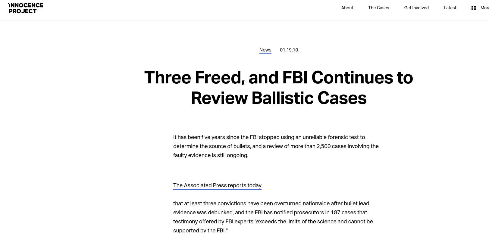

class: secondary

---
class: secondary

---
class: secondary

---
class: primary

## Challenges to Forensic Analysis

- 2009 National Academy of Sciences Report - [*Strengthening Forensic Science in the United States: A Path Forward*](https://www.ncjrs.gov/pdffiles1/nij/grants/228091.pdf)

- 2016 President's Council of Advisors on Science and Technology (PCAST) report - [*Forensic Science in Criminal Courts: Ensuring Scientific Validity of Feature Comparison Methods*](https://obamawhitehouse.archives.gov/sites/default/files/microsites/ostp/PCAST/pcast_forensic_science_report_final.pdf)

#### Fundamental Conclusions:

- Subjective
- Not founded in good science
- No statistical basis for making claims of identification (match) or exclusion (non-match)
- Error rate estimates are ?

Primary problems in "Pattern Evidence" - Shoeprints, Fingerprints, Bullet/Cartridge, Blood spatter, Handwriting.

???
Over the past 15 years or so, there was a bit of a revolution in forensics; starting with DNA. It became possible to revisit old cases and examine evidence from these cases using new DNA techniques, which has led to the overturning of at least 365 different verdicts. As a result of these cases, some of the errors in the forensic sciences became much more obvious; generally, the falsely accused were convicted through a combination of shoddy science, false confessions, and poor legal representation. 

There have been two major reports which analyzed the state of forensic science in the US: the National Academy of Science report in 2009 and the PCAST report in 2016. These reports highlight a number of problems in forensics, but primarily focus on the "pattern" disciplines - disciplines that involve the analysis of evidence that is usually stored in image form. 

These disciplines use subjective assessments by examiners, without good scientific underpinnings, with no statistical basis for making the claims that are usually made. In addition, because of the way our legal system works, examiners generally are reluctant to admit that they could make a mistake - the "beyond a reasonable doubt" standard means that admitting to a mistake could make their testimony moot.

---
class:primary
## Forensic Examiner Conclusions
Two or more pieces of evidence of the same type: A and B

- Identification: A and B were produced by the same source

- Inconclusive: Insufficient information in A and B to make a decision

- Exclusion/Elimination: A and B were produced by different sources

???

Right now, when examiners testify, they usually have two pieces of evidence of the same type: A and B. Then they visually examine A and B to decide whether they originated from the same source (the same gun, shoe, finger) or a different source; if there is not enough detail or the examiner is not sure, they can also say that their examination was inconclusive. Sometimes, they'll say "Could not be excluded", sometimes, they'll say "Insufficient individualizing characteristics to make an identification" -- this terminology differs by forensic lab.

---
class: primary

## Juror Perception of Evidence

Estimated frequency that a qualified, experienced forensic scientist would make a false identification:

- 1 in 5.5 million for fingerprints
- 1 in 1 million for bitemark
- 1 in 1 million for hair
- 1 in 100,000 for handwriting

(PCAST Report, 2016)

???

The classification system has its problems, but the larger problem is the so-called CSI effect: Jurors tend to believe forensic examiners are far more knowledgeable and far less likely to make a mistake than in reality. 

