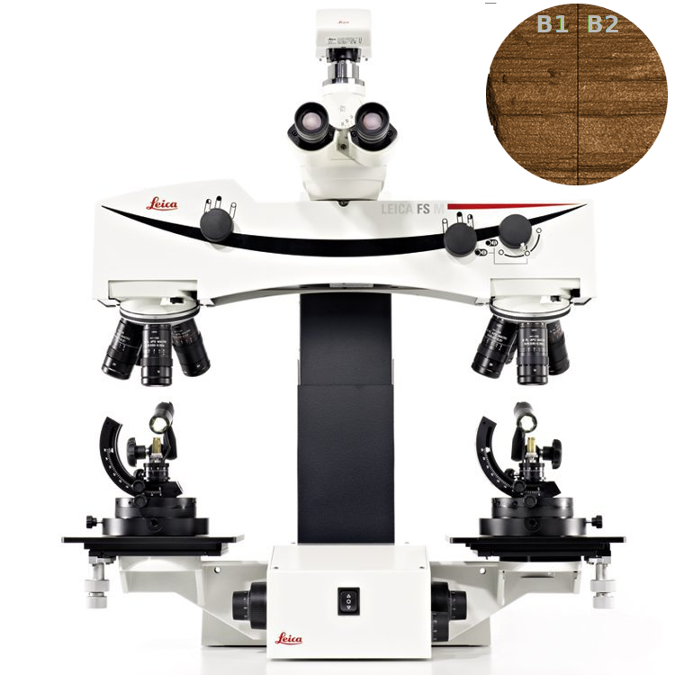

class: secondary

```{r, include = F, eval = T}
knitr::opts_chunk$set(echo=F, dpi=300)
library(tidyverse)
clean_file_name <- function(x) {
  basename(x) %>% str_remove("\\..*?$") %>% str_remove_all("[^[A-z0-9_]]")
}

img_modal <- function(src, alt = "", id = clean_file_name(src), other = "") {
  
  other_arg <- paste0("'", as.character(other), "'") %>%
    paste(names(other), ., sep = "=") %>%
    paste(collapse = " ")
  
  js <- glue::glue("<script>
        /* Get the modal*/
          var modal{id} = document.getElementById('modal{id}');
        /* Get the image and insert it inside the modal - use its 'alt' text as a caption*/
          var img{id} = document.getElementById('img{id}');
          var modalImg{id} = document.getElementById('imgmodal{id}');
          var captionText{id} = document.getElementById('caption{id}');
          img{id}.onclick = function(){{
            modal{id}.style.display = 'block';
            modalImg{id}.src = this.src;
            captionText{id}.innerHTML = this.alt;
          }}
          /* When the user clicks on the modalImg, close it*/
          modalImg{id}.onclick = function() {{
            modal{id}.style.display = 'none';
          }}
</script>")
  
  html <- glue::glue(
     " <!-- Trigger the Modal -->


<!-- The Modal -->
<div id='modal{id}' class='modal'>

  <!-- Modal Content (The Image) -->
  

  <!-- Modal Caption (Image Text) -->
  <div id='caption{id}' class='modal-caption'></div>
</div>
"
  )
  write(js, file = "js-addins.html", append = T)
  return(html)
}

# Clean the file out at the start of the compilation
write("", file = "js-addins.html")
```


---
class: secondary


---
class: secondary


---
class: primary

## Challenges to Forensic<br/>Analysis

- 2009 National Academy of Sciences Report - [*Strengthening Forensic Science in the United States: A Path Forward*](https://www.ncjrs.gov/pdffiles1/nij/grants/228091.pdf)

- 2016 President's Council of Advisors on Science and Technology (PCAST) report - [*Forensic Science in Criminal Courts: Ensuring Scientific Validity of Feature Comparison Methods*](https://obamawhitehouse.archives.gov/sites/default/files/microsites/ostp/PCAST/pcast_forensic_science_report_final.pdf)

#### Fundamental Conclusions:

- Science - Poor or nonexistent scientific foundations for specific analyses

- Subjectivity - Conclusions are based off of subjective evaluations

- Screw ups - Estimates of error rates are nonexistent or not credible

Primary problems in "Pattern Evidence" - Shoeprints, Fingerprints, Bullet/Cartridge, Blood spatter, Handwriting.

???
Over the past 15 years or so, there was a bit of a revolution in forensics; starting with DNA. It became possible to revisit old cases and examine evidence from these cases using new DNA techniques, which has led to the overturning of at least 365 different verdicts. As a result of these cases, some of the errors in the forensic sciences became much more obvious; generally, the falsely accused were convicted through a combination of shoddy science, false confessions, and poor legal representation. 

There have been two major reports which analyzed the state of forensic science in the US: the National Academy of Science report in 2009 and the PCAST report in 2016. These reports highlight a number of problems in forensics, but primarily focus on the "pattern" disciplines - disciplines that involve the analysis of evidence that is usually stored in image form. 

The reports note that the scientific foundations of these disciplines is poor - we do not know enough about the mechanisms that generate the evidence (tooling marks on a rifle barrel, how fingerprints are formed, the distribution of shoes in the population) to be able to characterize the process of leaving pattern evidence at a crime scene in a scientific way. 

In addition, at the moment, most pattern evidence is evaluated subjectively. Examiners will compare the crime scene evidence to evidence generated using a test object (a recovered gun, a pair of the suspect's shoes, etc.) visually, with little or no quantitative evidence to back that up. This makes it very hard to assess the strength of any particular match - examiners will testify based on their experience as an examiner, it is extremely unlikely that a match that good would come from two different sources, but there isn't any scientific foundation there or any objective method for evaluation. 

Finally, the reports found that error rate quantification in the forensic sciences is poor. During training, examiners are taught that it is part of their job to contribute to the discipline's foundations by doing these error rate studies, but the design of these studies, and the conclusions that can be drawn from them, leaves a lot to be desired.

Today, I'm going to talk about some of the work I'm doing in forensics, touching briefly on a couple of different projects and situating them in the wider context of the state of the field as a whole. I'm going to primarily focus on work with firearms and toolmark examination data, but the concepts are applicable across a wide range of pattern disciplines.

---
class:secondary
.move-up-more[

]


 
.move-margin-wide[

]


???
Before I start talking about the research addressing the deficiencies in forensic science, however, I think it's probably worth talking a bit about firearms evidence and the comaprisons which are made. 

This gif shows a bullet being fired from a rifled handgun. At the end of the clip, there are two pieces of metal left - the cartridge, which has a mark from the firing pin and has slammed into the "breech face" (which was cut away in this image so you could see the firing process) leaving an impression. There's also the bullet, which has been forced through the barrel at high speed, leaving scrapes along the bullet surface. These scrapes are a result of microscopic imperfections left behind during the rifling process, and are believed to be unique to the barrel.


---
class:secondary
.move-up-more[
.pull-left[

].pull-right[

]
]


???

Cartridge cases are harder for me to see and show you, but it's really easy to see why it seems like these two bullets would have come from the same source - the microscopic striations line up exactly; this is indicative of the same pattern of imperfections along the barrel's length. 

An examiner would use a comparison microscope, like the one shown on the left, to examine the striation marks on each bullet at the same time, yielding a view like the top-right image. 

In higher detail, you can see a similar image created using 3D scans of two matching bullet lands to see just how much correspondance there is between bullets that are from the same source.

But we don't actually have any scientific foundation for making the claim that with substantial similarity the only reasonable explanation is that the bullets came from the same source.

---
class:primary
## Science

> Conclusions drawin in firearms identification should not be made to imply the presence of a firm statistical basis when none has been demonstrated

What would we need? According to Spiegelman & Tobin (2013)

- Every rifled firearm brand
  - different production settings, batches, tempering methods, barrel alloys
- Different ammunition types and sizes
- Different break-in periods for the guns
- Different maintenance procedures and lubrication types

THEN, examine multiple fired bullets/cartridges from each combination of factors to see how unique the markings are across different factors. 

And even then, you can't generalize to new firearms

???

To completely understand how the marking process works and how identifiable everything is, some people suggest that a rigorous study of all possible environmental conditions, firearm/ammunition combinations, manufacturing conditions, and other factors should be examined. If any bullets found have similar markings and were fired from different guns, then game over, firearms examination is not scientifically valid. Similarly, if bullets with different markings came from the same gun, there's no scientific validity.

I think that view is too harsh on a number of levels: This experiment is not possible to do, but it's also worth pointing out that there are reasons why bullets might not have the same striation marks even if they were fired from the same gun - they may collide with other objects, they may have been damaged during the firing process (explosions are unpredictable), the trajectory through the barrel might have resulted in certain imperfections not making contact with the bullet surface.

In any case, addressing the question of scientific validity from a head-on approach is not particularly easy. 

---
class:primary
## Subjectivity

Hare, Hofmann, and Carriquiry (2017) proposed a method for automated bullet matching

.pull-left[
```{r results='asis', echo = F, include = T}
cat(img_modal(src = "images/HS36-Bullet-With-Crosscut.png", alt = "Bullet with Crosscut"))
cat(img_modal(src = "images/Combined-cross-section.png", alt = "Crosscut and profile"))
```
].pull-right[
```{r results='asis', echo = F, include = T}
cat(img_modal(src = "images/signature-combined.png", alt = "Bullet smooth and resulting signature"))
cat(img_modal(src = "images/signature-aligned.png", alt = "Aligned bullet signatures"))
```

]

.move-margin[
Numeric features derived from aligned signatures 

Features used to train a random forest

Random forest votes used to assess similarity
]

---
class:primary
## Subjectivity

- Random Forest initially trained on data from the [NIST Ballistics Toolmark Research Database](https://tsapps.nist.gov/NRBTD/Account/Login)
  - 35 bullets from the "Hamby" studies used for training
  - 10 consecutively rifled Ruger P-85 barrels
  - Digital scans with resolution of 1.5625 microns
  
- How well does the Hare, Hofmann, and Carriquiry algorithm generalize to other (similar) firearms?
> Vanderplas, Nally, Klep, Cadevall, & Hofmann (2020) Comparison of three similarity scores for bullet LEA matching. Forensic Science International

  - 3 different test sets
  - different scan resolution (0.65 microns)
  - different firearms (Ruger P-85, Ruger P-95, Ruger LCP)
  - different types of ammunition


---
class:primary
## Subjectivity

Comparison of 3 different quantitative measures for bullet LEA matching:
- Consecutive Matching Striae (CMS)
- Cross-correlation (CCF)
- Random forest score (RF)

Goals:
- Quantify error rates on external test sets
- Is the optimal cutoff (EER) stable across different firearms?


---
class:primary
## Subjectivity

```{r results='asis'}
i1 <- img_modal(src = "images/compare-1.png", alt = "Bullet-to-Bullet Average Score Discrimination", other = list(width="46%"))
i2 <- img_modal(src = "images/compare-land-to-land-1.png", alt = "Land-to-land Score Discrimination", other = list(width="50%"))

c(str_split(i1, "\\n", simplify = T)[1:2],
  str_split(i2, "\\n", simplify = T)[1:2],
  str_split(i1, "\\n", simplify = T)[3:12],
  str_split(i2, "\\n", simplify = T)[3:12]) %>% paste(collapse = "\n") %>% cat()

```

- Complete separation of bullet-to-bullet scores for both RF and CCF
- Consecutive Matching Striae are terrible at the land-to-land level and not great at the bullet-to-bullet level.
- The RF score has better separation on most land-to-land measures than CCF

---
class:primary
## Subjectivity

```{r results='asis'}
i1 <- img_modal(src = "images/roc-auc-1.png", alt = "ROC Curves", other = list(width="49%"))
i2 <- img_modal(src = "images/roc-auc-2.png", alt = "Equal Error Rates with 95% CIs", other = list(width="49%"))

c(str_split(i1, "\\n", simplify = T)[1:2],
  str_split(i2, "\\n", simplify = T)[1:2],
  str_split(i1, "\\n", simplify = T)[3:12],
  str_split(i2, "\\n", simplify = T)[3:12]) %>% paste(collapse = "\n") %>% cat()

```


---
class:primary
## Subjectivity
.center[
```{r results='asis', echo = F, include = T}
cat(img_modal(src = "images/hou-1.png", alt = "Houston Set 1", other=list(width="60%")))
cat(img_modal(src = "images/hou-2.png", alt = "Houston Set 2", other=list(width="60%")))
cat(img_modal(src = "images/hou-3.png", alt = "Houston Set 3", other=list(width="60%")))
```
]
.move-margin[Coming soon: <br/>A paper comparing the matching algorithm's performance to examiner performance on the Houston FSC test sets.]

---
class:primary
## Screw-Ups <br/>(Error Rate Estimates)

To be admitted in court, examiner testimony must pass the **Daubert standard** as codified in Rule 702 of Federal rules of evidence
- Relevance - the method is relevant to the evidence
- Reliability - the method rests on a reliable foundation
- Scientific Knowledge - the method is based in scientific methodology. 

.small[Additional factors: general acceptance in the scientific community, peer review, whether it can be tested, whether the known or potential error rate is acceptable]

???

Right now, when examiners testify, they usually have two pieces of evidence of the same type: A and B. Then they visually examine A and B to decide whether they originated from the same source (the same gun, shoe, finger) or a different source; if there is not enough detail or the examiner is not sure, they can also say that their examination was inconclusive. Sometimes, they'll say "Could not be excluded", sometimes, they'll say "Insufficient individualizing characteristics to make an identification" -- this terminology differs by forensic lab.


---
class: primary
## Screw-Ups <br/>(Error Rate Estimates)

Types of forensic evidence error rate studies:
- In a *closed set* study, all unknown samples share the same source as one of the knowns in the set (*open set* studies contain unknowns that do not match any knowns)

- A *white-box* study asks examiners to explain why they made a decision, by marking images of the samples or otherwise indicating their thought process. (A *black-box* study only records the answers)

- A *blind* study is one where examiners do not know they are participating in a study -- the test is designed to look like casework. This is hard to pull off effectively.

Different numbers of known and unknown samples in each study - varies the number of comparisons required.

---
class:primary
## AFTE Theory of <br/>Identification

Option 1: Identification
> Agreement of a combination of individual characteristics and all discernible class characteristics where the extent of agreement exceeds that which can occur in the comparison of toolmarks made by different tools and is consistent with the agreement demonstrated by toolmarks known to have been produced by the same tool.

Option 2: Elimination
> Significant disagreement of discernible class characteristics and/or individual characteristics.

---
class:primary
## AFTE Theory of <br/>Identification

Option 3: Inconclusive
> (a) Some agreement of individual characteristics and all discernible class characteristics, but insufficient for an identification.

> (b) Agreement of all discernible class characteristics without agreement or disagreement of individual characteristics due to an absence, insufficiency, or lack of reproducibility.

> (c) Agreement of all discernible class characteristics and disagreement of individual characteristics, but insufficient for an elimination.

Under AFTE Theory of Identification, inconclusive results are not errors. An examiner could report nothing but inconclusive results for their entire career and have a 0% error rate.

---
class:primary
## AFTE Theory of <br/>Identification

Option 4: Unsuitable
> Unsuitable for examination.

Unsuitable evidence should be discarded when considered alone and not as part of a set of known and unknown evidence.

---
class:primary
## Error Rate Estimates<br/>The Good

Keisler

---
class:primary
## Error Rate Estimates<br/>The Good

Baldwin et al. (2014): A Study of False-Positive and False-Negative Error Rates in Cartridge Case Comparisons

---
class:primary
## Error Rate Estimates<br/>The Bad
Hamby

---
class:primary
## Error Rate Estimates<br/>The Ugly
Lyons


