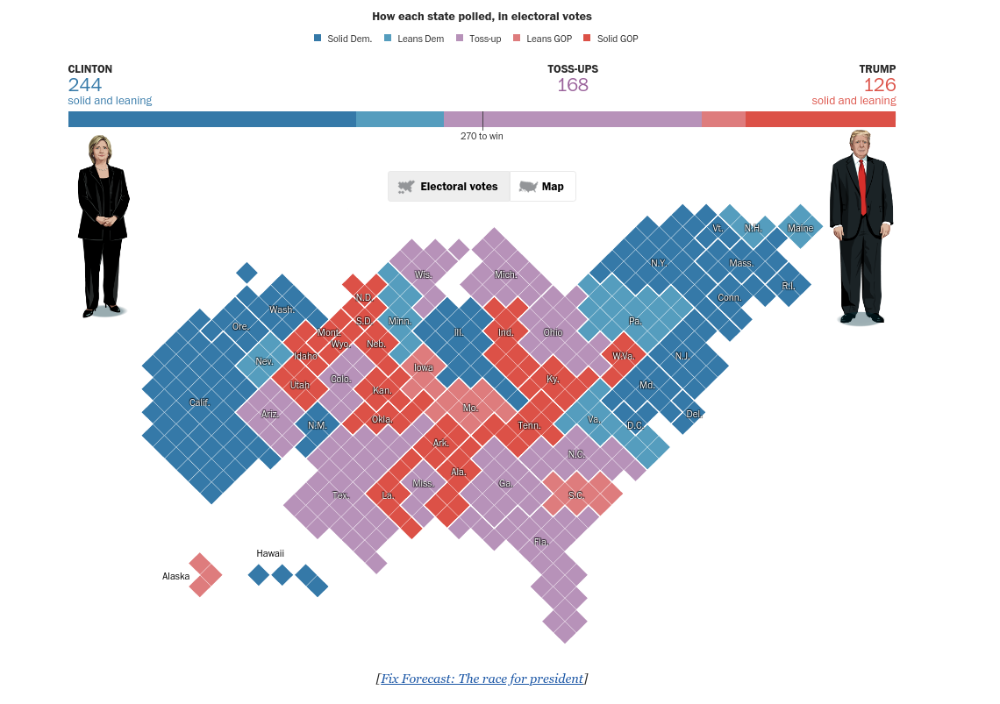
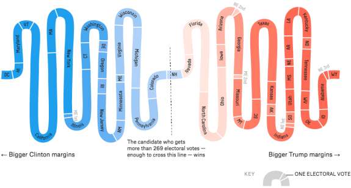
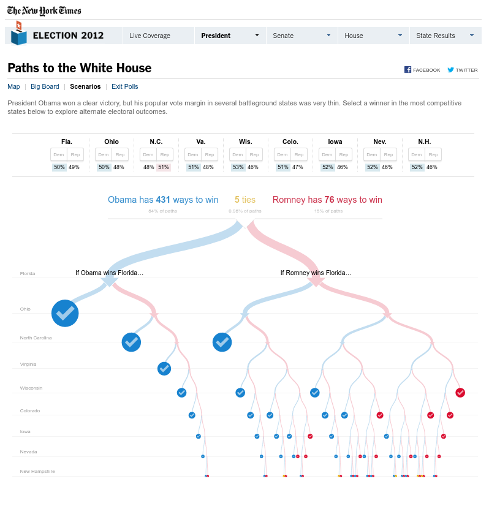
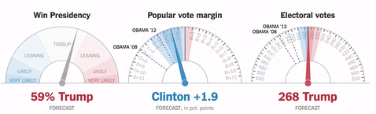

```{r setup, include=FALSE}
knitr::opts_chunk$set(echo = F, dpi = 300, message = F, warning = F, cache = T)
options(htmltools.dir.version = FALSE)
library(tidyverse)
```


```{r, include = F, eval = T, cache = F}
clean_file_name <- function(x) {
  basename(x) %>% str_remove("\\..*?$") %>% str_remove_all("[^[A-z0-9_]]")
}

img_modal <- function(src, alt = "", id = clean_file_name(src), other = "") {
  
  other_arg <- paste0("'", as.character(other), "'") %>%
    paste(names(other), ., sep = "=") %>%
    paste(collapse = " ")
  
  js <- glue::glue("<script>
        /* Get the modal*/
          var modal{id} = document.getElementById('modal{id}');
        /* Get the image and insert it inside the modal - use its 'alt' text as a caption*/
          var img{id} = document.getElementById('img{id}');
          var modalImg{id} = document.getElementById('imgmodal{id}');
          var captionText{id} = document.getElementById('caption{id}');
          img{id}.onclick = function(){{
            modal{id}.style.display = 'block';
            modalImg{id}.src = this.src;
            captionText{id}.innerHTML = this.alt;
          }}
          /* When the user clicks on the modalImg, close it*/
          modalImg{id}.onclick = function() {{
            modal{id}.style.display = 'none';
          }}
</script>")
  
  html <- glue::glue(
     " <!-- Trigger the Modal -->


<!-- The Modal -->
<div id='modal{id}' class='modal'>

  <!-- Modal Content (The Image) -->
  

  <!-- Modal Caption (Image Text) -->
  <div id='caption{id}' class='modal-caption'></div>
</div>
"
  )
  write(js, file = "js-addins.html", append = T)
  return(html)
}

# Clean the file out at the start of the compilation
write("", file = "js-addins.html")
```

```{css, echo = F}
.wrap
{
  width: 1050px;
  height: 550px;
  padding: 0;
  overflow: hidden;
  position: absolute;
}
.wrap2
{
  width: 1200px;
  height: 650px;
  padding: 0;
  overflow: hidden;
}


.scale-frame
{
  width: 1100px;
  height: 760px;
  border: 0;
  
  -ms-transform: scale(0.75);
  -moz-transform: scale(0.75);
  -o-transform: scale(0.75);
  -webkit-transform: scale(0.75);
  transform: scale(0.75);
  
  -ms-transform-origin: 0 0;
  -moz-transform-origin: 0 0;
  -o-transform-origin: 0 0;
  -webkit-transform-origin: 0 0;
  transform-origin: 0 0;
}
```


## Outline

- `ElectionViz` package

- A Brief Tour of (In)famous Election Graphics

- Why are election graphics complicated?

???

Today, I'll be talking a bit about election graphics, and showing off a package that I've been slowly building with Heike Hofmann and Kiegan Rice to provide a way to generate some of the most interesting election graphics in R. 

I'll start by showing you the basic functionality of ElectionViz, and then I'll do a general tour of different types of election related charts, showing you the ones we've added to electionViz as we go along.

Feel free to interrupt, ask questions, and make comments as we go. I'm pretty awful at paying attention to the chat, so just interrupt.

I will also say I'm doing my best to keep the discussion on the graphics instead of the political situation. Should any snark creep in unnecessarily, please remember that snark is my own opinion and not that of the university. 


---

.pull-left[
## `electionViz` 

[https://github.com/heike/electionViz](https://github.com/heike/electionViz)

```{r, eval = F, include = T}
devtools::install_github("heike/electionViz")
```

```{r, echo = T, out.extra="class: tiny"}
library(electionViz)
state_polls <- 
fivethirtyeight_update(
  polls="president_polls") %>% 
  filter(
    !is.na(state), 
    population %in% c("lv", "rv")) %>%
  
  # Last 5 polls
  polls_filter(
    method="last_k", k = 5) 

state_poll_df <- state_polls %>%
  # Estimate from past
  polls_plus(electoral_votes_2016) 

```
].pull-right[
```{r, echo = F, fig.width = 6, fig.height = 8, out.width = "100%"}
state_poll_df <- state_poll_df %>%
  mutate(state = reorder(state, pct_diff, mean))

state_1 <- state_polls %>%
  mutate(
    state = reorder(factor(state), pct_diff, mean)
  ) 
state_3 <- state_1 %>%
  polls_plus(electoral_votes_2016) %>%
  mutate(
    state = reorder(state, pct_diff, mean)
  )

state_1 <- state_1 %>%
  mutate(state = factor(state, levels = levels(state_3$state)))

gg_states <- state_1 %>%
  filter(!(state %in% c("Maine CD-1", "Maine CD-2", "Nebraska"))) %>%
  ggplot(aes(x = pct_diff, y = state)) + 
  geom_rect(xmin=-5, xmax=+5, ymin=-Inf, ymax = +Inf, 
            fill="#fcfcc5", size=0) + 
  geom_vline(xintercept = 0, colour = "grey10") + 
  geom_point(colour = "grey50", alpha = 0.35) +
  geom_text(aes(label=rank), colour = "grey30", size = 2) +
  theme_bw() +
  ylab("") +
  scale_y_discrete(drop=FALSE) 

gg_states +
  geom_point(aes(x = pct_diff, colour = pct_diff>0, shape=source),
             size = 2, data = state_3) +
  scale_colour_party("Party", labels=c("Democrat", "Republican")) +
  scale_x_continuous("Percent Difference", breaks=c(-60,-40,-20,0,20,40,60), 
                     limits=c(-60,60),
                     labels = c("←\nMore Dem", "40","20",0,20, 40, "→\nMore Rep")) +
  theme(legend.position="bottom") +
  scale_shape_manual("Source", values = c(1, 19)) +
  ggtitle(sprintf("Polls of likely or registered voters,\n%s to %s", min(state_1$end_date), max(state_1$end_date))) + 
  theme(legend.position = c(1, 0), legend.direction = "vertical", legend.justification = c(1.1, -.1))
```
]

???

The ElectionViz package is at the moment available only on github and still under active development. We wanted to make it easy to include the most up-to-date data, so we have functions to get the latest polls from several different sources, as well as functions that will substitute data from the last election for areas that haven't been polled (which seems to at this point only include the third district in Nebraska.)

---
class:middle,center,inverse
# .emph[A Tour of (In)famous US Election Charts]

---
```{r results='asis', echo = F, include = T, cache=F}
i1 <- img_modal(src = "figure/1883-stat-atlas-county-map.jpg", alt = "1880 Election Results by County from the Statistical Atlas", other=list(width="90%", class ="center"))
i2 <- img_modal(src = "figure/1883-key.png", alt = "Key", other=list(height="50px"))
i3 <- img_modal(src = "figure/1883-by-state.png", alt = "1880 Election Results by State from the Statistical Atlas", other=list(height="50px"))
i4 <- img_modal(src = "figure/1883-popular-vote-sub2.png", alt = "1880 Election Results (Popular Vote)", other=list(height="50px"))
i5 <- img_modal(src = "figure/1883-electoral-vote-sub.png", alt = "1880 Election Results (Electoral Vote)", other=list(height="50px"))
i6 <- img_modal(src = "figure/1883-vote-ratio-sub.png", alt = "1880 Election Results (Vote Ratio)", other=list(height="50px"))
i7 <- img_modal(src = "figure/1883-presidential-vote.png", alt = "1880 Election Results (Presidential Vote)", other=list(height="50px"))

c(str_split(i1, "\\n", simplify = T)[1:2],
  str_split(i1, "\\n", simplify = T)[3:12],
  str_split(i2, "\\n", simplify = T)[1:2],
  str_split(i3, "\\n", simplify = T)[1:2],
  str_split(i4, "\\n", simplify = T)[1:2],
  str_split(i5, "\\n", simplify = T)[1:2],
  str_split(i6, "\\n", simplify = T)[1:2],
  str_split(i7, "\\n", simplify = T)[1:2],
  str_split(i2, "\\n", simplify = T)[3:12],
  str_split(i3, "\\n", simplify = T)[3:12],
  str_split(i4, "\\n", simplify = T)[3:12],
  str_split(i5, "\\n", simplify = T)[3:12],
  str_split(i6, "\\n", simplify = T)[3:12],
  str_split(i7, "\\n", simplify = T)[3:12]) %>% paste(collapse = "\n") %>% cat()
```

[Source](https://www.loc.gov/resource/g3701gm.gct00009/?sp=40)

???

The first chart I want to show you is, as best as I can tell, the first US election chart ever generated. It is part of the Statistical Atlas of 1880, which was published in 1883, showing the results of the 10th census. 

The main part of the spread is this map, which isn't so different from our election maps today (except for e.g. the gaping hole in the middle of Oklahoma, Texas, Kansas, and Nebraska, where there weren't any votes for various resasons.) The map shows the popular vote as a proportion of the total vote, using a bivariate color scale for the two parties.

When we zoom in to see the key, though, we can see that the two parties are assigned colors that are exactly the opposite of what we use today (though the two parties in 1880 were very different from the parties of the same name today). Increasing amount/density of color is used to show an increasingly partisan vote. These maps were made with lithography, which meant that someone had to apply wax to soapstone very precisely to remove areas of color from the chart; for each color ink used, this process had to be repeated *precisely* in order to generate a color chart. It was a ton of work. You can see a little bit of misalignment in the greenback vote rectangle that shows how the process worked. 

Personally, I'll take a moment to be very grateful for ggplot2. I don't have the patience for lithography.

The spread also includes a state-level summnary map, which is again not so different from how we'd show things today.

There's also an analysis of the popular vote (with vote totals plotted, and the breakdown by candidate shown in the table.) I've cut this off so that it fit on the slide, but you can see that there's an index between the alphabetical state name and the rank, plus exact counts in the tables. It's a pretty cool display, really - the only thing I wish they'd included was the state population in addition to the rest of it so that we could see what the voter participation rate was. 

Even in 1880, though, there was a recognition that the total vote and the electoral vote weren't the same thing. So the electoral vote is shown as well; it looks like Garfield won handily. So even as far back as 1880, people were wrestling with this question of how to represent both the vote of the people and the vote of the electoral college, and even wrestling a bit with the visualization of people's votes vs. land votes.

The next piece of the chart that I want to highlight (and yes, there is a ton of information packed into this display) is this ratio of predominant to total vote. So earlier, we showed the black bar chart showing the total vote, and this is filling in the rest of the story - who won the state and by how much did they win? In 1880, Vermont was the safest state, followed by Louisiana, Georgia, South Carolina, Mississippi, and Texas... sounds like some things just don't change that much!

The last feature of this chart I'd like to highlight is one that I had to alter a bit to fit on the slide. Across the bottom of this spread is a chart showing the total vote, with all of the minor candidates as well. So you can very effectively see that Scattering and Weaver had very little support relative to Hancock and Garfield, but that either minor candidate could have thrown the popular vote!

We don't use scales like this very often anymore, which is something of a shame - it really makes the point effectively, even though I did have to chop the graph up into several pieces in order to get it to fit. 


---
## A few definitions

- **cartogram** - a map which distorts the geometry of the regions to convey information about another variable (e.g. electoral vote or population rather than area)
    <!-- - [How cartograms are created](http://www.geog.ucsb.edu/~kclarke/G232/ToblerCartograms.pdf) -->

- **chloropleth** - a map which is shaded according to a numeric variable

[](https://www.washingtonpost.com/graphics/politics/2016-election/how-election-maps-lie/)

```{r results='asis', echo = F, include = F, cache=F}
i1 <- img_modal(src = "figure/2016_countywinner_map.png", alt = "2016 Election Results by County", other=list(width="32%"))
i2 <- img_modal(src = "figure/2016-population-county-election-map.jpg", alt = "2016 Election Results by County (Population Area)", other=list(width="32%"))
i3 <- img_modal(src = "figure/2016-election-map-margin-white-balance.png", alt = "2016 Election Results by # votes and margin", other=list(width="32%"))
c(str_split(i1, "\\n", simplify = T)[1:2],
  str_split(i2, "\\n", simplify = T)[1:2],
  str_split(i3, "\\n", simplify = T)[1:2],
  str_split(i1, "\\n", simplify = T)[3:12],
  str_split(i2, "\\n", simplify = T)[3:12],
  str_split(i3, "\\n", simplify = T)[3:12]) %>% paste(collapse = "\n") %>% cat()
```

<!-- .small[.bottom[Maps from https://stemlounge.com/muddy-america-color-balancing-trumps-election-map-infographic/]] -->

???

A few definitions are in order here, since I decided to start in with maps. A cartogram is a map which distorts the geometry fo the regions to show information about another variable. A chloropleth map is a map with shading corresponding to another (non spatial) variable.

So the 1880 election map is a chloropleth map but isn't a cartogram. Cartograms have become more popular since the advent of computer graphics meant that we didn't have to painstakingly apply layers of wax to soapstone by hand in order to create graphical forms. It's much easier to let a computer make a cartogram than to draw one by hand.

In the image shown here, which I have taken from the Washington post (if you are looking at these slides online, you can click on the picture to get the original source), shows several different ways to show the same data, summarized differently. You can shade the map differently to show the proportion of the vote instead of the winner, and you can shift the geography to show different levels of population density distribution. These types of continuous cartograms are sometimes very hard to read - so hard that they destroy the original point, which is to represent the individual voters instead of the geographic land where they reside.


---
[](https://www.nytimes.com/interactive/2016/11/01/upshot/many-ways-to-map-election-results.html)

```{r results='asis', echo = F, include = T, cache=F}
i1 <- img_modal(src = "figure/nyt-map-1896.png", alt = "1896 Election Results", other=list(width="32%"))
i3 <- img_modal(src = "figure/nyt-map-2004.png", alt = "2004 Election Results", other=list(width="32%"))
i4 <- img_modal(src = "figure/nyt-map-2004-popdens.png", alt = "2004 Election Results", other=list(width="32%"))
i2 <- img_modal(src = "figure/nyt-map-1992.png", alt = "1992 Election Results", other=list(width="32%"))
i5 <- img_modal(src = "figure/nyt-map-2012.png", alt = "2012 Election Results", other=list(width="32%"))
i6 <- img_modal(src = "figure/nyt-map-2012-popcirc.png", alt = "2012 Election Results", other=list(width="32%"))
c(str_split(i1, "\\n", simplify = T)[1:2],
  str_split(i3, "\\n", simplify = T)[1:2],
  str_split(i4, "\\n", simplify = T)[1:2],
  str_split(i2, "\\n", simplify = T)[1:2],
  str_split(i5, "\\n", simplify = T)[1:2],
  str_split(i6, "\\n", simplify = T)[1:2],
  str_split(i1, "\\n", simplify = T)[3:12],
  str_split(i3, "\\n", simplify = T)[3:12],
  str_split(i4, "\\n", simplify = T)[3:12],
  str_split(i2, "\\n", simplify = T)[3:12],
  str_split(i5, "\\n", simplify = T)[3:12],
  str_split(i6, "\\n", simplify = T)[3:12]) %>% paste(collapse = "\n") %>% cat()
```
<!-- [](https://www.nytimes.com/interactive/2020/us/politics/battleground-states-trump-biden.html) -->

???

This battle between fidelity to the geography and fidelity to the individual voter is one that is very well recognized as a hard, hard problem. The NYT published an article in 2016 showing several different ways they've historically tried to show election results. Again, if you click on the headline, you'll get to the original article, which is a great read.

The first map is from 1896, where William Jennings Bryan lost to William McKinley; it shows the print version of the election results, with Bryan's states in black.

By the advent of computer graphics, in 1992, the shapes were somewhat more precise, but things hadn't changed that much (other than representing some undecided states; I'm not sure if this is from just after the election or just before the election where there are only a couple of swing states). This is obviously computer generated, but still in the age of black-and-white newsprint.

The next two attempts are both from 2004; one is a square cartogram showing the electoral votes of each state; with shading that shows the percentage of the vote. I find this cartogram a bit odd in that somehow Kansas is east of and north of Nebraska (and North/south dakota?) - but cartograms are hard to make because it's not easy to compromise on area and still maintain the approximate shape. 

Another 2004 map shows the results by population density, which is I believe a relatively good attempt to show the popular vote as a result of "total amount of color" - what isn't clear is how easily we aggregate over color intensity. 

In 2012, they also show two different attempts at displaying the results: county-level chloropleth maps first, and with county-level dots showing the size of the vote margin. In both cases, they're using county as a proxy for voting unit, but votes are aggregated at the precinct level and at the state level (or in the case of Nebraska and Maine, at the precinct, district, and state level). So county isn't a great approximation of anything, really; it's not totally clear whether either map actually achieves the objective. 

The point is that if there were one perfect way to show election results, NYT probably would have found it by now...

---
## Election Maps - Washington Post

[](https://www.washingtonpost.com/graphics/politics/2016-election/50-state-poll/)

???

Here's another cartogram, this time from the washington post in 2016. It uses diamonds, which are an interesting choice; it's also showing polling instead of actual returns. 

---
## Election Maps - FiveThirtyEight

[](https://projects.fivethirtyeight.com/2020-election-forecast/house/)

???

The last cartogram I decided to show you from the media is actually for the House seats and not the presidential race. I put this presentation together over the weekend; and I've updated it somewhat to show the newest graphics, but I didn't have infinite time over the last day or so. I like the hexagonal cartogram too, and especially like the fact that each state is broken up - it makes it easier to maintain some sort of spatial similarity (though IL bordering NE is ... irritating). 

I also like the solid/likely/lean color scale - it preserves the important parts while reducing the visual complexity of the situation. The other part of this graphic I really like is the summary at the bottom comparing the forecast to the status quo, with the uncertainty shown as well - it's clear that there is a chance for an increased majority, but not a huge chance. So the aggregated summary really helps me with integrating the map information into a "what does this mean in reality" situation.

<!-- --- -->
<!-- <iframe src="https://s3.us-east-2.amazonaws.com/wiscontext-viz/cartograms/election_gov_2018.html" width="100%" height="600px"></iframe> -->

<!-- .small[.bottom[https://urbanmilwaukee.com/2019/01/17/cartogram-makes-last-election-look-different/]] -->

---
## Maps in ElectionViz

```{r, fig.width = 6, fig.height = 4, out.width = c("45%", "55%"), echo = F}
states <- state_1 %>%
  polls_plus(electoral_votes_2016) %>%
  mutate(
    state = reorder(state, pct_diff, mean)
  ) %>%
  filter(!str_detect(state, "CD-")) 

data(ushex_plus, package = "electionViz")

hexplot(states$state, states$pct_diff, labelcolor = "black") + 
  scale_fill_party_binned("") + 
  theme(legend.title = element_blank()) + 
  ggtitle("Hexbin Cartogram by State (2020 polls)") + 
  geom_path(aes(x = long, y = lat, group = group), color = "grey20")

state_mapping <- unique(select(elections, state_name = state, state_po)) %>%
  left_join(unique(select(electoral_hex, state_po = state, group))) %>%
  mutate(ev = abs(parse_number(group))) %>%
  mutate(state_name = ifelse(group %in% c("NE-1", "NE-2", "NE-3", "ME-1", "ME-2"),
                             paste0(state_name, " CD-", ev), state_name))

state_names <- unique(electoral_state_outline_hex[,c("centerX", "centerY", "state", "group")]) %>%
  left_join(select(state_mapping, -group), by = c("state" = "state_po")) %>%
  left_join(state_3, by = c("state_name" = "state")) %>%
  mutate(color = ifelse(abs(pct_diff) < 10, "grey40", "grey90"))

state_mapping %>% left_join(state_3, by = c("state_name" = "state")) %>%
  left_join(electoral_hex, by = "group") %>%
  ggplot(aes(x = long, y = lat, group = group)) +
  geom_polygon(aes(fill =  pct_diff), 
               colour = "grey60", size = 0.1, alpha = 0.9) +
  geom_text(aes(x = centerX, y = centerY, label = state, color = color), 
            size = 3, 
            data = state_names) +
  scale_color_identity() + 
  geom_path(colour = "grey70", size = 0.35, 
            data = electoral_state_outline_hex) +
  theme_void() +
  scale_fill_party_binned() +
#  coord_map() +
  theme(legend.position = "none") +
  ggtitle("Hexbin Cartogram by Electoral Votes (2020 polls+)")
```

???

At the moment, ElectionViz has the ability to make two different hex cartograms, utilizing maps borrowed from other packages. Part of our reasoning here was that you can get so many different shapefiles that we just wanted to make it easy to make a couple of simple charts; the other reason is that creating these cartograms isn't easy and I had limited time to mess with svgs in Illustrator or Inkscape. 

I spent that time in Inkscape on other things, like the graphics which I'll show you next.


---
## The Electoral Snake (538 - 2016)

.center[

]

???

One of the most effective electoral visualizations out there is the 538 electoral snake. It orders each electoral unit by vote margin, from left to right (so DC is always on the left and the nebraska 3rd district is most always on the right.) Each electoral vote has the same area, and it is easy to see where the "threshold" is crossed.

This is from September 22, 2016. It's easy to see what the predicted swing states would be, and that Michigan, Pennsylvania, and Wisconsin were close but not a complete tossup at this point in the election cycle. How things change.

---
## The Electoral Snake (538 - 2020)

<div class="wrap">
<iframe class="scale-frame" src = "https://projects.fivethirtyeight.com/2020-election-forecast/#ec-margins" width = "100%" height = "500px"/></div>

???

Here's the 2020 version, which has mostly changed so that it's tilted diagonally.

---

## The Electoral Snake (electionViz)

```{r, fig.width = 8, fig.height = 6}
label_fix <- c("District of Columbia" = "DC", "Maine CD" = "ME", "Nebraska CD" = "NE",
               "Rhode Island" = "RI", "New Hampshire" = "NH", "Wyoming" = "WY", "New York" = "NY",
               "Vermont" = "VT", "West Virginia" = "WV", "Kansas"="KS", "Montana" = "MT",
               "New Mexico" = "NM", "Hawaii" = "HI", "Connecticut" = "CT",
               "Delaware" = "DE", "Colorado" = "CO", "Maine" = "ME", "Alaska" = "AK", 
               "South Dakota" = "SD", "North Dakota" = "ND", "Mississippi" = "MI", "Nebraska" = "NE")

state_3 %>%
  mutate(diff = perc_rep - perc_dem, 
         party = ifelse(perc_dem > perc_rep, "Dem", "Rep"),
         label = state) %>%
  mutate(label = str_replace_all(label, label_fix)) %>%
  ggsnake(order = diff, fill = diff, label = label, 
          color = party, size = electoral_votes) +
  scale_fill_party_binned(name = "") + 
  scale_color_party(guide = "none") +
  theme_void(base_size = 8) + 
  theme(legend.title = element_blank(), 
        legend.position = c(.5325, 0.45), 
        legend.justification = c(.5325, 0.45)) +
  ggtitle(sprintf("Based on polls from %s to %s",
                  min(state_polls$end_date), 
                  max(state_polls$end_date)))

```

---
## The Electoral Tower

```{r results='asis', echo = F, include = T, cache=F}
i1 <- img_modal(src = "figure/2000-NYT-tower.png", alt = "2000 NYT Electoral Tower", other=list(height = "400px", style = "margin:auto;padding:5%")) 
i2 <- img_modal(src = "figure/2016-FT-election-tower.jpg", alt = "2012/2016 Financial Times Electoral Tower Comparison", other=list(height = "400px", style = "margin:auto;padding:5%"))
c(str_split(i1, "\\n", simplify = T)[1:2],
  str_split(i2, "\\n", simplify = T)[1:2],
  str_split(i1, "\\n", simplify = T)[3:12],
  str_split(i2, "\\n", simplify = T)[3:12]) %>% paste(collapse = "\n") %>% cat()

```

.bottom[Images from [12 notable election visualization techniques](https://www.visualisingdata.com/2016/11/12-notable-election-visualisation-techniques/) post]

```{r, fig.width = 6, fig.height = 4, echo = F}
label_fix2 <- c("District of Columbia" = "DC", "Maine CD" = "ME", "Nebraska CD" = "NE")

state_3 <- state_3 %>% #filter(!(state %in% c("Maine", "Nebraska"))) %>% 
  mutate(label = str_replace_all(state, label_fix2))
```

---
## The Electoral Tower

.pull-left[
```{r elec-building1, echo = T, eval = F}
state_3 %>% with(
electoral_building(
    state_district = label, 
    electoral_votes = 
      electoral_votes, 
    perc_dem = perc_dem, 
    perc_rep = perc_rep,
    source = source)
) +
  scale_color_party("Party") +
  scale_fill_party("Party")

```
]
.pull-right[
```{r elec-building, echo = F, eval = T, fig.width = 6, fig.height = 8}
state_3 %>% with(
electoral_building(
    state_district = label, 
    electoral_votes = electoral_votes, 
    perc_dem = perc_dem, 
    perc_rep = perc_rep,
    source = source)
) +
  scale_color_party("Party") +
  scale_fill_party("Party") +
  theme_void() + 
  theme(legend.position = "none") +
  ggtitle("Electoral building, based on polls")

```
]


---
## Paths to the White House

[](https://www.nytimes.com/elections/2012/results/president/scenarios.html#app)


---
## Paths to the White House

[](https://www.nytimes.com/interactive/2020/us/elections/election-states-biden-trump.html)

---
## Explore the Ways to Win


<div class="wrap">
<iframe class="scale-frame" src = "https://projects.fivethirtyeight.com/trump-biden-election-map/#ui" width = "100%" height = "500px"/></div>


---
## Uncertainty - The Needle (NYT)

.center[

]

- "jitter" motion to show simulation uncertainty

- motion sometimes falsely interpreted as new data coming in

- [The Needle and the Damage Done](https://fair.org/home/the-needle-and-the-damage-done/) (FAIR.org, from 2018)

- [The NYT Needle and the Damage Done](https://www.rollingstone.com/politics/politics-news/iowa-caucus-new-york-times-election-needle-donald-trump-947101/) (Rolling Stone)

- [Beyond the Needle: Probability Experts Assess 2020 race](https://apnews.com/article/election-2020-donald-trump-hillary-clinton-elections-nate-silver-a5b62d04f8747702c0ab3ae61423219b)

- ['The Needle' Won't Be Used on Election Night](https://politicalwire.com/2020/10/24/the-needle-wont-be-used-on-election-night/)

---
<iframe src="http://presidential-plinko.com/" width = "100%" height = "600px"></iframe>


---
## Outcome Uncertainty - 538

<iframe src="https://projects.fivethirtyeight.com/2020-election-forecast/#topline" width = "100%" height = "500px"></iframe>


---
## "Wave" Graphics


???

- Arrow size shows direction of the swing (but it's not clear whether that's percentage points or population shift)

---
## Other Factors affecting Election Graphics

- Majority/plurality voting, first-past-the-post, single transferable voting, ranked choice voting

- Parliamentary system (UK, Canada, Aus, NZ), Proportional Representation (e.g. Germany), Electoral College
    
- Data availability
    - Laws restricting polling (e.g. exit polling, polls X days before the election)
    - Polling not available in all areas
    - Not all areas are electing all offices each election

---
## Fun Reading

- [Reasons to consider a cartogram](https://medium.com/civic-tech-thoughts-from-joshdata/how-that-map-you-saw-on-538-under-represents-minorities-by-half-and-other-reasons-to-consider-a-4a98f89cbbb1)

- [How We Visualized an Election with No Political Parties](https://source.opennews.org/articles/how-we-visualized-election-no-political-parties/) - Visualizing Afghan Elections

