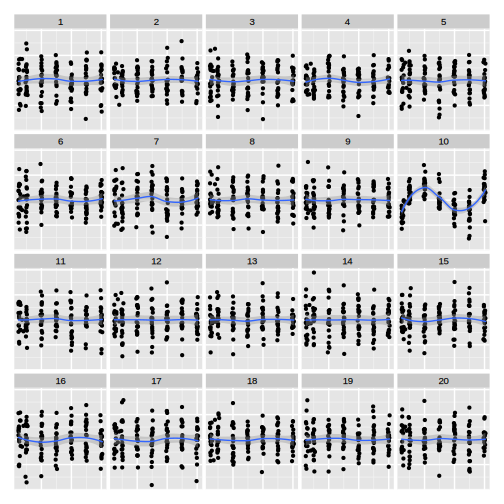

```{r setup, include=FALSE}
options(htmltools.dir.version = FALSE)
knitr::opts_chunk$set(echo = F, fig.width = 8, fig.height = 8, dpi = 300)
library(tidyverse)
source("code/photo_lineup.R")
```

.center[

]

---
## Significant Plots

