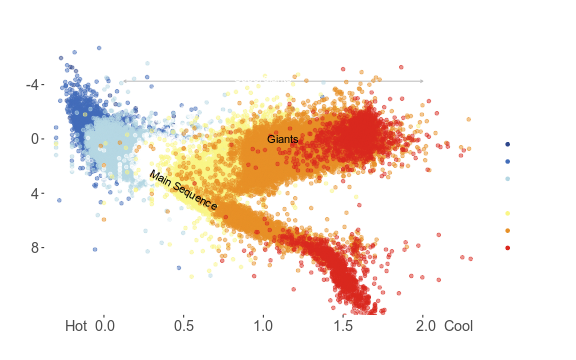
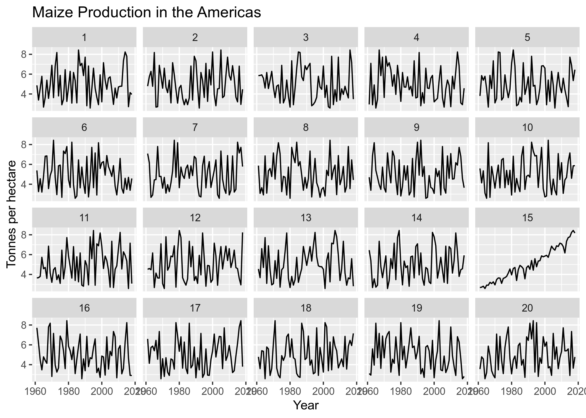
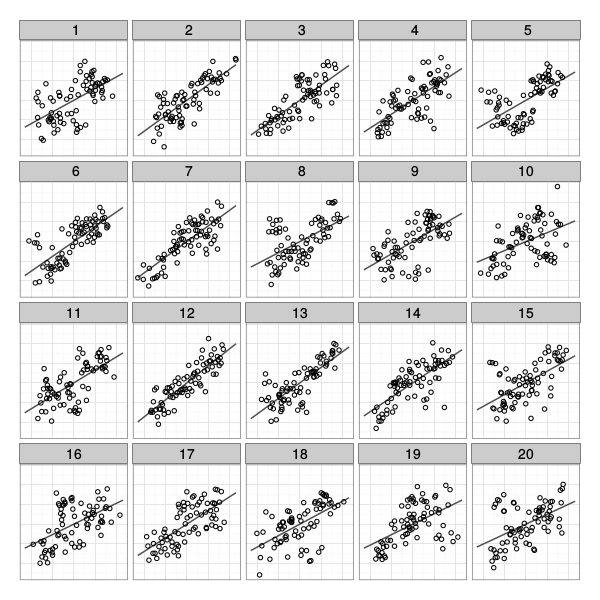
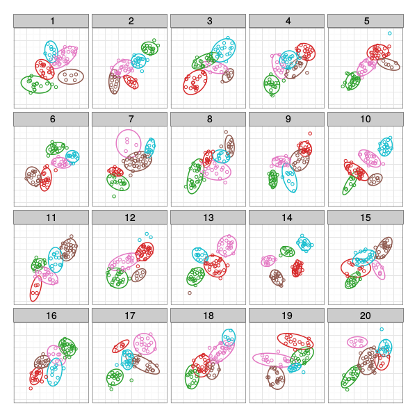

class:middle
## Why do we use Visualizations?

.large.center[https://pollev.com/susanvanderp753]
<!-- <iframe src="https://pollev-embeds.com/discourses/dFoDVGNn2jsoUu9hww9D9/respond" width="800px" height="500px"></iframe> -->

```{r setup, include=FALSE}
options(htmltools.dir.version = FALSE)
knitr::opts_chunk$set(dpi = 300, echo = F)
library(tidyverse)
library(gridExtra)
suppressPackageStartupMessages(library(nullabor))

source("code/MixtureLineups.R")
source("code/theme_lineup.R")
```

```{r color-scheme-setup}

colors <-  c("#1f77b4", "#ff7f0e", "#2ca02c", "#d62728", "#9467bd", 
             "#8c564b", "#e377c2", "#7f7f7f", "#bcbd22", "#17becf")
shapes <- c(1,0,3,4,8,5,2,6,-0x25C1, -0x25B7)

colortm <- read.csv("data/color-perceptual-kernel.csv")
# colortm[3,4] <- 0
# colortm[4,3] <- 0
colortm[8,] <- 0
colortm[,8] <- 0

shapetm <- read.csv("data/shape-perceptual-kernel.csv")
# shapetm[9:10,] <- 0
# shapetm[, 9:10] <- 0
shapetm[9,] <- 0
shapetm[,9] <- 0
shapetm[10,] <- 0
shapetm[,10] <- 0

color3pal <- best.combo(3, colors, colortm)
color5pal <- best.combo(5, colors, colortm)
shape3pal <- best.combo(3, shapes, shapetm)
shape5pal <- best.combo(5, shapes, shapetm)

```

---

## Why do we use Visualizations?
<iframe src="https://embed.polleverywhere.com/discourses/NFICXszwVrNRqLfxPe5fy?controls=none&short_poll=true" width="800px" height="500px"></iframe>


---
class:inverse
## The Good, the Bad, and the Ugly


???

When drawn well, statistical graphics help us understand our data and see things that we didn't know were there. The relationship between star magnitude, star color, and spectral class wasn't well understood until someone created a chart like this that showed the color index (or spectral class) against the absolute brightness. Then, it was much easier to see that the chart described a life-cycle - stars start out in the main sequence, and then become giants, dwarfs, or slowly change spectral class over time as they cool down in temperature.

Well designed graphs can help us understand the natural phenomenon behind the raw numerical data we've collected.

---
class:inverse
## The Good, the Bad, and the Ugly

<iframe src="https://xkcd.com/2126/#comic" width="800px" height="500px"/>

???

Of course, even decent visualizations can't compensate for lousy data... 


---
class:inverse
## The Good, the Bad, and the Ugly

.center[]

???

And as always, there are multiple ways to show some data, not all of which are optimal. So we could easily show this as 3 lines, across multiple months, which would let you see the relative change in Bear, Dolphin, and Whale populations each month, while also letting you easily compare across months. 

---
class:inverse
## The Good, the Bad, and the Ugly


???

As with anything, graphics require a combination of "art" and "science" - you not only have to use the best method to display the data (which this isn't, necessarily), you also have to use some judgement as to how to show what you're hoping to show... and this is a good example of what happens when that doesn't happen. 

---
class:middle,center,inverse
# Statistical Visualizations

???

I'm going to start out talking about some basic definitions, and then I'll show you one of my favorite ways that we use to determine how well statistical charts work.

---
## Statistics and Charts

.pull-left[
A **statistic** is a quantity computed from values in a sample used for a statistical purpose    
.small[Source: [Wikipedia](https://en.wikipedia.org/wiki/Statistic)]
]
.pull-right[
A **chart** is a graphical representation for data visualization, in which the data is represented by symbols    
.small[Source: [Wikipedia](https://en.wikipedia.org/wiki/Chart)]
]

<br/><br/>

--

.center.large[But, charts are computed from values in a sample (usually) and used for a statistical purpose]

<br/><br/>

--

.xx.center.emph.cerulean[So... charts **are** statistics!]

---
## Testing Statistics: Example
.bottom[Data from [Tidy Tuesday, 2020-09-01](https://github.com/rfordatascience/tidytuesday/blob/master/data/2020/2020-09-01/readme.md)]
```{r, include = F, cache = T}
tuesdata <- tidytuesdayR::tt_load('2020-09-01')
```

```{r, echo = F, message = F, fig.width = 8, fig.height = 5, out.width = "100%"}
library(tidyverse)
df <- tuesdata$key_crop_yields %>%
  filter(Entity == "Americas") %>%
  rename(Corn = `Maize (tonnes per hectare)`)

ggplot(df, aes(x = Year, y = Corn, group = Entity)) + 
  geom_line() + 
  ggtitle("Maize Production in the Americas") + 
  scale_y_continuous("Tonnes per hectare")
```

???

Suppose we have this data, and we want to determine whether there is a relationship between Maize production and time. 

If we were testing this statistically, we'd fit a linear regression to the data, and test to see whether the slope is equal to 0, right?

We can do that graphically as well: if there is no relationship, then it doesn't matter which Y value is assigned to which X value - we can just shuffle the production values independently of time.

---
## Testing Statistics

- If statistics are charts, then what is the reference distribution? 

- What constitutes an "extreme" or "significant" chart?

.pull-left[
Hypothesis testing:

- take a sample

- calculate a test statistic

- compare test statistic to reference distribution    
(formed by $H_0$)

- if it is unlikely, reject null hypothesis
].pull-right[
Graphical hypothesis testing:
- take a sample

- create a test statistic/graph

- compare graph to a reference distribution of other graphs generated under $H_0$

- if test graph "stands out" then reject null hypothesis
]

???

Using the hypothesis that there is no relationship between X and Y, we can create a reference distribution of other graphs generated by shuffling the Y values. Do you think you'll be able to pick out the reference chart?

---
## Testing Statistics: Example

```{r, echo = F, fig.align="center", fig.width = 7, fig.height = 5, out.width = "90%"}
library(nullabor)
fit <- lm(Corn ~ Year, data = df)
fit.reg <- tibble(df, .resid = residuals(fit), .fitted = fitted(fit))
coefs <- coefficients(summary(fit))
lineup_coefs <- rnorm(19, 0.02, sd = 2*coefs[2,2])
lineup_coefs <- c(lineup_coefs[1:14], coefs[2,1], lineup_coefs[15:19])
intercept <- c(rnorm(14, coefs[1,1], 2*coefs[1,2]), coefs[1,1], rnorm(5, coefs[1,1], 2*coefs[1,2]))

lineup_data <- tibble(.sample = 1:20, intercept = intercept, coef = lineup_coefs) %>%
  mutate(data = list(tibble(Year = df$Year, Corn = df$Corn, resid = resid(fit)))) %>%
  unnest(data) %>%
  mutate(y = intercept + coef*Year + resid)

ggplot(lineup(null_permute("Corn"), n = 20, pos = 15, df), aes(x = Year, y = Corn)) + geom_line() + facet_wrap(~.sample) + 
  ggtitle("Maize Production in the Americas") + 
  scale_y_continuous("Tonnes per hectare")
```

???

Now, this is a very easy example, because we all know there's been a massive increase in crop yields over the last 50 years. But, you can see how this paradigm is powerful - you can easily tell which plot is "different", and if I ask 20 different people to evaluate it, I'd wager at least 19 would say "plot 15 is different".

You'll also notice that we didn't have to ask anything statistical in nature - all of our hypotheses are embedded into the statistical lineup through the generation of the other 19 plots. We call these lineups because they're similar to the criminal procedure of the same name. 

The powerful part of this is that we can test for statistical significance of data even in cases where the effect is very subtle, or not easily mathematically quantified, as long as we can generate realistic "null" data through a reasonable mechanism.

---
## Testing Statistics

.pull-left[
- The plot is a **statistical lineup**

- The method is **visual inference**    
(a graphical hypothesis test)

- Many factors influence the results
    - the data
    - the plot type
    - the plot aesthetics    
.small[(color, shape, etc.)]
    - extra statistical features     
.small[trend lines, error bars]
]
.pull-right[

]

---
class:middle,center,inverse
# How much do graphical features matter?

???

Now I'm going to talk a bit about a specific experiment I ran to determine which features matter the most when creating a plot. There is not much guidance on how to create plots that is experimentally driven, so I wanted to try to lay a foundation for scientifically validated plot creation guidelines.

To talk about this, though, I'll need a bit of help.

---
## Which plot(s) are the most different?



---
## Which plot(s) are the most different?


---
## Which plots are the most different?

.pull-left[

.center[31 Evaluations]

Panel | % selected
----: | -------:
12 | 9.7%
5 | 29.0%
18 | 32.3%
Other | 29.1%

].pull-right[

.center[22 Evaluations]

Panel | % selected
----: | -------:
12 | 59.1%
5 | 9.1%
18 | --
Other | 31.7%
]

???

These plots are from the study I'm going to talk about, but just as a proof of concept - 
both of these plots contain the same data. However, which plot was selected as "interesting" varies massively.

So we can determine that the data isn't the part that matters here - the way the plot is designed matters. 

I'll talk about how we designed the study and then I'll show you more conclusive results.

---
## Two-Target Lineups

.pull-left[
- Modify lineup protocol for tests of competing hypotheses $H_1$ and $H_2$

- $H_1$ and $H_2$ target plots

- 18 null plots generated using a mixture model consistent with $H_0$

].pull-right[

]

???

To generate this data, we used a mixture model - so we generated data from a cluster model, and data from a linear model, and then to create the null plots, we selected points randomly from each model type. 

I'm going to skip over how we designed the simulation model, because we don't have time to get into the details, but it was a fun ride.

---

## Experimental Design - Parameters

- $K = 3, 5$ clusters

- $N = 15 K$ points

- $\sigma_T = 0.25, 0.35, 0.45$ (variability around the trend line)

- $\sigma_C = \begin{array}{cc}0.25, 0.30, 0.35 (K = 3)\\0.20, 0.25, 0.30 (K = 5)\end{array}$ (variability around the cluster centers)

- $\lambda = 0.5$ (mixture parameter)

<br/><br/>
.center[
18 combinations of plot parameters ( $2K \times 3\sigma_T \times 3\sigma_C$ )

3 replicates of each parameter set =  54 total lineup data sets
]

---
## Experimental Design - Aesthetics

```{r aes-combo, fig.width = 15, fig.height = 6.5, out.width = "90%", message = F, warning = F, cache = T}
set.seed(325095273)
data <- mixture.sim(K=5, N=75, sd.cluster=.20, sd.trend=.25, lambda=0.5)
plot.parms <- expand.grid(
  color = c(0,1),
  shape = c(0,1),
  reg = c(0,1),
  err = c(0,1),
  ell = c(0,1)
)[c(
  1, # control
  5, # trend
  13, # trend + error
  2, # color
  3, # shape
  4, # color + shape
  18, # color + ellipse
  20, # color + shape + ellipse
  6, # color + trend
  30 # color + ellipse + trend + error
),]

plot.parms$name <- c("Default", "Trend", "Trend + Error", "Color", "Shape", "Color + Shape", "Color + Ellipse", "Color + Shape + Ellipse", "Color + Trend", "Color + Ellipse + Trend + Error")

# function to create a list of chosen aesthetics
get.aes <- function(r){
  c("Color", "Shape")[which(as.logical(r[1:2]))]
}

# function to create a list of chosen statistics
get.stats <- function(r){
  c("Reg. Line", "Error Bands", "Ellipses")[which(as.logical(r[3:5]))]
}

xlims <- range(data$x) * 1.05
ylims <- range(data$y) * 1.05


model <- lm(y~x, data=data)
range <- diff(range(data$x))
newdata <- data.frame(x=seq(min(data$x), max(data$x), length.out=400))
tmp <-   data.frame(.sample=1, x=newdata$x, 
             predict.lm(model, newdata=newdata, interval="prediction", level=0.9))

plots <- rep(NA, 10) %>% as.list()

for(i in 1:10) {
  stats <- get.stats(plot.parms[i,])
  aes <- get.aes(plot.parms[i,])
  pointsize <- 5
  
  myplot <- ggplot(data=data, aes(x=x, y=y)) + theme_lineup() + 
    coord_cartesian(xlim = xlims, ylim = ylims)
  
  if("Reg. Line"%in%stats){
    myplot <- myplot + geom_smooth(method="lm", color="grey30", se=F, fullrange=TRUE)
  } 
  if("Error Bands"%in%stats){
    if("Shade Error Bands"%in%stats & "Error Bands"%in%stats){
      myplot <- myplot + 
        geom_line(data=tmp, aes(x=x, y=lwr), linetype=2, inherit.aes=F) + 
        geom_line(data=tmp, aes(x=x, y=upr), linetype=2, inherit.aes=F) + 
        geom_ribbon(data=tmp, aes(x=x, ymin=lwr, ymax=upr), fill="black", color="transparent", alpha=.1, inherit.aes=F)
    } else {
      myplot <- myplot + 
        geom_line(data=tmp, aes(x=x, y=lwr), linetype=2, inherit.aes=F) + 
        geom_line(data=tmp, aes(x=x, y=upr), linetype=2, inherit.aes=F)
    }
  }
  
  if("Ellipses"%in%stats){
    if("Color"%in%aes){
      if("Shade Ellipses"%in%stats){
        myplot <- myplot + stat_ellipse(geom="polygon", level=.9, aes(fill=factor(group), colour=factor(group)), alpha=0.1) + 
          scale_fill_manual(guide="none", values=color5pal)
      } else {
        myplot <- myplot + stat_ellipse(geom="polygon", level=.9, aes(colour=factor(group)), alpha=0.2, fill="transparent")
      }
    } else if("Shape"%in%aes){
      myplot <- myplot + stat_ellipse(geom="polygon", level=.9, aes(group=factor(group)), 
                                  colour="grey15", fill="transparent")
    } else {
      myplot <- myplot + stat_ellipse(geom="polygon", level=.9, aes(group=factor(group)), 
                                  colour="grey15", fill="transparent")
    }
  }
  
  if("Shade Ellipses"%in%stats & "Ellipses" %in% stats){
    myplot <- myplot + stat_ellipse(geom="polygon", level=.9, aes(group=factor(group)), alpha=0.1, fill="black", color="transparent") 
  }
  
  # points on top of everything
  # Set Aesthetics
  if(length(aes)==0){
    myplot <- myplot + geom_point(size=pointsize, shape=1) + 
      scale_shape_discrete(solid=F)
  } else if(length(aes)==1){
    if("Color"%in%aes){
      myplot <- myplot + geom_point(aes(color=factor(group)), size=pointsize, shape=1) + 
        scale_color_manual(guide="none", values=color5pal)
    } else {
      myplot <- myplot + geom_point(aes(shape=factor(group)), size=pointsize) + 
        scale_shape_manual(guide="none", values=shape5pal)
    }
  } else {
    myplot <- myplot + geom_point(aes(color=factor(group), shape=factor(group)), size=pointsize) + 
      scale_color_manual(guide="none", values=color5pal) + 
      scale_shape_manual(guide="none", values=shape5pal)
  }
  
  myplot <- myplot +
    xlab(NULL) + ylab(NULL) +
    ggtitle(plot.parms$name[i])
    
  plots[[i]] <- myplot
}

fs <- 18
grid.arrange(
  arrangeGrob(plots[[1]], 
              top = textGrob("", gp = gpar(fontsize = fs))), 
  arrangeGrob(plots[[2]], plots[[3]], ncol = 2, 
              top = textGrob("Trend Emphasis", gp = gpar(fontsize = fs))),
  arrangeGrob(plots[[9]], plots[[10]], ncol = 2, 
              top = textGrob("Conflicting Emphasis", gp = gpar(fontsize = fs))),
  arrangeGrob(plots[[4]], plots[[5]], plots[[6]], plots[[7]], plots[[8]], ncol = 5, 
              top = textGrob("Cluster Emphasis",  gp = gpar(fontsize = fs))),
  layout_matrix = matrix(c(1, 2, 2, 3, 3, 4, 4, 4, 4, 4), nrow = 2, byrow = T)
)
grid.rect(x = 0, y = .5, width = .2, height = .5, gp = gpar(lwd = 2, col = "black", fill = NA), hjust = 0, vjust = 0)
grid.rect(x = .2, y = .5, width = .4, height = .5, gp = gpar(lwd = 2, col = "black", fill = NA), hjust = 0, vjust = 0)
grid.rect(x = .6, y = .5, width = .4, height = .5, gp = gpar(lwd = 2, col = "black", fill = NA), hjust = 0, vjust = 0)
grid.rect(x = 0, y = 0, width = 1, height = .5, gp = gpar(lwd = 2, col = "black", fill = NA), hjust = 0, vjust = 0)

```

10 Aesthetics  $\times$ 54 data sets = 540 plots


---
## Experimental Design

- 1201 participants from Mechanical Turk
- Each participant evaluates 10 plots (12010 evaluations)
    - Each $\sigma_C \times \sigma_T$ value with one replicate, randomized across $K$ values
    - All 10 aesthetic types
- Participants select the plot or plots which are most different
    - Provide a short explanation
    - Rate confidence level

???

The experiment is set up as a balanced incomplete block design, where each participant sees all 10 aesthetic types, and 9 distinct variability combinations, randomized across number of groups. Participants are instructed to select the plots which are most different, and then asked to briefly explain their reasoning and rate their confidence in their answer. 

---
## Results
```{r, fig.width = 6, fig.height = 3, out.width = "80%"}
load("data/modeldata.Rdata")
user.data <- modeldata %>% group_by(individualID) %>% 
summarize(answers=length(individualID),
          cluster=sum(cluster.correct),
          trend=sum(trend.correct))
clusters <- as.data.frame(table(user.data$cluster))
trends <- as.data.frame(table(user.data$trend))
names(clusters) <- c("x", "Cluster")
clusters$Trend <- trends$Freq 
clm <- gather(clusters, key = variable, value = value, -x)

ggplot() + 
  geom_point(aes(x, value, colour=variable, shape=variable), size=3, data=clm) + 
  geom_line(aes(x, value, colour=variable, group=variable), data=clm) + 
  theme_bw() + 
  scale_colour_brewer("Target", palette="Set1") + 
  scale_shape_discrete("Target") + 
  theme(legend.position=c(1, 1), legend.justification = c(1, 1), legend.direction="horizontal",
        legend.background = element_rect(fill = "transparent")) + 
  ylab("Number of participants") + xlab("Number of target identifications (out of ten)") + 
  ggtitle("Target Identification by Participants")

```

Most participants identified a mix of cluster and trend targets

???

We expect that there will be more cluster plot identifications than trend plot identifications, as there are more aesthetic combinations which emphasize clustering. This plot shows that most participants identified some cluster and some trend target plots; that is, that participants were sensitive to the different aesthetics in the charts.

---
## Results

```{r, fig.width = 6, fig.height = 3, out.width = "80%"}
md <- data.frame(plottype = levels(modeldata$plottype), 
                 tendency=c("none", "trend", "cluster", "cluster", "cluster", "cluster", "conflict", "trend", "cluster", "conflict"))

modeldata$label <- modeldata$plottype
modeldata$label <- modeldata$plottype %>% 
  str_replace("color", "Color + ") %>% 
  str_replace("[sS]hape", "Shape + ") %>%
  str_replace("[tT]rend", "Trend + ") %>%
  str_replace("Ellipse", "Ellipse + ") %>%
  str_replace("Error", "Error + ") %>%
  str_replace("plain", "Plain") %>%
  str_replace("( \\+ )$", "") %>%
  str_replace_all(c("Color" = "C", "Shape" = "S", "Ellipse" = "L", "Trend" = "T", "Error" = "E")) %>%
  str_replace_all(" \\+ ", "+") 

faceoff <- subset(modeldata, trend.correct | cluster.correct)

fac.order <- levels(with(faceoff, reorder(label,label,function(x) -length(x))))
modeldata$label <- factor(modeldata$label, levels=fac.order)

totals <- modeldata %>% group_by(label, plottype) %>% summarize(eval=length(label), type="Total")
correct.totals <- faceoff %>% group_by(label, plottype) %>% summarize(eval=length(label), type="Correct")

sub.totals <- modeldata %>% group_by(label, plottype, simpleoutcome) %>% summarize(eval=length(label))
sub.totals <- merge(sub.totals, md, by="plottype")

totals <- rbind(totals, correct.totals)
totals <- merge(totals, md, by="plottype")
totals$tendency <- factor(totals$tendency, levels=c("none", "trend", "cluster", "conflict"))
totals$label <- factor(totals$label, levels=fac.order, ordered=T)

md <- merge(md, subset(totals, type=="Correct")[,c("plottype", "label", "eval")], by="plottype")
md <- md[order(md$tendency, md$eval),]

totals$label <- factor(totals$label, levels=md$label)
  
totals$nlabel=as.numeric(totals$label)
sub.totals$nlabel = as.numeric(factor(sub.totals$label, levels=md$label))
sub.totals$simpleoutcome <- factor(
  sub.totals$simpleoutcome,
  levels=c("cluster", "both", "trend", "neither"))
sub.totals$tendency <- factor(sub.totals$tendency, levels=c("none", "trend", "cluster", "conflict"))
ggplot() +
  geom_bar(aes(x = label, fill=simpleoutcome, weight=eval), data=sub.totals, 
           colour="black") +
  facet_grid(.~tendency, space="free", scales="free") +
  xlab("") + ylab("# of target evaluations") +
  theme_bw() +
  theme(axis.text.x = element_text(vjust=1), axis.title.x = element_blank(), legend.position = "bottom", text = element_text(size = 10)) +
  scale_fill_manual("Outcome", values=c("#E41A1C", "grey90", "#377EB8", "#4DAF4A"),
                    guide = guide_legend(reverse=TRUE)) 

```

???

This plot shows the aesthetic types and proportion of target plot selections. Participants were more likely to choose cluster targets across plot aesthetic types.  When ellipses were present, there were many more participants selecting null plots; we will discuss why this occurred at the end of the presentation. 

---
## Faceoff Model

- Examine trials in which participants identified at least one target (`r nrow(faceoff)`)
- Compare P(select cluster target) to P(select trend target)

$$C_{ijk} := \left\{\begin{array}{c}\text{Participant }k\text{ selects the cluster target }\\
\text{for dataset }j\text{ with aesthetic }i\end{array}\right\}$$

???

We fit several models to the participant responses, but the most interesting of these models is a conditional model which analyzes only trials in which participants selected one of the target plots. We compare the probability that participants select the cluster target to the probability that participants select the trend target, modeling the implicit choice between the two competing data generating models. 

---
## Faceoff Model

$$\text{logit} P(C_{ijk}|C_{ijk}\cup T_{ijk}) = \mathbf{W}\alpha + \mathbf{X}\beta + \mathbf{J}\gamma + \mathbf{K}\eta$$

- $\alpha$: vector of fixed effects describing the effect of data parameters $\sigma_C,\sigma_T, K$
- $\beta$: vector of fixed effects describing the effect of aesthetics $1 \leq i \leq 10$
- $\gamma_j$: random effect of dataset, $\gamma_j\sim N(0, \sigma^2_{\text{data}})$
- $\eta_k$: random effect of participant $\eta_k\sim N(0, \sigma^2_{\text{participant}})$
- $\epsilon_{ijk}$: error associated with single evaluation of plot $ij$ by participant $k$, $\epsilon_{ijk}\sim N(0, \sigma^2_e)$

???

The faceoff model is a logistic mixed effects model, with fixed effects describing the effects of data parameters sigma C, sigma T, and K, as well as the effects of the aesthetics. We include random effects to describe dataset and participant variability, as well as the error associated with each plot identification by a single participant. All errors are orthogonal due to the study design and are assumed to be iid. 

---
## Faceoff Model

```{r, fig.width = 7, fig.height = 4, out.width = "100%", eval = F}
library(lme4)
gvl.4 <-  glmer(cluster.correct~sdline_new + sdgroup_new +k_new + plottype + (1|data_name) + (1|individualID), data=faceoff, family=binomial(), control=glmerControl(optimizer="bobyqa"))

gvl.fixef <- data.frame(confint(gvl.4, method="Wald"))[-(1:2),] # exclude sigmas
names(gvl.fixef) <- c("LB", "UB")
gvl.fixef$OR <- fixef(gvl.4)
gvl.fixef <- rbind(gvl.fixef, c(0,0,0))
row.names(gvl.fixef)[14] <- "plottypePlain"
gvl.all <- gvl.fixef
gvl.fixef <- gvl.fixef[c(14,5:13),]

suppressMessages(require(multcomp))
type_compare <- glht(gvl.4, mcp(plottype="Tukey"))
gvl.fixef$letters <- cld(type_compare)$mcletters$Letters
# not sure what to do about those warnings


gvl.fixef$label <- gsub("plottype", "", row.names(gvl.fixef))
gvl.fixef$label <- gvl.fixef$label %>% 
  str_replace("color", "Color + ") %>% 
  str_replace("[sS]hape", "Shape + ") %>%
  str_replace("[tT]rend", "Trend + ") %>%
  str_replace("Ellipse", "Ellipse + ") %>%
  str_replace("Error", "Error + ") %>%
  str_replace("\\(Intercept\\)", "Plain + ") %>%
  str_replace("( \\+ )$", "") %>% 
  reorder(gvl.fixef$OR)
save(gvl.4, gvl.fixef, gvl.all, type_compare, file = "data/ModelRes.Rdata")
```
```{r fig.width = 6, fig.height = 4, out.width = "75%"}
load("data/ModelRes.Rdata")
ggplot(data=gvl.fixef) + 
  geom_hline(yintercept=0, colour="gray70") + 
  geom_pointrange(aes(x=label, y=OR, ymin=LB, ymax=UB), size=.25) + 
  coord_flip() + 
  theme_bw() + 
  ggtitle("Odds of selecting Cluster over Trend Target") + 
  xlab("") +
  geom_text(aes(y=-1, x=label, label=letters)) + 
  scale_y_continuous(
    "Odds (on log scale) with 95% Wald Intervals\n(Reference level: Plain plot)", 
    breaks=c(-1, log(c(1/c(2, 1.5), c(1,1.5, 2 ))), 1), labels=c("  <--Trend\n      Target", "1/2", "1/1.5" ,"1", "1.5", "2", "Cluster-->  \nTarget      "), limits=c(-1,1)) +
  theme(axis.text=element_text(size=10), axis.title=element_text(size=10),
        plot.title=element_text(size=10),
        panel.margin=grid::unit(c(0,0,0,0), unit="cm"))

```

???

Overall, when there are multiple aesthetics which emphasize point similarity over linear continuity, participants are more likely to identify the cluster target relative to the trend target. When viewing graphical displays, the Gestalt principal of similarity tends to dominate over the gestalt principal of 

Interestingly, the two conflict conditions produce opposite effects - with color, ellipse, trend, and error, participants are significantly more likely to select the trend target; with color and trend, participants are significantly more likely to select the cluster target. This may be because the ellipses in the linear target are all in a line, which, when combined with the error bands may serve to further highlight the continuity of the points. This effect is related to the gestalt principal of common region, which, when combined with the continuity effect would strengthen the likelihood of participant detection of the trend target plot. When the ellipses and error bands are not present, the principal of common region is not recruited and the similarity effect dominates over the continuity effect created by the trend line. 

In addition, while not shown here, the estimates for parameters alpha_C and alpha_T are highly significant: as variability increases, the strength of the target's signal decreases and the probability of detecting the corresponding target also decreases.

```{r participant-reasoning-setup, include =F, fig.width = 4, fig.height = 4}
lexicaldata <- modeldata
lexicaldata$choice_reason <- tolower(lexicaldata$choice_reason)
lexicaldata$choice_reason <- gsub("^_", "", lexicaldata$choice_reason)

words <- lexicaldata %>% 
  group_by(plottype, simpleoutcome) %>% 
  summarize(list = paste(choice_reason, collapse=" ")) %>% 
  filter(simpleoutcome != "both", plottype %in% c("plain", "color", "trend", "colorEllipse")) %>%
  ungroup()

library(wordcloud)
library(tm)
# devtools::install_github("raivokolde/GOsummaries")
library(GOsummaries)

makeWordcloud <- function(i) {
  set.seed(340280)
  words.corpus <- i %>%
    str_split(" ") %>%
    unlist() %>%
    removePunctuation() %>%
    removeWords(stopwords("en")) 
  
  words.corpus <- words.corpus %>%
    stemDocument(language = "english") %>%
    stemCompletion(dictionary = words.corpus, type = "shortest") %>%
    VectorSource()  %>%
    Corpus()
  
  tdm <- TermDocumentMatrix(words.corpus)
  m <- as.matrix(tdm)
  v <- sort(rowSums(m), decreasing=TRUE)
  d <- data.frame(word = names(v), freq = v)
  pal <- brewer.pal(9, "BuGn")
  pal <- pal[-(1:2)]
  
  plotWordcloud(d$word,
                d$freq, 
                max_min=c(5,.3),
                scale = 1,
                min.freq=2,
                max.words=100,
                random.order=F, 
                tryfit = T,
                rot.per=.15, 
                colors="black")
  
}

words$plot <- map(words$list, makeWordcloud)
```

---
## Participant Reasoning: Plain plots

```{r reasoning-plain, fig.width = 12, fig.height = 4, include = T, out.width = "100%"}
plain_words <- filter(words, plottype == "plain") %>%
  arrange(simpleoutcome)


fs <- 18
grid.arrange(
  arrangeGrob(grobs = plain_words$plot[1], 
              top = textGrob("Neither Target", gp = gpar(fontsize = fs, col = "blue", lineheight = 2))),
  arrangeGrob(grobs = plain_words$plot[2], 
              top = textGrob("Cluster Target", gp = gpar(fontsize = fs, col = "blue", lineheight = 2))),
  arrangeGrob(grobs = plain_words$plot[3], 
              top = textGrob("Trend Target", gp = gpar(fontsize = fs, col = "blue", lineheight = 2))),
  ncol = 3
)
```

???

We asked participants to briefly describe their reasoning for choosing a specific plot or plots. We removed stopwords and "stemmed" answers so that "groups", "group", "grouping", "grouped" are all the same word, then plotted the words used in the reasoning as wordclouds, where the size of the word is proportional to the frequency of its appearance in the participant explanations. 

These 3 wordclouds show participant reasoning for participants who selected null plots, cluster targets, and trend targets, respectively, when shown a lineup with no additional aesthetics. Participants who selected cluster targets were clearly concerned with the clustered nature of the points; participants who selected the trend target were more concerned with the linear relationship between x and y. Participants who selected null plots were concerned with variability and outliers. As we didn't give the participants guidance on what feature to judge "different" by, it is not surprising that some selected features other than clustering and linear trends. 

---
## Participant Reasoning: Trend plots

```{r reasoning-trend, fig.width = 12, fig.height = 4, include = T, out.width = "100%"}
trend_words <- filter(words, plottype == "trend") %>%
  arrange(simpleoutcome)


fs <- 18
grid.arrange(
  arrangeGrob(grobs = trend_words$plot[1], 
              top = textGrob("Neither Target", gp = gpar(fontsize = fs, col = "blue", lineheight = 2))),
  arrangeGrob(grobs = trend_words$plot[2], 
              top = textGrob("Cluster Target", gp = gpar(fontsize = fs, col = "blue", lineheight = 2))),
  arrangeGrob(grobs = trend_words$plot[3], 
              top = textGrob("Trend Target", gp = gpar(fontsize = fs, col = "blue", lineheight = 2))),
  ncol = 3
)
```

???

When a trend line aesthetic is added to the plots, the reasoning changes somewhat for participants identifying cluster target and null plots. Participants who selected cluster targets talk about the separation (presumably, the linear trend line separating the groups) between lines, points, and groups of points; participants who selected null plots talk about the outliers, angle of the trend line, and spread of points around the line.

---
## Participant Reasoning: Color plots

```{r reasoning-color, fig.width = 12, fig.height = 4, include = T, out.width = "100%"}
color_words <- filter(words, plottype == "color") %>%
  arrange(simpleoutcome)


fs <- 18
grid.arrange(
  arrangeGrob(grobs = color_words$plot[1], 
              top = textGrob("Neither Target", gp = gpar(fontsize = fs, col = "blue", lineheight = 2))),
  arrangeGrob(grobs = color_words$plot[2], 
              top = textGrob("Cluster Target", gp = gpar(fontsize = fs, col = "blue", lineheight = 2))),
  arrangeGrob(grobs = color_words$plot[3], 
              top = textGrob("Trend Target", gp = gpar(fontsize = fs, col = "blue", lineheight = 2))),
  ncol = 3
)
```

???
When points are colored by group, participants who select null plots use the color of the points to highlight the outliers which they are using as cues. The logic for selecting the cluster or trend target plots does not change much, but the reasoning of those who selected null plots demonstrates that the color aesthetic facilitates description of outlying points. Even though participants selected the wrong plot, in many cases they still used logic indicating that the gestalt organization of the plot through color cues is quite powerful.

---
## Participant Reasoning: Color + Ellipse plots

```{r reasoning-colorellipse, fig.width = 12, fig.height = 4, include = T, out.width = "100%"}
color_ellipse <- filter(words, plottype == "colorEllipse") %>%
  arrange(simpleoutcome)


fs <- 18
grid.arrange(
  arrangeGrob(grobs = color_ellipse$plot[1], 
              top = textGrob("Neither Target", gp = gpar(fontsize = fs, col = "blue", lineheight = 2))),
  arrangeGrob(grobs = color_ellipse$plot[2], 
              top = textGrob("Cluster Target", gp = gpar(fontsize = fs, col = "blue", lineheight = 2))),
  arrangeGrob(grobs = color_ellipse$plot[3], 
              top = textGrob("Trend Target", gp = gpar(fontsize = fs, col = "blue", lineheight = 2))),
  ncol = 3
)
```

???
When Color and Ellipses are shown, it is clear that participants who selected the cluster targets did so because the clusters were "distinct" or "didn't touch" or didn't overlap. Separation and space, as well as cluster size/cohesion are also commonly expressed sentiments.

The addition of ellipses does also emphasize the linear trend target more than we had initially hoped - in many cases, a line of ellipses serves to create a sense of continuity due to the spatial arrangement of the ellipses. In most cases, though, this effect was minor compared to the visual weight of the small, compact clustered groups of points surrounded by an ellipse.

At the beginning of the results section, we talked about how plots with ellipse aesthetics were more likely to lead to null plot selection. Participant explanations provide some additional insight: Words like "one", "two", "oval", and "missing" provide clues as to what exactly was so different about some of these plots. I've reproduced a plot on the next slide to demonstrate this effect.

---
## Participant Reasoning 




--

Some of the null plots were missing an ellipse - We failed to enforce group size constraints on k-means algorithm.

???

The addition of the ellipse aesthetic highlighted the fact that some groups had as few as one or two points. These groups were assigned using the k-means algorithm, which doesn't by default have a constraint on the sizes of groups. With 540 plots and 10800 panels to proofread before running the experiment, we missed the fact that some null plots were missing an ellipse, as a group needs at least 3 points to have a valid bounding ellipse.

It's safe to say that there was a strong effect of the ellipse aesthetic; however, that effect did not induce participants to act in the hypothesized manner by selecting the target plots. Working with humans is difficult sometimes.

We re-ran this experiment with more even null plot cluster allocation, but hit an additional snag: participants cued in on the odd cluster shapes generated from the mixture model. They were still using the ellipses, but once again, the features participants made their decision on weren't the features we expected them to examine. 


---
## Conclusion

- Plot aesthetics matter
    - non-additive effects
    - what do you want to emphasize?
- Multiple encoding is useful -     
  "show the data" in a way that makes it easy to understand
