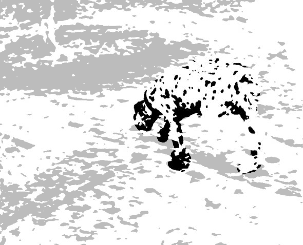
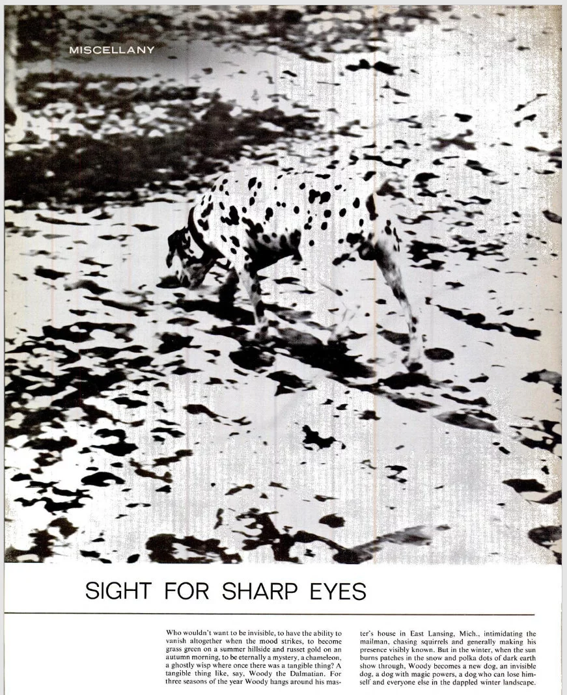

```{r setup, include=FALSE, message = F, warning = F}
knitr::opts_chunk$set(echo = FALSE, message = F, warning = F, error = F)
knitr::opts_chunk$set(dev.args=list(bg="transparent"))
library(tidyverse)
library(gridExtra)
```

## What do you see?

.center[

]
.bottom[Image source: https://www.moillusions.com/mysterious-dots-optical-illusion/]

---
## What do you see?

.center[

]

???

Vision, in general, involves a *lot* of unconscious pattern recognition. If we can harness that power, we can show people data in a way that doesn't require a lot of thought for them to engage with the data.

---
## It's not just an illusion - it's a photo

.center[

]

.bottom[Life Magazine, 19 Feb 1965]

---
## Why Graphics Matter

.large.center[Graphics are a form of .large.emph.cerulean[external cognition] that allow us to think about the .large.emph.red[data] rather than the .large.emph.gray[chart]]

--

<br/><br/>

.large.red[Good graphics take advantage of how the brain works]

- preattentive processing

- perceptual grouping

- awareness of visual limitations

---
class: inverse
## Example

```{r HR-diagram, message = F, warning = F, echo = F, fig.width = 8, fig.height = 5, out.width = "100%", dev = 'png'}
# download.file("https://github.com/astronexus/HYG-Database/blob/master/hygfull.csv?raw=true", destfile = "stars.csv")
stars <- readr::read_csv("stars.csv")

stars <- stars %>%
  mutate(Spectral.Class = str_extract(Spectrum, "^.") %>%
           str_to_upper() %>%
           factor(levels = c("O", "B", "A", "F", "G", "K", "M"), ordered = T),
         EarlyLate = str_extract(Spectrum, ".(\\d)") %>%
           str_replace_all("[A-z]", "") %>% as.numeric(),
         Temp = 4600*(1/(.92*ColorIndex + 1.7) + 1/(.92*ColorIndex) + 0.62)) %>%
  filter(!is.na(Spectral.Class) & !is.na(EarlyLate) & !is.na(Hip)) %>%
  arrange(Spectral.Class, EarlyLate) %>%
  mutate(SpectralClass2 = paste0(Spectral.Class, EarlyLate) %>% factor(., levels = unique(.)))

ggplot(data = filter(stars, Distance < 500)) + 
  # annotate(x = -.25, xend = .75, y = -2, yend = -6.5, arrow = arrow(ends = "both", length = unit(.1, "cm")), geom = "segment", color = "grey") + 
  annotate(x = 0.125, xend = 2, y = 4.25, yend = 4.25, arrow = arrow(ends = "both", length = unit(.1, "cm")), geom = "segment", color = "grey") + 
  geom_point(aes(x = ColorIndex, y = -AbsMag, color = Spectral.Class), alpha = .5) + 
  scale_x_continuous("B-V Color Index", breaks = c(0, .5, 1, 1.5, 2), labels = c("Hot  0.0       ", "0.5", "1.0", "1.5", "           2.0  Cool")) + 
  scale_y_continuous("Absolute Magnitude (Brightness)", breaks = c(-8, -4, 0, 4), labels = c(8, 4, 0, -4)) + 
  scale_color_manual("Spectral\nClass", values = c("#2E478C", "#426DB9", "#B5D7E3", "white", "#FAF685", "#E79027", "#DA281F")) + 
  annotate(x = .25, y = -5.5, label = "Dwarfs", geom = "text", angle = -25, color = "white") + 
  annotate(x = .5, y = -3.75, label = "Main Sequence", geom = "text", angle = -28) + 
  annotate(x = 1.125, y = 0, label = "Giants", geom = "text") + 
  annotate(x = 1, y = 4.5, label = "Supergiants", geom = "text", color = "white") +
  theme(panel.background = element_blank(), legend.key = element_blank(), 
        text = element_text(size = 18, color = "white"), 
        plot.background = element_blank()) + 
      theme(
        panel.grid.major = element_blank(), 
        panel.grid.minor = element_blank(),
        panel.background = element_rect(fill = "transparent",colour = NA),
        plot.background = element_rect(fill = "transparent",colour = NA),
        legend.background = element_rect(fill = "transparent", color = NA)
        ) +
  ggtitle("Hertzsprung-Russell Diagram") + 
  coord_cartesian(xlim = c(-.25, 2.25), ylim = c(-12, 7)) + 
  guides(color = guide_legend(override.aes = list(alpha = 1)))
```


???

This is a famous chart in astronomy - it shows the life cycle of a star, classifying it by its brightness and color. The interesting thing is that it wasn't originally intended to show the life cycle of a star - it was originaly intended to show the relationship between the two - and at the time, it wasn't known that the star's life cycle governed the relationship. But, when you look at the chart, it's very clear that there is a relationship, and stars can take several different paths through the "life cycle" depending on their type. 

Through the rest of this talk, we'll explore some of the features that make the HR diagram (and other good charts) effective.

---
## Spot the Difference

```{r preattentive1,echo=FALSE,include=T, fig.width=4, fig.height=4, out.width = "49.5%"}
set.seed(153253)
data <- data.frame(expand.grid(x=1:6, y=1:6), color=sample(c(1,2), 36, replace=TRUE))
data$x <- data$x+rnorm(36, 0, .25)
data$y <- data$y+rnorm(36, 0, .25)
suppressWarnings(library(ggplot2))
new_theme_empty <- theme_bw()
new_theme_empty$line <- element_blank()
# new_theme_empty$rect <- element_blank()
new_theme_empty$strip.text <- element_blank()
new_theme_empty$axis.text <- element_blank()
new_theme_empty$plot.title <- element_blank()
new_theme_empty$axis.title <- element_blank()
# new_theme_empty$plot.margin <- structure(c(0, 0, -1, -1), unit = "lines", valid.unit = 3L, class = "unit")

data$shape <- c(rep(2, 15), 1, rep(2,20))
library(scales)
qplot(data=data, x=x, y=y, color=factor(1, levels=c(1,2)), shape=factor(shape), size=I(5))+scale_shape_manual(guide="none", values=c(19, 15)) + scale_color_discrete(guide="none") + new_theme_empty

data$shape <- c(rep(2, 25), 1, rep(2,10))
qplot(data=data, x=x, y=y, color=factor(shape), shape=I(19), size=I(5))+scale_shape_manual(guide="none", values=c(19, 15)) + scale_color_discrete(guide="none") + new_theme_empty
```

---
## Spot the Difference

```{r preattentive2,echo=FALSE,include=T, fig.width=4, fig.height=4, out.width = "49.5%"}
set.seed(1532534)
data <- data.frame(expand.grid(x=1:6, y=1:6), color=sample(c(1,2), 36, replace=TRUE))
data$x <- data$x+rnorm(36, 0, .25)
data$y <- data$y+rnorm(36, 0, .25)
suppressWarnings(library(ggplot2))
new_theme_empty <- theme_bw()
new_theme_empty$line <- element_blank()
# new_theme_empty$rect <- element_blank()
new_theme_empty$strip.text <- element_blank()
new_theme_empty$axis.text <- element_blank()
new_theme_empty$plot.title <- element_blank()
new_theme_empty$axis.title <- element_blank()
# new_theme_empty$plot.margin <- structure(c(0, 0, -1, -1), unit = "lines", valid.unit = 3L, class = "unit")

data$shape <- data$color
qplot(data=data, x=x, y=y, color=factor(color), shape=factor(shape), size=I(5))+scale_shape_manual(guide="none", values=c(19, 15)) + scale_color_discrete(guide="none") + new_theme_empty


data$shape[1] <- if(data$shape[1]==2) 1 else 2
qplot(data=data, x=x, y=y, color=factor(color), shape=factor(shape), size=I(5))+scale_shape_manual(guide="none", values=c(19, 15)) + scale_color_discrete(guide="none") + new_theme_empty
```

---
## Preattentive perception 

- Occurs automatically (no effort)

- Color, shape, angle 

- Combinations of preattentive features require attention
    - Unless you double-encode    
    (use different features for the same variable)


<br/><br/>


.emph.center.cerulean.huge[Using preattentive features reduces the amount of work your viewer has to expend to understand your chart]

---
## What do you see?

gestalt images