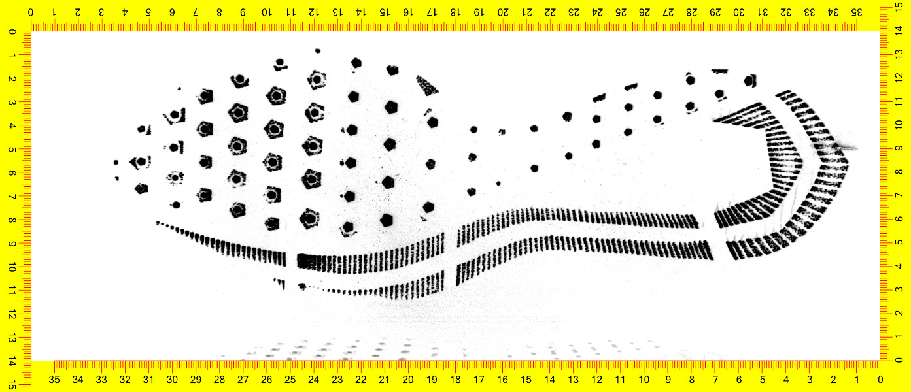
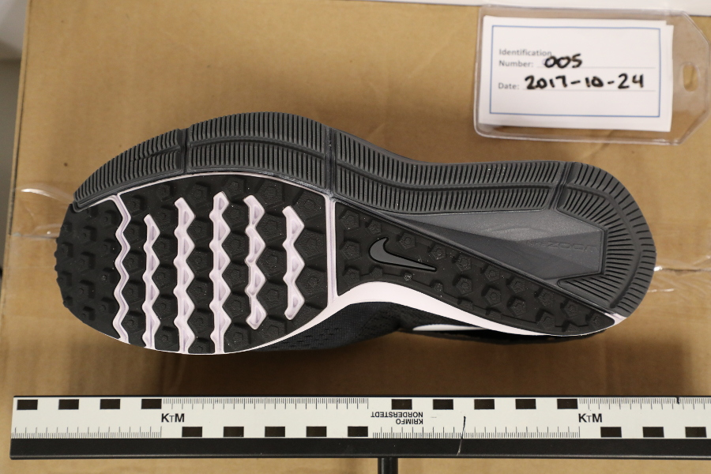
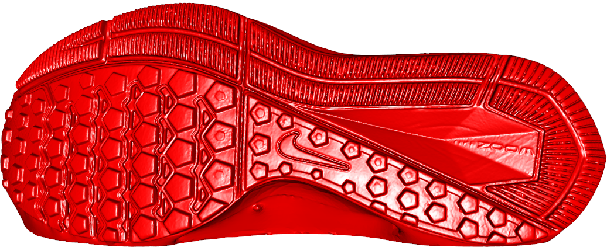
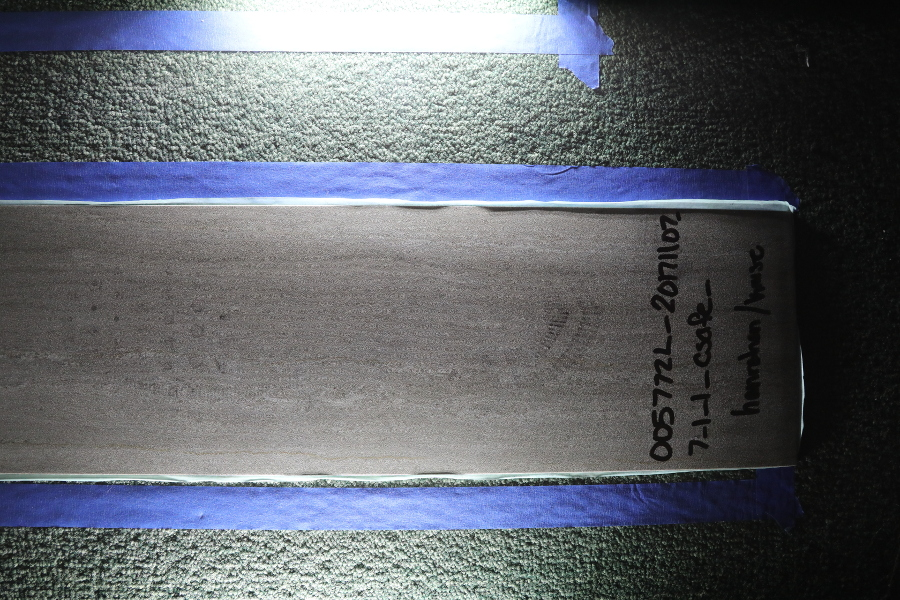
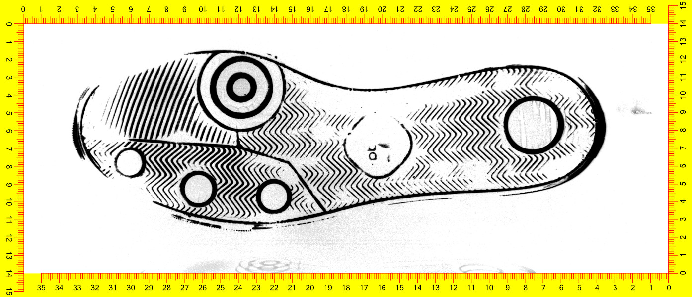
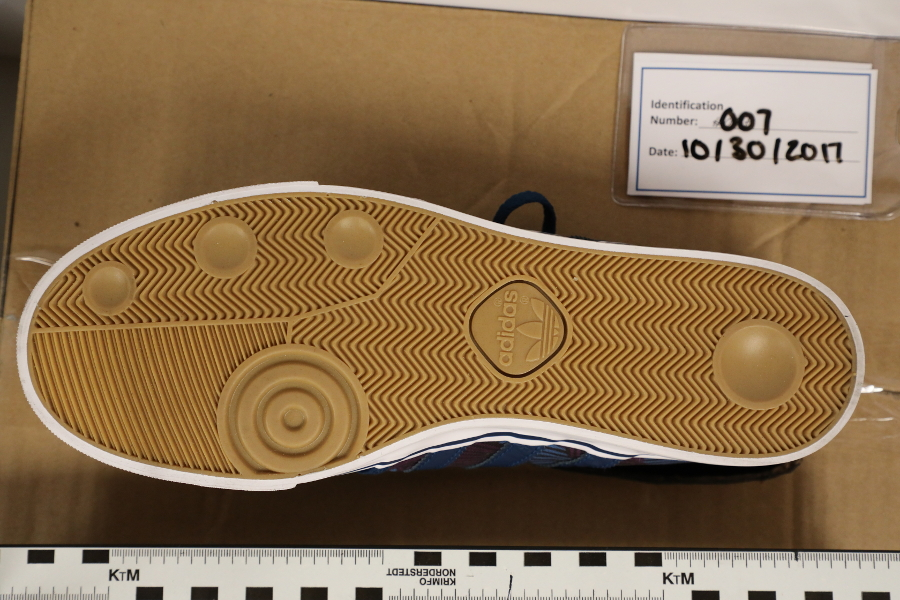
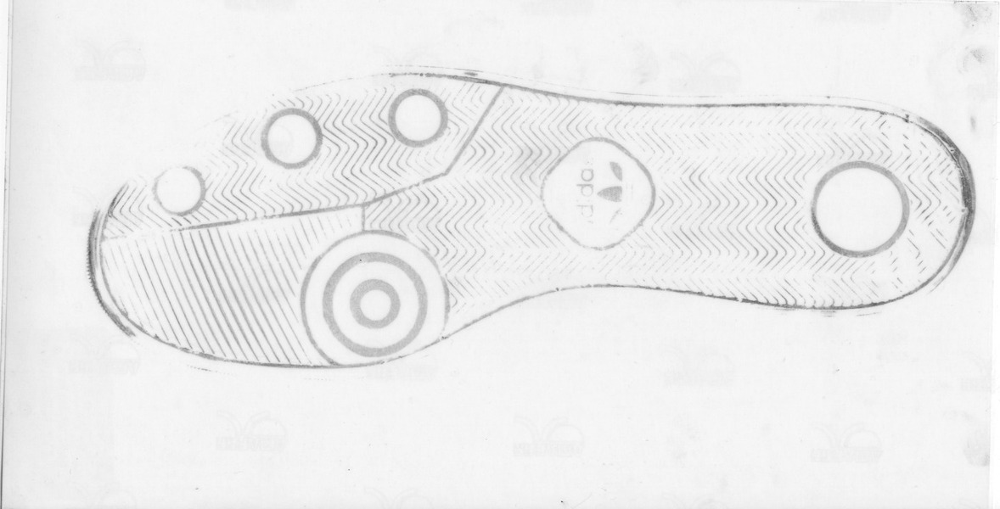
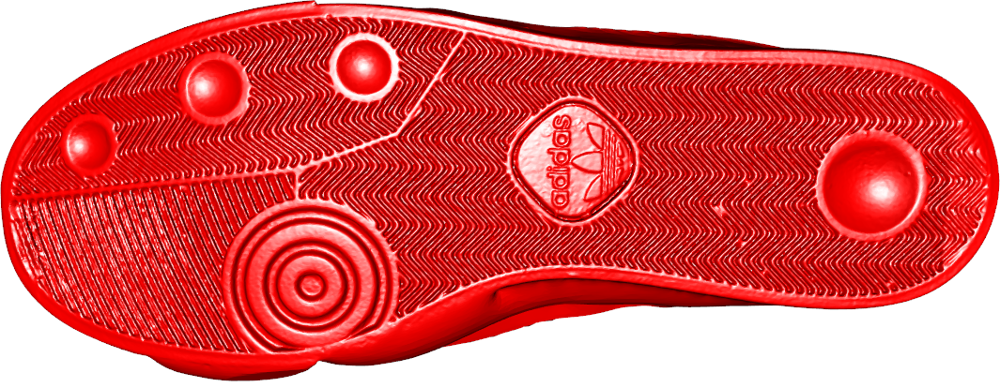

class: primary-blue
## A Brief Intro to Forensic Statistics

- Big challenge: Validate ad-hoc visual methods scientifically

- Unknowns: every shoe in the world, with every wear pattern possible, infinite potential for incidental damage

- Simpler questions: 

    - Can we distinguish shoes of the same make/model/size?
    
    - How do shoes accumulate damage over time?
    
    - What measurement methods are best?
    
    - Do lab methods translate to "real world" crime scenes?
    
???

Back in 2015, the National Institute for Standards and Technology created a center of excellence in forensic statistics, with the goal of doing basic research to hopefully add statistical foundations to forensic science. 

There was a lot of pressure to get things up off the ground quickly, which meant that suddenly a bunch of statisticians were working with types of data they'd really never messed with before. But data is data, right, and we were excited.

The problem in forensics is that forensic examiners were making statements like "This shoe made this print to the exclusion of all other shoes in the world", with the only evidence for that claim being the experience of the examiner. So one of the early identified issues that CSAFE tackled was data collection - generating databases for research purposes, to validate statistical methods that would be developed to match shoe prints and make probabilistic statements supported by data instead of personal experience.

Since we knew assembling a database of every shoe in the world was impossible (we're crazy, but not that crazy), we decided to start "small" - with a few questions that were seen as foundational to our ability to create algorithms to assess the statistical probability that two shoes matched - that's the holy grail. 

Starting small, incidentally, meant that we tried to answer all 4 of these questions at the same time.

---
class: secondary-blue
## Longitudinal Shoe Study

- 160 Pairs of shoes, each worn for ~6 months

- 2 shoe models with different patterns and sole materials
    - 4 half-sizes for each shoe model

- 7 different methods for imaging the shoes

- 3-4 different time points

<table width="100%">
<tr class="blank"><td></td><td></td><td></td><td></td><td></td><td>
</td></tr>
<tr class="blank"><td></td><td></td><td></td><td></td><td></td><td>
</td></tr>
</table>

???

So in collaboration with a group at NIST whose primary interest was metrology - how to measure things - we set this experiment up. We had 2D digital scans, 3D digital scans, the old-fashioned fingerprint powder and sticky film, and a few other methods that various forensic scientists wanted us to try. 

As you can imagine, this experiment was pretty expensive - 160 pairs of shoes, plus the measurement equipment, plus the lab workers to take all of the measurements. The experiment was designed and run by statisticians and people who measure things professionally - so there were extensive protocols for measurement developed, and we controlled things like whether pebbles were removed from the shoes before imaging, and what kind of socks the lab workers wore during data collection. 

---
class: primary-red
## Things Fall Apart ...

- Not enough play time with the collection instruments

--

- Modifying data collection procedures mid-experiment to account for helpful suggestions from collaborators

--

- Supplier changes - background and sticky film color don't matter, right?

--

- Analysis pipeline? It's just data, we can figure out how to analyze it later

.center[]

---
class:primary-cyan
## Epilogue

- 3 years after the study is completed, we're still struggling to build that analysis pipeline

- We've discovered that certain patterns of shoes make for easier analysis... but the Nike/Adidas models we originally picked aren't among them.

- It's very difficult to get a paper published describing the database without any actual analysis work to go with it

---
class:inverse-green,center
# Acknowledgements

<h3>Collaborators</h3>
<ul><li>Alicia Carriquiry<li>Guillermo Basulto-Elias<li>James Kruse<li>Soyoung Park</ul>

This work was partially funded by the Center for Statistics and Applications in Forensic Evidence (CSAFE) through Cooperative Agreement #70NANB15H176 between NIST and Iowa State University, which includes activities carried out at Carnegie Mellon University, University of California Irvine, and University of Virginia.
