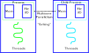
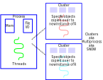

```{r setup, include=FALSE, message = F, warning = F}
knitr::opts_chunk$set(echo = FALSE, message = F, warning = F, error = F, dpi = 300)
knitr::opts_chunk$set(dev.args=list(bg="transparent"))
library(tidyverse)
library(gridExtra)
```

## Resources

.large[
- [Parallel Computing intro](https://nceas.github.io/oss-lessons/parallel-computing-in-r/parallel-computing-in-r.html) by Matt Jones

- [Parallel Computation](https://bookdown.org/rdpeng/rprogdatascience/parallel-computation.html) by Roger Peng

]

---
## Basic Definitions

| Concurrent | Parallel |
| :----------: | :----------: |
|  |  |
| Multiple tasks in progress at one time | Multiple tasks run simultaneously |
| `future` package | `parallel` package |


.bottom[Images from [angelaholdsworth.com](https://www.angelaholdsworth.com/wp-content/uploads/2014/11/Mom-Juggling-671x1024.jpg) and gocomics.com via [Bill Watterson](https://www.gocomics.com/calvinandhobbes/1990/01/11)]

---
## Basic Definitions

| Concurrent | Parallel |
| :----------: | :----------: |
|  |  |
| Multiple tasks in progress at one time | Multiple tasks run simultaneously |
| `future` package | `parallel` package |

.bottom[Images from [guru99.com](https://www.guru99.com/cpu-core-multicore-thread.html)]
---
## Hidden Parallelism

- Most statistical calculations use linear algebra libraries written in e.g. C or C++
    - BLAS (basic linear algebra subroutines) libraries

- These  libraries have versions that are parallel by default
    - No special code
    - parallel computing handled for you automatically
    
- Microsoft R Open provides these libraries
    - You can also compile R against e.g. [parallel AMD/Intel libraries, Accellerate (mac), or ATLAS](https://bookdown.org/rdpeng/rprogdatascience/parallel-computation.html#hidden-parallelism) 
    - see the R installation manual [BLAS](https://cran.r-project.org/doc/manuals/r-release/R-admin.html#BLAS) section
    
    
---
## Hidden Parallelism


[Speeds up certain tasks considerably](https://mran.microsoft.com/documents/rro/multithread) under the right circumstances

---
## Cores, Threads, Processes

.center[]

???

A thread is a job

A process is a set of one or more threads with some memory and file access

A core is the part of the computer that does the calculations

.bottom[Picture from https://medium.com/@tarunjain07/multi-vs-multi-cb9b0ec382ad]
---
## Cores, Threads, Processes

.center[]

.bottom[Picture from https://medium.com/@tarunjain07/multi-vs-multi-cb9b0ec382ad]

???

Some processors have hyper-threading - so a computer core can handle multiple "threads" at the same time. This is optimized on the processor level, and you generally don't have a lot of control over it other than being aware of how many parallel jobs you can assign to your machine.

---
## Forking and Clustering

UNIX-based operating systems allow "forking" processes



- Entire R session is copied over (lazily)

- If you don't overwrite variables, this is fast (nothing actually copied)

- Spawns many different "child" processes, each theoretically assigned its own core


---
## Forking 

```{r, echo = T}
library(parallel)
detectCores()

r <- mclapply(1:10,  
              ## Do nothing for 10 seconds
              function(i) { Sys.sleep(10) }, 
              ## Split this job across 10 cores
              mc.cores = 10)      

```


---
## Forking and Clutering

Windows doesn't allow forking. On Windows, you have to use a cluster. 

.center.img75[]

- Explicitly copy data to/from clusters (takes time + memory)


---
## "Embarrassingly Parallel"

- Multiple independent pieces of a problem are executed simultaneously

```{r}
library(tidyverse)
library(parallel)

data(txhousing)
txhousing %>% group_by(city, year) %>% 
  summarize(total_volume = sum(volume))


```