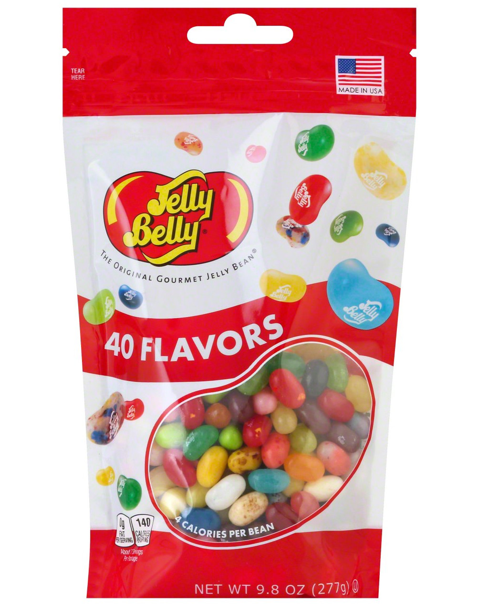
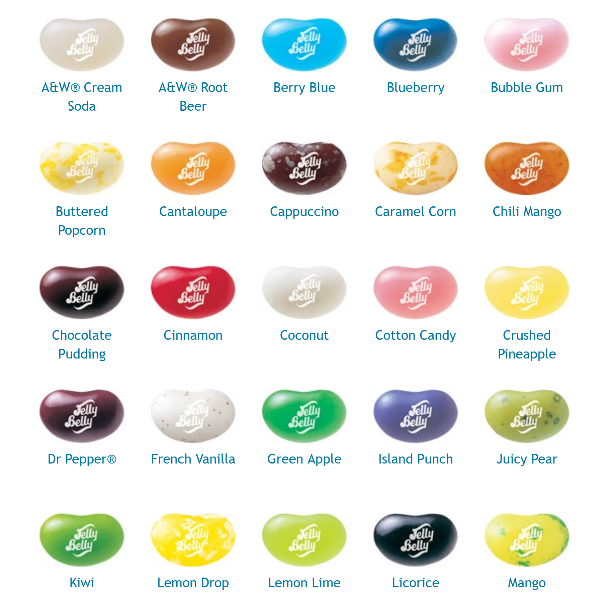
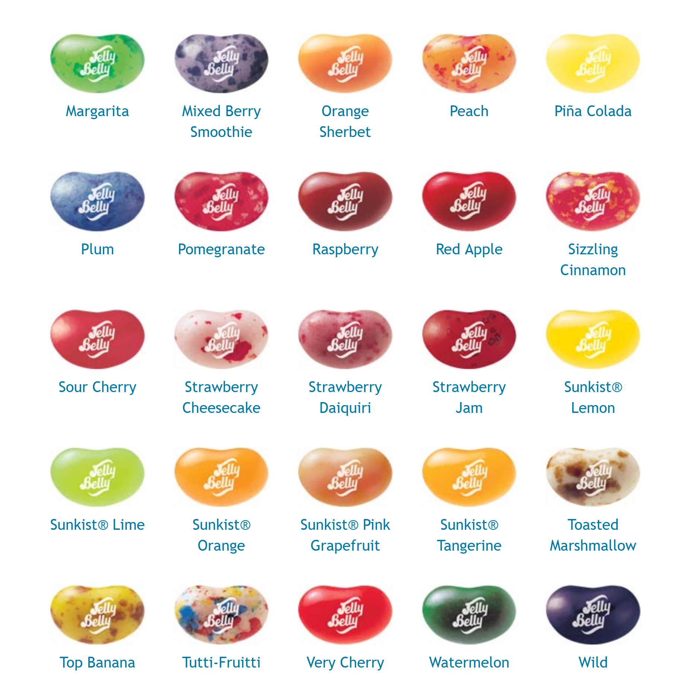
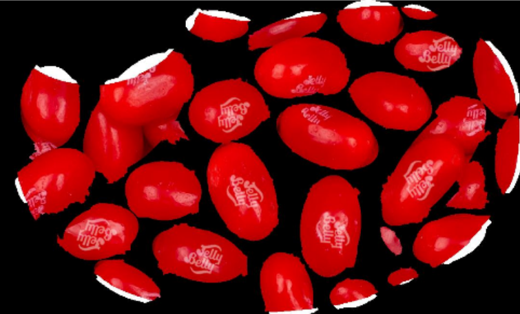
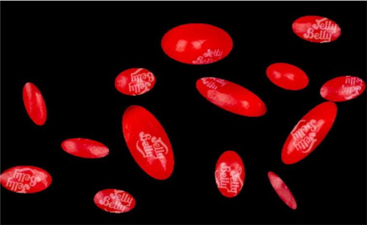
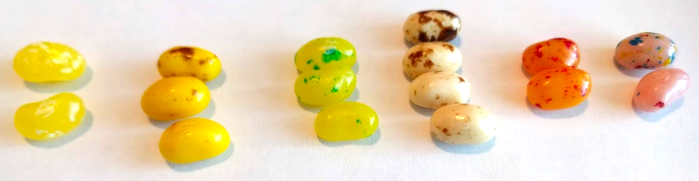

```{r setup, include=FALSE}
knitr::opts_chunk$set(echo = F, dpi = 300, message = F, warning = F)
options(htmltools.dir.version = FALSE)
```


```{r, include = F, eval = T}
library(tidyverse)
clean_file_name <- function(x) {
  basename(x) %>% str_remove("\\..*?$") %>% str_remove_all("[^[A-z0-9_]]")
}

img_modal <- function(src, alt = "", id = clean_file_name(src), other = "") {
  
  other_arg <- paste0("'", as.character(other), "'") %>%
    paste(names(other), ., sep = "=") %>%
    paste(collapse = " ")
  
  js <- glue::glue("<script>
        /* Get the modal*/
          var modal{id} = document.getElementById('modal{id}');
        /* Get the image and insert it inside the modal - use its 'alt' text as a caption*/
          var img{id} = document.getElementById('img{id}');
          var modalImg{id} = document.getElementById('imgmodal{id}');
          var captionText{id} = document.getElementById('caption{id}');
          img{id}.onclick = function(){{
            modal{id}.style.display = 'block';
            modalImg{id}.src = this.src;
            captionText{id}.innerHTML = this.alt;
          }}
          /* When the user clicks on the modalImg, close it*/
          modalImg{id}.onclick = function() {{
            modal{id}.style.display = 'none';
          }}
</script>")
  
  html <- glue::glue(
     " <!-- Trigger the Modal -->


<!-- The Modal -->
<div id='modal{id}' class='modal'>

  <!-- Modal Content (The Image) -->
  

  <!-- Modal Caption (Image Text) -->
  <div id='caption{id}' class='modal-caption'></div>
</div>
"
  )
  write(js, file = "js-addins.html", append = T)
  return(html)
}

# Clean the file out at the start of the compilation
write("", file = "js-addins.html")
```

class:inverse,middle,center
# Computer Vision, Machine Learning, and... Jellybeans?
## Ved Piyush and Susan Vanderplas<br/>2020-04-17

---
## Christmas Turns into Data Collection
.pull-left[

].pull-right[
Initial Observations

There are a lot of [crazy](https://sweets.seriouseats.com/2012/03/the-serious-eats-field-guide-to-jelly-belly-identification-slideshow.html) [jellybean hobbyists](http://www.waynesthisandthat.com/How%20To%20Sort%20Jelly%20Belly%20Jelly%20Beans.html) on the internet


Not all mistakes are equally consequential
  - Cinnamon / Sizzling Cinnamon, Lemon Lime / Sunkist Lime, Pina Colada / Crushed Pineapple
  - Cinnamon / Very Cherry 
  - Watermelon / Chocolate Pudding

Even people with good color vision have some issues
]

---
## Flavor Headaches

.pull-left[

].pull-right[

]

---
class:middle,inverse,center
# Attempt 1
### (Timeline: Christmas Day - mid-February)

---
## How to Collect Data?

.left-column[

]
.right-column[
- Take pictures of each bean in the 40-flavor bag
  1. immediately taste the bean
  2. save the picture with the proper name
  3. hope I can differentiate between Tangerine/Orange, Very Cherry/Sour Cherry
  4. separate bean from background
  
  ... too much work
  
- Scrape labeled images off the web
  1. Mask non-jellybean information (automatically?)
  2. Separate individual beans into different images


]


---
## Image Processing (Ideally)

1. Mask out white background and 10 pound bulk label

2. Threshold remaining area w/ adaptive threshold - get only top area of the bean

3. "Clean" thresholded image to get separate regions, each roughly corresponding to a bean

4. Compute features for each bean

---
## Image Processing (Reality)

1. Mask out white background and 10 pound bulk label

2. Threshold using adaptive threshold

  a. Discover that adaptive thresholds require tuning parameters that are different for each color bean
  
  b. Cry
  
3. Read tutorials on various image segmentation methods

4. Discover these tutorials are mostly meant for images that are rectangular, not masked regions of irregular shape

5. Bang head on desk...

6. Resort to Python

---
## Image Processing Steps

.pull-left[
1. Watershed segmentation or Adaptive Thresholding (OpenCV)

2. "Clean" image to get separate regions

3. Fit ellipses to the separated regions to get better edge definition

  - necessary because of speckled beans, JellyBelly label, and "shine" glare 
  
4. Compute features for each bean
].pull-right[
Watershed:<br/>

Adaptive Thresholding:<br/>


]


---
## Important Characteristics

- Overall color

```{r results='asis', echo = F, include = T}
i1 <- img_modal(src = "all_flavors/Red_Apple.png", alt = "Red Apple", other=list(width="15%"))
i2 <- img_modal(src = "all_flavors/Cantaloupe.png", alt = "Cantaloupe", other=list(width="15%"))
i3 <- img_modal(src = "all_flavors/Lemon.png", alt = "Lemon", other=list(width="15%"))
i4 <- img_modal(src = "all_flavors/Kiwi.png", alt = "Kiwi", other=list(width="15%"))
i5 <- img_modal(src = "all_flavors/Blueberry.png", alt = "Blueberry", other=list(width="15%"))
i6 <- img_modal(src = "all_flavors/Island_Punch.png", alt = "Island Punch", other=list(width="15%"))

c(str_split(i1, "\\n", simplify = T)[1:2],
  str_split(i2, "\\n", simplify = T)[1:2],
  str_split(i3, "\\n", simplify = T)[1:2],
  str_split(i4, "\\n", simplify = T)[1:2],
  str_split(i5, "\\n", simplify = T)[1:2],
  str_split(i6, "\\n", simplify = T)[1:2],
  str_split(i1, "\\n", simplify = T)[3:12],
  str_split(i2, "\\n", simplify = T)[3:12],
  str_split(i3, "\\n", simplify = T)[3:12],
  str_split(i4, "\\n", simplify = T)[3:12],
  str_split(i5, "\\n", simplify = T)[3:12],
  str_split(i6, "\\n", simplify = T)[3:12]) %>% paste(collapse = "\n") %>% cat()

```

--

- Speckles?


```{r results='asis', echo = F, include = T}
i1 <- img_modal(src = "all_flavors/Sizzling_Cinnamon.png", alt = "Sizzling Cinnamon", other=list(width="15%"))
i2 <- img_modal(src = "all_flavors/Pomegranate.png", alt = "Pomegranate", other=list(width="15%"))
i3 <- img_modal(src = "all_flavors/Strawberry_Jam.png", alt = "Strawberry Jam", other=list(width="15%"))
i4 <- img_modal(src = "all_flavors/Cinnamon.png", alt = "Cinnamon", other=list(width="15%"))
i5 <- img_modal(src = "all_flavors/Sour_Cherry.png", alt = "Sour Cherry", other=list(width="15%"))
i6 <- img_modal(src = "all_flavors/Raspberry.png", alt = "Raspberry", other=list(width="15%"))

c(str_split(i1, "\\n", simplify = T)[1:2],
  str_split(i4, "\\n", simplify = T)[1:2],
  str_split(i2, "\\n", simplify = T)[1:2],
  str_split(i5, "\\n", simplify = T)[1:2],
  str_split(i3, "\\n", simplify = T)[1:2],
  str_split(i6, "\\n", simplify = T)[1:2],
  str_split(i1, "\\n", simplify = T)[3:12],
  str_split(i4, "\\n", simplify = T)[3:12],
  str_split(i2, "\\n", simplify = T)[3:12],
  str_split(i5, "\\n", simplify = T)[3:12],
  str_split(i3, "\\n", simplify = T)[3:12],
  str_split(i6, "\\n", simplify = T)[3:12]) %>% paste(collapse = "\n") %>% cat()

```

--

- Speckle size

```{r results='asis', echo = F, include = T}
i1 <- img_modal(src = "all_flavors/Margarita.png", alt = "Margarita", other=list(width="15%"))
i2 <- img_modal(src = "all_flavors/Mango.png", alt = "Mango", other=list(width="15%"))
i3 <- img_modal(src = "all_flavors/Lemon_Drop.png", alt = "Lemon Drop", other=list(width="15%"))
i4 <- img_modal(src = "all_flavors/Buttered_Popcorn.png", alt = "Buttered Popcorn", other=list(width="15%"))
i5 <- img_modal(src = "all_flavors/Caramel_Corn.png", alt = "Caramel Corn", other=list(width="15%"))
i6 <- img_modal(src = "all_flavors/French_Vanilla.png", alt = "French Vanilla", other=list(width="15%"))

c(str_split(i1, "\\n", simplify = T)[1:2],
  str_split(i2, "\\n", simplify = T)[1:2],
  str_split(i3, "\\n", simplify = T)[1:2],
  str_split(i4, "\\n", simplify = T)[1:2],
  str_split(i5, "\\n", simplify = T)[1:2],
  str_split(i6, "\\n", simplify = T)[1:2],
  str_split(i1, "\\n", simplify = T)[3:12],
  str_split(i2, "\\n", simplify = T)[3:12],
  str_split(i3, "\\n", simplify = T)[3:12],
  str_split(i4, "\\n", simplify = T)[3:12],
  str_split(i5, "\\n", simplify = T)[3:12],
  str_split(i6, "\\n", simplify = T)[3:12]) %>% paste(collapse = "\n") %>% cat()

```

--

- Speckle Color(s)

```{r results='asis', echo = F, include = T}
i1 <- img_modal(src = "all_flavors/Strawberry_Cheesecake.png", alt = "Strawberry Cheesecake", other=list(width="15%"))
i2 <- img_modal(src = "all_flavors/Tutti_Fruitti.png", alt = "Tutti Fruitti", other=list(width="15%"))
i3 <- img_modal(src = "all_flavors/Chili_Mango.png", alt = "Chili Mango", other=list(width="15%"))
i4 <- img_modal(src = "all_flavors/Top_Banana.png", alt = "Top Banana", other=list(width="15%"))
i5 <- img_modal(src = "all_flavors/Plum.png", alt = "Plum", other=list(width="15%"))
i6 <- img_modal(src = "all_flavors/Cappuchino.png", alt = "Cappuchino", other=list(width="15%"))

c(str_split(i1, "\\n", simplify = T)[1:2],
  str_split(i2, "\\n", simplify = T)[1:2],
  str_split(i3, "\\n", simplify = T)[1:2],
  str_split(i4, "\\n", simplify = T)[1:2],
  str_split(i5, "\\n", simplify = T)[1:2],
  str_split(i6, "\\n", simplify = T)[1:2],
  str_split(i1, "\\n", simplify = T)[3:12],
  str_split(i2, "\\n", simplify = T)[3:12],
  str_split(i3, "\\n", simplify = T)[3:12],
  str_split(i4, "\\n", simplify = T)[3:12],
  str_split(i5, "\\n", simplify = T)[3:12],
  str_split(i6, "\\n", simplify = T)[3:12]) %>% paste(collapse = "\n") %>% cat()

```

---
## Important Characteristics


- Speckle frequency



--

- Opacity

```{r results='asis', echo = F, include = T}
i1 <- img_modal(src = "translucent/pink.png", alt = "Cotton Candy and Bubble Gum", other=list(width="15%"))
i2 <- img_modal(src = "translucent/orange.png", alt = "Orange and Orange Sherbet", other=list(width="15%"))
i3 <- img_modal(src = "translucent/yellow.png", alt = "Lemon and Crushed Pineapple", other=list(width="15%"))
i4 <- img_modal(src = "translucent/green.png", alt = "Kiwi and Lime", other=list(width="15%"))
i5 <- img_modal(src = "translucent/white.png", alt = "Cream Soda and Coconut", other=list(width="15%"))
i6 <- img_modal(src = "translucent/black.png", alt = "Wildberry and Licorice", other=list(width="15%"))

c(str_split(i1, "\\n", simplify = T)[1:2],
  str_split(i2, "\\n", simplify = T)[1:2],
  str_split(i3, "\\n", simplify = T)[1:2],
  str_split(i4, "\\n", simplify = T)[1:2],
  str_split(i5, "\\n", simplify = T)[1:2],
  str_split(i6, "\\n", simplify = T)[1:2],
  str_split(i1, "\\n", simplify = T)[3:12],
  str_split(i2, "\\n", simplify = T)[3:12],
  str_split(i3, "\\n", simplify = T)[3:12],
  str_split(i4, "\\n", simplify = T)[3:12],
  str_split(i5, "\\n", simplify = T)[3:12],
  str_split(i6, "\\n", simplify = T)[3:12]) %>% paste(collapse = "\n") %>% cat()

```

---
background-image: url("desk_photo.png")
background-size: cover
class:inverse,center
## My desk while making this presentation...
### (I didn't eat a single one)