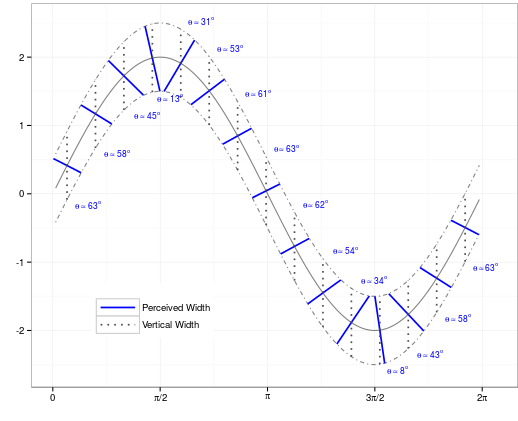

```{r setup, include=FALSE}
options(htmltools.dir.version = FALSE)
```

class: center,inverse
## How many dots are there?


---
class: center,inverse
## What about now?


---
class: center, inverse
## What shape is it?

<iframe width="740" height="442" src="https://www.youtube.com/embed/KtA6u1HIqbg" frameborder="0" allow="accelerometer; autoplay; encrypted-media; gyroscope; picture-in-picture" allowfullscreen></iframe>

???

We like right angles and order. Our brains will impose order if there is any ambiguity in the information provided.

---
class: center, inverse
## Context matters

<iframe width="740" height="442" src="https://www.youtube.com/embed/pNe6fsaCVtI" frameborder="0" allow="accelerometer; autoplay; encrypted-media; gyroscope; picture-in-picture" allowfullscreen></iframe>

???

This is an artifact of two different gestalt effects: gestalt proximity/similarity (grouping the dots into a circle/unified whole) and common fate (things that move together belong together)

It's simpler to see the image as a rotating circle of dots (or a square, or ... ) than it is to see them as single dots moving along a diameter.

---
class: center
## Which orange dot is bigger?


???

Every judgement you make is relative (implicitly or explicitly) to the context. 

---
class: center
## Which is darker, A or B?


???

A and B are really and truly the same color. 

---
class: center
## Which is darker, A or B?


---
class: center
## Which is longer?


???

This illusion leverages depth perception - lines that are the same length but further away are obviously longer

---
class: middle, center
# So can you trust your eyes?

--

## Probably not

---
class: middle, center
# What does this have to do with graphics? Or statistics?

---
class: center
## Describe the variability of this data


---
class: center
## Describe the variability of this data


---
class: center
## The Sine Illusion

link: https://bigfoot.csafe.iastate.edu:442/srvander/SineIllusionDemo/


---
class: center
## The Sine Illusion

```{r echo = F}
x <- seq(0, 2*pi, length=42)[2:41]
data <- do.call("rbind", lapply(seq(-.5, .5, 1), function(i) data.frame(x=x, y=2*sin(x), z=i)))

data.persp <- reshape2::acast(data, x~z, value.var="y")
x <- sort(unique(data$x))
y <- sort(unique(data$y))
z <- sort(unique(data$z))


linedata <- data.frame(x=c(0, 0, 2*pi, 2*pi), y=c(5, 0, 5, 0), z=seq(-.5, .5, 1))
xline <- linedata$x
yline <- linedata$y
zline <- linedata$z

par.settings <- par()
par(mfrow=c(1, 2), mar=c(0, 0, 0, 0))

p1 <- persp(x, z, data.persp,  xlab="", ylab="", zlab="", theta=0, phi=45, border="black", shade=.35, col="white", xlim=c(-pi/12, 2*pi+pi/12), ylim=c(-1.75, 1.75), scale=FALSE, box=FALSE, expand=3/pi, d=2) # , ltheta=0, lphi=-15
lines(trans3d(x=xline[1:2], y=yline[1:2], z=zline[1:2], p1), lty=2)
lines(trans3d(x=xline[3:4], y=yline[3:4], z=zline[3:4], p1), lty=2)
points(trans3d(x=xline[c(1,3)], y=yline[c(1,3)], z=zline[c(1,3)], p1), pch=2, cex=.75)
text(trans3d(x=pi, y=max(yline), z=0, p1), label="Finite Vanishing Point")
text(trans3d(x=pi, y=min(yline), z=-pi, p1), label="3D version")


linedata <- data.frame(x=c(0, 0, 2*pi, 2*pi), y=c(4, 0, 4, 0), z=seq(-.5, .5, 1))
xline <- linedata$x
yline <- linedata$y
zline <- linedata$z

p2 <- persp(x, z, data.persp, xlab="", ylab="", zlab="", theta=0, phi=45, border="black", shade=.35, col="white", xlim=c(-pi/12, 2*pi+pi/12), ylim=c(-1.75, 1.75), scale=FALSE, box=FALSE, d=20, expand=3/(pi)) # , ltheta=0, lphi=-15
lines(trans3d(x=xline[1:2], y=yline[1:2], z=zline[1:2], p2), lty=2)
lines(trans3d(x=xline[3:4], y=yline[3:4], z=zline[3:4], p2), lty=2)
points(trans3d(x=xline[c(1,3)], y=yline[c(1,3)], z=zline[c(1,3)], p2), pch=2, cex=.75)
text(trans3d(x=pi, y=max(yline)-.25, z=0, p2), label="Near-infinite Vanishing Point")
text(trans3d(x=pi, y=min(yline), z=-pi, p2), label="Sine Illusion + Shading")
 
```

---
class: center
## Geometry



---
class: center
## Fixing the Illusion


---
class: center
## Fixing the Illusion


---
class: center
## Fixing the Illusion


---
class: center
## Fixing the Illusion


---
class: center,middle,inverse
## Why the visual system matters

---
## What size are the bars?

---
## What area are the slices?


---
class: center, inverse
## This one is a real trip

<iframe width="740" height="442" src="https://www.youtube.com/embed/tdjUbToLeng" frameborder="0" allow="accelerometer; autoplay; encrypted-media; gyroscope; picture-in-picture" allowfullscreen></iframe>