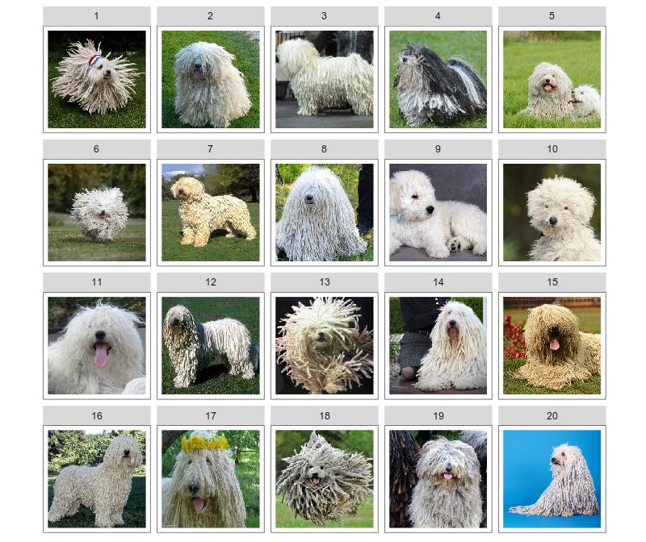
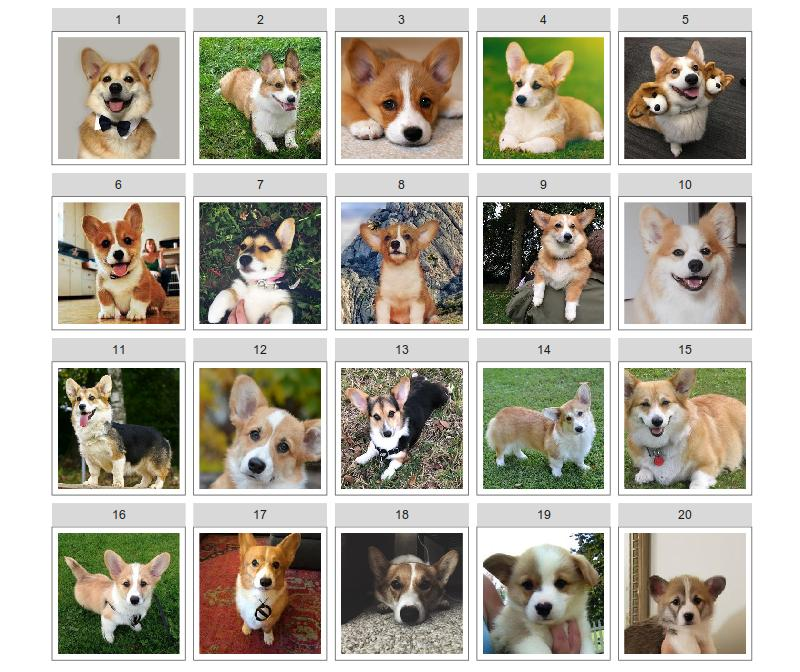
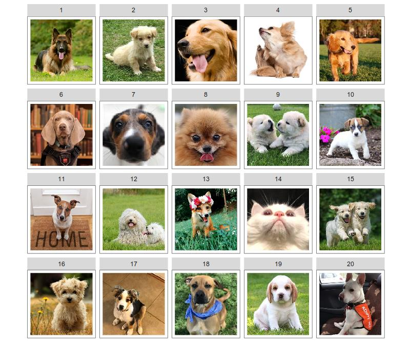
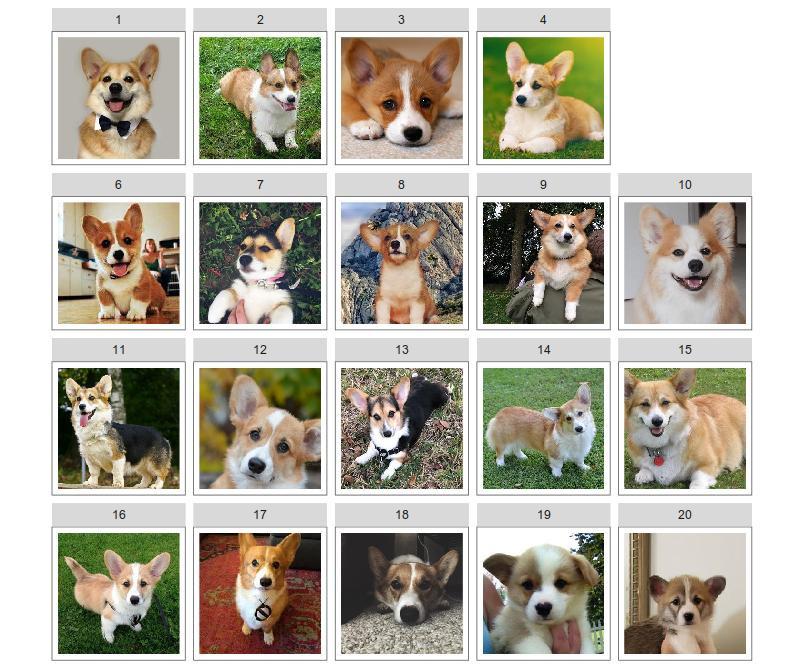
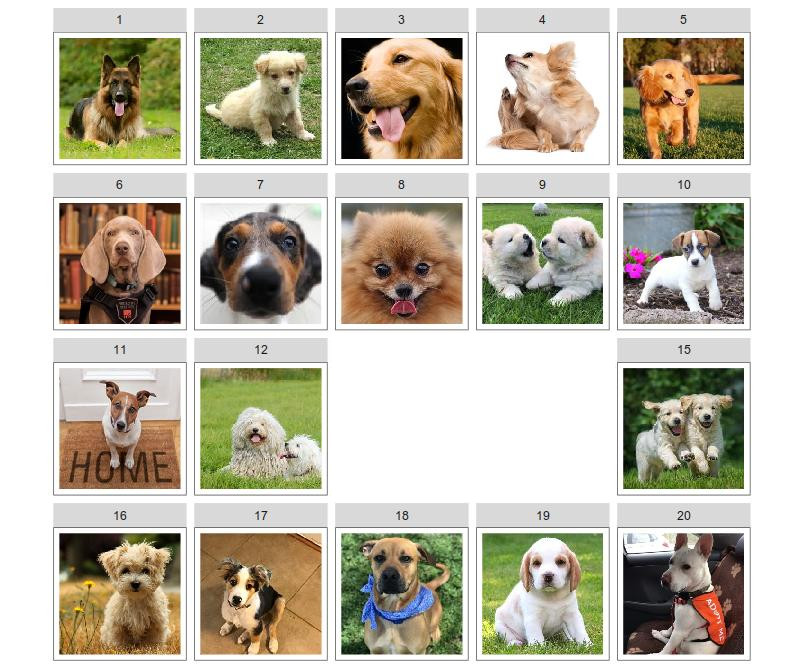
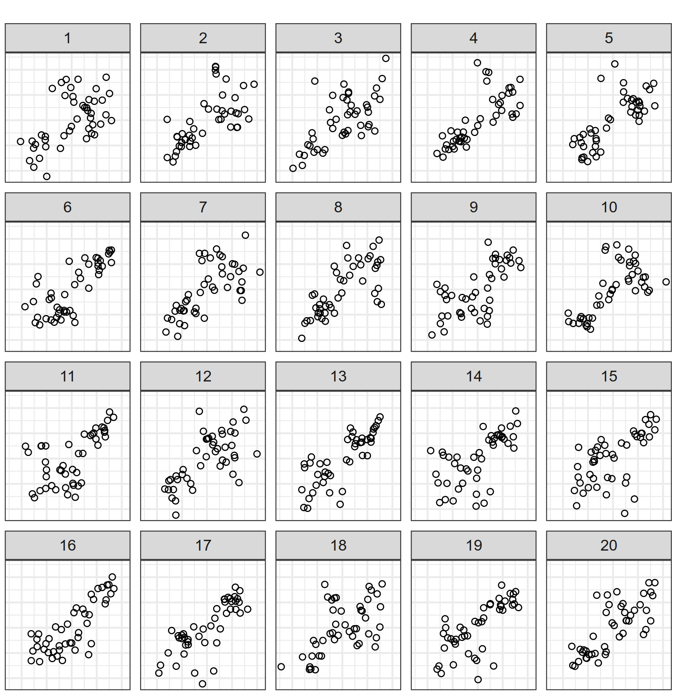
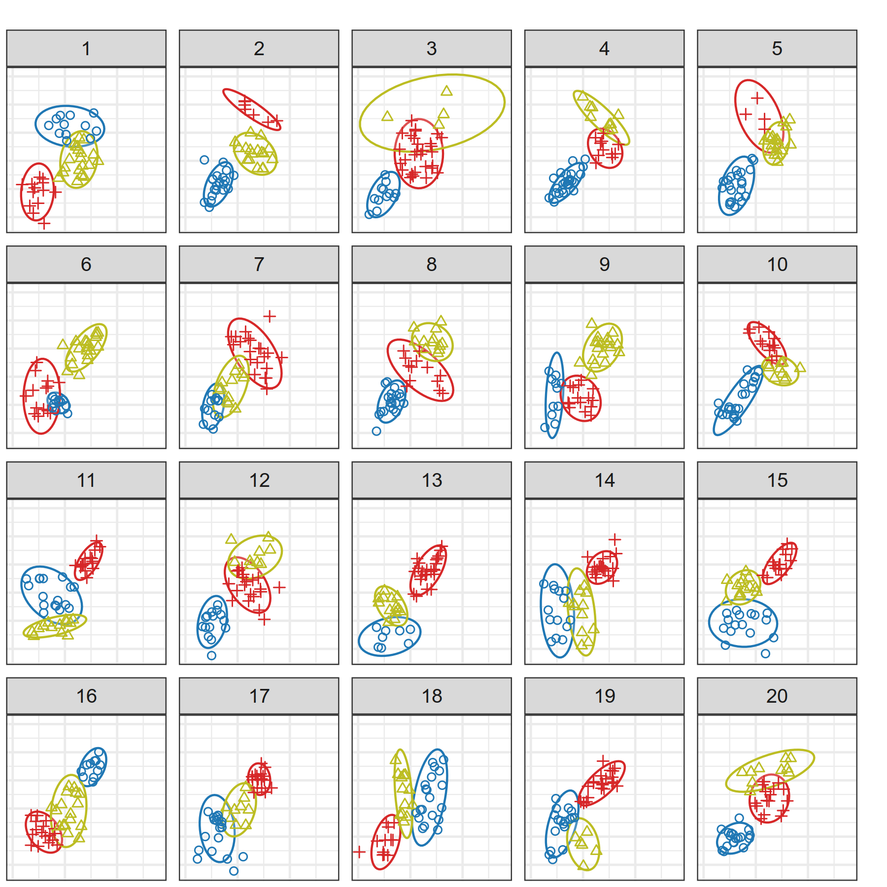

```{r setup, include=FALSE}
options(htmltools.dir.version = FALSE)
knitr::opts_chunk$set(echo = F, fig.width = 8, fig.height = 8, dpi = 300)
library(tidyverse)
source("code/photo_lineup.R")
```

# Outline

1. Types of Lineups

2. Modeling Lineup Panel Selection

3. Visual P-values

4. Informative Null Panels

5. Implications for Visual Inference

???

Today, I'm going to discuss modeling the process of selecting a panel from a lineup. I'll start by explaining the hierarchical model that we're using for plot selection. Then I'll discuss the p-values and Bayes Factors which can be computed with experimental data, explaining why the published approach for computing lineup p-values doesn't match what we know about human perception. I'll present a way to adjust the calculated p-values by using the Bayesian model to inform the Frequentist p-value calculation. Finally, I'll discuss how this research might be used to modify the visual inference paradigm to produce more accurate results.

---
class: inverse, middle,center
# Types of Lineups

???

Let's talk about types of lineups. 
Throughout this talk, I'm going to use lineups with animals when we're discussing concepts (and because who doesn't like puppies?). 

```{r lineup-puppy, eval = F, include = F, fig.height = 5, fig.width = 4.2, dpi = 300, out.width = "100%"}
set.seed(50293403)

corgs <- list.files("aww", pattern = "corg\\d{1,2}", full.names = T) %>% 
  purrr::map(imager::load.image)
corg_3h <- list.files("aww", pattern = "3headedcorg", full.names = T) %>% 
  purrr::map(imager::load.image)
dogs <- list.files("aww", pattern = "dog\\d{1,2}", full.names = T) %>% 
  purrr::map(imager::load.image)
fox <- list.files("aww", pattern = "fox", full.names = T) %>% 
  purrr::map(imager::load.image)
cat <- list.files("aww", pattern = "cat", full.names = T) %>% 
  purrr::map(imager::load.image)
puli <- list.files("aww", pattern = "puli\\d{1,2}", full.names = T) %>%
  purrr::map(imager::load.image)

# corg_stuffed <- c(list.files("aww", pattern = "corg1?\\d\\.", full.names = T), 
#                   list.files("aww", pattern = "3headedcorg", full.names = T))
lineup_corg_3h <- c(corgs[1:19], corg_3h)
lineup_corg_3h %>% photo_lineup_prep() #%>% image_lineup()
# ggsave("corg-lineup-3head_5.jpg", dpi = 100, width = 8, height = 8/5*4.2)


# corg_null <- c(list.files("aww", pattern = "corg\\d{1,2}\\.", full.names = T))
corgs %>% photo_lineup_prep() #%>% image_lineup()
# ggsave("corg-null_0.jpg", dpi = 100, width = 8, height = 8/5*4.2)


# dog_null <- c(list.files("aww", pattern = "dog\\d{1,2}\\.", full.names = T))
dogs %>% photo_lineup_prep() #%>% image_lineup()
# ggsave("dog-null_0.jpg", dpi = 100, width = 8, height = 8/5*4.2)


# dog_fox <- c(list.files("aww", pattern = "dog1?\\d\\.", full.names = T),
#              list.files("aww", pattern = "fox", full.names = T))
dog_fox <- c(dogs[1:19], fox)
dog_fox %>% photo_lineup_prep() #%>% image_lineup()
# ggsave("dog-fox_3.jpg", dpi = 100, width = 8, height = 8/5*4.2)


# dog_cat <- c(list.files("aww", pattern = "dog1?\\d\\.", full.names = T),
#              list.files("aww", pattern = "cat", full.names = T))
dog_cat <- c(dogs[1:19], cat)
dog_cat %>% photo_lineup_prep() #%>% image_lineup()
# ggsave("lineups/dog-cat_7.jpg", dpi = 100, width = 8, height = 8/5*4.2)

dog_2target <- c(dogs[1:18], cat, fox)
dog_2target %>% photo_lineup_prep() #%>% image_lineup()
# ggsave("lineups/dog-2-target_13_14.jpg", dpi = 100, width = 8, height = 8/5*4.2)

puli_cat <- c(puli[1:19], cat)
puli_cat %>% photo_lineup_prep() #%>% image_lineup()
# ggsave("lineups/puli-cat_1.jpg", dpi = 100, width = 8, height = 8/5*4.2)

puli %>% photo_lineup_prep() #%>% image_lineup()
# ggsave("lineups/puli-null_0.jpg", dpi = 100, width = 8, height = 8/5*4.2)
```

---

# Types of Lineups
.right-column[

]
--
.left-column[.middle[
<br/><br/>
<br/><br/>
__Null Lineup__     
(AKA Rorshach Lineup)    


Consists entirely of null plots
]]
 
???
Which panel is different?

In a null lineup, all of the plots are drawn from the same null distribution: in this case, we have a lineup consisting of 20 komondor pictures. The dogs aren't all the same, and we'd expect that one or two panels might be selected more frequently even though all of the panels are from the same distribution, because we're very good at picking out differences between sets of things. Our brains were optimized to separate "predator" from "nature scene", and we apply that same discriminative ability to less threatening stimuli.

---

# Types of Lineups
.right-column[

]
--
.left-column[.middle[
<br/><br/><br/><br/>
__Standard__    
Lineup

One target plot
]]

???
Which panel is different?

In a standard lineup, one of the panels shows real data and the rest of the panels show null data, that is, data generated from the null distribution. In this case, panel 5 - the corgi has an extra two (stuffed) heads. 


---

# Types of Lineups
.right-column[

]
--
.left-column[
<br/><br/><br/><br/>
__Two-Target__ Lineups

Head-to-head comparisons of two models

Null plots from a third and/or mixture distribution.
]

???
Which panel is different?

In a two-target lineup, the goal is to determine which target is more visually salient. Here, we have dogs for the null plots, and a fox and a cat for the two different "models". The cat is quite a bit more salient than the fox. 

---
class:inverse,center,middle
# Modeling Lineup Panel Selection

---

# Modeling Lineup Panel Selection

- $m$ panel lineup with $m_0$ null plots<br><br>
- Panel selection probabilities $\displaystyle\theta_1, ..., \theta_m\;\;\text{and}\;\;\sum_{i=1}^m \theta_i = 1$
- $K$ evaluations resulting in panel selection counts $c_1, ..., c_m$,     
where $\displaystyle K = \sum_{i=1}^m c_i$

???


To start, let's define some terminology. Suppose we have an $m$ panel lineup, with $m_0$ null plots (usually, $m = 20$ and $m_0 = 19$, but I've done studies where $m_0 = 18$). A participant would select panel $i$ with probability $\theta_i$, where $\sum\theta_i = 1$. The lineup is evaluated by $K$ participants, who select panels with frequency $c$. 

--
<br/><br/><br/><br/>
$$\Large\displaystyle\vec\theta \sim \text{Dirichlet}(\alpha) \;\;\;\text{  where  }\;\;\;\alpha = \alpha_1 = \cdots = \alpha_m$$

$$\Large\vec{c}\sim\text{Multinomial}(\vec{\theta}, K)$$
???
Then we can model $\theta$ as symmetric Dirichlet-distributed random variables with hyperparameter $\alpha$ the same for each panel in the lineup, and the counts $c$ would have a multinomial($\theta$,K) distribution. Note that this is similar to the straight multinomial model used in Majumder(2013) and most other visual inference studies, but allows for more variability or overdispersion in $\theta$. 


---

# Modeling Lineup Panel Selection

### Joint Probability of Observed Results

$$\begin{align} \text{Pr}(\vec{c} | \alpha) &= \frac{(K)!\,\, \Gamma(m\alpha)}{\Gamma(K + m\alpha)\left(\Gamma(\alpha)\right)^m}
\prod_{i=1}^{m} \frac{\Gamma\left(c_i + \alpha\right)}{c_i!} \\ & \text{Dirichlet-multinomial distribution}\end{align}$$

???

From this point, we can use the model to produce a probability of observed results, as an analog to the calculations in Majumder(2013), or we could conduct inference on the $\theta$s as in a standard Bayesian model.

--

### Marginal Probability of Observed Results
$$P(c_i\geq x) = \sum_{x = c_i}^{K} \binom{K}{x} \frac{B\left(x+\alpha, K-x+m_0\alpha\right)}{B(\alpha, m_0\alpha)}$$

???

Note that I've been giving you equations for the full lineup specification, but in many cases we only care about the marginal distribution consisting of the target panel and the sum of all other selections. These reduce to Beta-binomial distributions in both cases.

---

# What does $\Large\alpha$ mean?

```{r prior-predictive, echo = F, fig.width = 7, fig.height = 3.5, out.width = "100%", dpi = 300}
sim_lineup_model <- function(alpha, m = 20, k = 20, N = 50) {
  theta <- gtools::rdirichlet(1, rep(alpha, m))
  sels <- rmultinom(N, size = k, prob = theta)
  sels
}

alphas <- c(.001, .02, .05, .1, .5, 1, 2, 10, 20, 1000)
prior_pred <- tibble(alpha = alphas,
                     plot_sels = purrr::map(alpha, sim_lineup_model, N = 100)) %>%
  mutate(
    sel_ordered = purrr::map(plot_sels, ~apply(., 2, sort, decreasing = T)),
    sel_ordered_long = purrr::map(
      sel_ordered,
      ~tibble(idx = rep(1:nrow(.x), times = ncol(.x)),
              rep = rep(1:ncol(.x), each = nrow(.x)),
              sels = as.vector(.x, mode = "numeric")))
  ) %>%
  select(-plot_sels, -sel_ordered) %>%
  unnest() %>%
  arrange(alpha) %>%
  mutate(label = sprintf("alpha == %f", alpha) %>% factor(levels = sprintf("alpha == %f", alphas), ordered = T))

ggplot(prior_pred) +
  geom_path(aes(x = idx, y = jitter(sels, amount = .4), group = interaction(rep, alpha)), alpha = .05) +
  facet_wrap(~label, labeller = label_parsed, nrow = 2) +
  scale_x_continuous("Ordered panel number") +
  scale_y_continuous("# Simulated Panel Selections (of 20 evaluations)") + 
  theme_bw()

```

???

If we're going to use this model, we should get have some intuition as to what $\alpha$ does. I simulated 20 evaluations of a lineup from the joint distribution with different values of alpha. I then sorted the resulting panel counts from largest to smallest (because panels are exchangeable) and plotted the counts (on the y axis) and the panel rank (on the x axis). You can see that when $\alpha$ is small, evaluations tend to be concentrated on one or two panels, while when $\alpha$ is large, evaluations are widely distributed across all panels. Note that even for $\alpha = 1000$, we do not get an exactly even distribution of panel selections as might be expected with Majumder(2013)'s $\theta = 1/m$ specification.

---
class: middle,center,inverse
# Visual P-values

???
With the model specified, we can then talk about hypothesis testing, even under the Bayesian paradigm. 

---

# Visual P-values
```{r vis-p-val, include = F}
vis_p_value <- function(C, K, alpha = 1, m = 20){
  single_p <- function(cc, kk, aa, mm) {
    x <- cc:kk
    sum(exp(lchoose(kk, x) - lbeta(aa, (mm - 1) * aa) + lbeta(x + aa, kk - x + (mm - 1) * aa)))
  }

  df <- tibble(cc = C,
               kk = K,
               aa = alpha,
               mm = m) %>%
    unnest() %>%
    mutate(p = purrr::pmap_dbl(., single_p))
  df$p
}
vis_p_value_orig <- function(C, K, m = 20){
  single_p <- function(cc, kk, aa, mm) {
    x <- cc:kk
    sum(exp(lchoose(kk, x) - x*log(mm) + (kk-x)*log(1-1/mm)))
  }

  df <- tibble(cc = C,
               kk = K,
               mm = m) %>%
    unnest() %>%
    mutate(p = purrr::pmap_dbl(., single_p))
  df$p
}
```

Majumder (2013): 
$$P(x \geq c_i) = \sum_{x = c_i}^K \binom{K}{x} \left(\frac{1}{m}\right)^x\left(1-\frac{1}{m}\right)^{K-x}$$
???
Majumder (2013) used a strict 1/m for $\theta$, with no variation - that is, every panel is selected with 1/m probability. We know this is unreasonable, because even in Rorshach lineups, not all plots are equally likely to be selected. The calculation of the visual p-value using this approach is, however, fairly simple. If we relax the assumption that every null plot is precisely equally likely to be selected, we need the $\alpha$ hyperparameter and the Dirichlet Multinomial calculation shown here. 

--
Dirichlet-Multinomial version:

$$P(x \geq c_i) = \sum_{x = c_i}^{K} \binom{K}{x} \frac{B\left(x+\alpha, K-x+m_0\alpha\right)}{B(\alpha, m_0\alpha)}$$

--
<br/><br/>
.small[.center[`heike/vinference` package: Calculate via simulation where $\alpha = 1$ 
]]

???
The Dirichlet-Multinomial version allows for a lot more flexibility, but depends heavily on $\alpha$. Heike's vinference package used this model with $\alpha = 1$, which doesn't assume that each panel is equally likely to be selected, but assumes the probability of panel selection $\theta$ is uniformly distributed on the (m-1) simplex. You might remember from the plot a few slides ago that when $\alpha = 1$ the simulated panel selections are relatively diffuse. If we want to explore how $\alpha$ values affect the calculation of visual p-values, 


```{r bayesfactorcode, include = F}
mvbeta <- function(alpha, log = F) {
  z <- sum(lgamma(alpha)) - lgamma(sum(alpha))
  if (!log) return(exp(z)) else return(z)
}

bf <- function(a1, a2, m = 20, c, k = sum(c)) {
  stopifnot(a1 > 0, a2 > 0, c <= k, m > 1)

  beta(a2, (m - 1)*a2) * beta(c + a1, k - c + (m - 1)*a1) /
    (beta(a1, (m - 1)*a1) * beta(c + a2, k - c + (m - 1)*a2))
}
bf_vec <- function(a1, a2, m = 20, c, k = sum(c)) {
  stopifnot(a1 > 0, a2 > 0, c <= k, m > 1)

 exp(mvbeta(rep(a2, length(c)), log = T) + mvbeta(a1 + c, log = T) -
   mvbeta(rep(a1, length(c)), log = T) - mvbeta(a2 + c, log = T))
}

```

---
# Visual p-values

```{r vis-p-val-sensitivity, fig.width = 8, fig.height = 5, out.width = "100%"}
alphas <- exp(seq(-6, 6, by = .01))
data_breaks <- c(1:5, 6, 8, 10, 15, 20)


pv <- tidyr::crossing(alpha = alphas, C = data_breaks, K = 20) %>%
  mutate(p = vis_p_value(C, K, alpha))
pv2 <- tidyr::crossing(C = data_breaks, K = 20) %>%
  mutate(p = vis_p_value_orig(C, K))

ggplot(pv, aes(x = alpha, y = p, color = factor(C), group = factor(C))) +
  geom_line(size = 1) +
  geom_point(aes(x = exp(6.25), y = p, color = factor(C), shape = "Binomial\np-value"), data = pv2) + 
  scale_y_continuous("Visual p-value") +
  scale_x_continuous(expression(alpha), trans = "log10", breaks = c(0.001, 0.01, .1, 1, 10, 100),
                     labels = c("0.001", "0.01", "0.1", "1", "10", "100")) +
  scale_color_brewer("# Data\nPanel\nIdentifications\n(K = 20)", palette = "Paired") +
  scale_shape_discrete("") + 
  geom_hline(yintercept = 0.05, color = "grey") +
  guides(color = guide_legend(override.aes = list(shape = NA))) +
  theme_bw()
```

???
Similarly, the effect of alpha under the multinomial-dirichlet p-value calculation is significant. Depending on the value of alpha, you may need between 4 and 10 data identifications (out of 20) to achieve p<0.05. Note that as $\alpha \rightarrow\infty$ the p-value converges to the binomial calculation. 

Since alpha is related to the lineup difficulty (how many null panels have interesting characteristics), we might want to estimate alpha from the null panels in a lineup (or from an entirely null lineup)

---
class:middle,center,inverse
# Informative Null Panels

---
# Informative Null Panels





- Consider null panel selection counts:
$$c_{i^*}, i = 1, ..., m_0\;\;\;\sum_{i^*} c_{i^*} = K^*$$
- Ideally, need between 5 and 8 null panel selections to get an estimate of $\alpha$
- Rorshach lineups are the best way to do this, but standard lineups will work

---
# Informative Null Panels

For lineups $j=1, ..., n$ with null panels $i = 1, ..., m_0$,
$$\mathscr{L}(\alpha|\theta) = \prod_{j=1}^n \left(\frac{1}{B(\alpha)}\right)^{m_0} \prod_{i=1}^{m_0} \theta_{ij}^{\alpha - 1}$$

$$\frac{d}{d\alpha}\ln \mathscr{L}(\alpha|\theta) = nm_0\psi(\alpha m_0) - nm_0\psi(\alpha) + \sum_{ij} \ln \theta_{ij}$$
where $\psi(x) = \frac{d}{dx}\ln\Gamma(x)$ is the digamma function.


The MLE of $\hat\alpha$ is then the solution to:

$$\psi(\alpha) - \psi(\alpha m_0) = \frac{1}{nm_0}\sum_{ij} \ln \theta_{ij}$$

---

# Estimating $\Large\alpha$ - Null Lineup
```{r, include = F}
source("code/alpha_ml.R")

turk16_sum <- read_csv("data/turk16_results_summary.csv")
```
.pull-left[]
.pull-right[Panel | 1 | 5 | 6 | 10 | 14 | 15 | 16
--- | -- | -- | -- | -- | -- | -- | -- 
Count | 2 | 1 | 1 | 2 | 1 | 2 | 5

$$\Large{\begin{align}\hat\alpha_\text{Rorshach} &= `r round(alpha.ml(c(2, 1, 1, 2, 1, 2, 5, rep(0, 13))), 4)`\\
\hat\alpha_\text{Null panels}&= `r filter(turk16_sum, param_value == "k-3-sdline-0.25-sdgroup-0.30", test_param == "turk16-plain") %>% filter(!target) %>% group_by(pic_id) %>% mutate(response_null = 1:n()) %>% select(pic_id, response_null, n) %>% ungroup() %>% tidyr::spread(key = response_null, value = n) %>% ungroup() %>% select(-pic_id) %>% as.matrix() %>% alpha.ml(., rowSums(.)) %>% round(digits = 4) `\end{align}}$$
]

---

# Estimating $\Large\alpha$ - Null Lineup
.pull-left[]
.pull-right[Panel | 2 | 3 | 10 | 16
--- | -- | -- | -- | -- 
Count | 1 | 11 | 1 | 1

$$\Large{\begin{align}\hat\alpha_{\text{Rorshach}} &= `r round(alpha.ml(c(1, 11, 1, 1, rep(0, 16))), 4)`\\
\hat\alpha_\text{Null panels}&= `r filter(turk16_sum, param_value == "k-3-sdline-0.25-sdgroup-0.30", test_param == "turk16-colorEllipse") %>% filter(!target) %>% group_by(pic_id) %>% mutate(response_null = 1:n()) %>% select(pic_id, response_null, n) %>% ungroup() %>% tidyr::spread(key = response_null, value = n) %>% ungroup() %>% select(-pic_id) %>% as.matrix() %>% alpha.ml(., rowSums(.)) %>% round(digits = 4)`\end{align}}$$
]

---
# Estimating $\Large\alpha$ - Standard Lineup

```{r all-lineup-alpha, fig.width = 8, fig.height = 5, out.width = "100%", message = F, warning = F}
source("code/process_all_lineup_data.R")
plot_df %>%
  ggplot(aes(x = dataset2, y = alpha, color = type, group = presentation)) +
  facet_wrap(~study, scales = "free_x", ncol = 4) +
  scale_color_manual("Panel Selection Type", values = c("orange4", "purple")) +
  geom_point(position = position_dodge(width = .3), shape = 1) +
  theme_bw() +
  theme(legend.position = "bottom") +
  theme(axis.title.x = element_blank()) + 
  scale_y_continuous(expression(hat(alpha))) +
  ggtitle(expression(paste(hat(alpha), " for Single-Target Lineup Studies")), subtitle = "Estimated from 19 null plots")
```
???

Using this method, I combed through 8 past lineup studies with single-target lineups, and estimated alpha for each set of parameters used to generate data. What I found is that the alpha values are remarkably consistent across most studies; the exception, studies 5 and 6, were so difficult that when looking over the lineups, I thought they were null lineups - they're from Loy(2015), and the study showed that residual plots which violated normality were indistinguishable from those generated from a normal model. In those studies, we see higher $\alpha$ values, indicating that the selection probability for each null panel is more equal. Some of these studies allowed participants to select multiple panels; typically, when this happens, estimated alpha values are slightly higher, but most participants still only select a single response for most lineups. 

---
class:middle,inverse,center
# Implications for Visual Inference

---
# Implications for Visual Inference

```{r vis-p-val-sensitivity-redux, fig.width = 8, fig.height = 5, out.width = "100%", warning = F}
alphas <- exp(seq(-6, 6, by = .01))
data_breaks <- c(1:5, 6, 8, 10, 15, 20)


pv <- tidyr::crossing(alpha = alphas, C = data_breaks, K = 20) %>%
  mutate(p = vis_p_value(C, K, alpha))
pv2 <- tidyr::crossing(C = data_breaks, K = 20) %>%
  mutate(p = vis_p_value_orig(C, K))

ggplot(pv, aes(x = alpha, y = p, color = factor(C), group = factor(C))) + 
  annotate("segment", x = exp(6.25), xend = exp(6.25), y = -Inf, yend = .7, color = "grey", alpha = .5) +
  annotate("text", x = exp(6.25), y = 0.7, 
           label = "Majumder\n(2013)", vjust = -0.1) + 
  annotate("segment", x = 1, xend = 1, y = -Inf, yend = .7, color = "grey", alpha = .5) +
  annotate("text", x = 1, y = 0.7, 
           label = "vinference\npackage", vjust = 0-0.1) + 
  annotate("rect", xmin = quantile(plot_df$alpha, 0.025), xmax = quantile(plot_df$alpha, 0.975), ymin = -Inf, ymax = .7, color = NA, alpha = .25, fill = "grey75") +
  annotate("segment", x = quantile(plot_df$alpha, 0.5), 
           xend = quantile(plot_df$alpha, 0.5), y = -Inf, yend = .7, 
           color = "grey40", alpha = .5) +
  annotate("text", x = quantile(plot_df$alpha, 0.5), y = 0.7, 
           label = expression(hat(alpha)), vjust = -0.1) + 
  geom_line(size = 1) +
  geom_point(aes(x = exp(6.25), y = p, color = factor(C), shape = "Binomial\np-value"), data = pv2) + 
  scale_y_continuous("Visual p-value", limits = c(0, .8)) +
  scale_x_continuous(expression(alpha), trans = "log10", breaks = c(0.001, 0.01, .1, 1, 10, 100),
                     labels = c("0.001", "0.01", "0.1", "1", "10", "100"), limits = c(0.001, 650)) +
  scale_color_brewer("# Data\nPanel\nIdentifications\n(K = 20)", palette = "Paired") +
  scale_shape_discrete("") + 
  geom_hline(yintercept = 0.05, color = "grey") +
  guides(color = guide_legend(override.aes = list(shape = NA))) +
  theme_bw()
```

---
# Implications for Visual Inference

- Estimate $\alpha$ for null plot generation models using 
    - Rorshach lineups evaluated by participants (better)
    - Null plot selections in standard lineups 
    
- When $\alpha$ is not known a priori, a value between 0.05 and 0.1 is consistent with most previous studies.
    
- Using estimated $\alpha$ to calculate visual p-values will produce more conservative results

- Accounting for null plot characteristics through $\alpha$ better models our experience with statistical lineups

---
# References
.tiny[
```{r, results='asis'}
library(RefManageR)
bib <- ReadBib("refs.bib", check = "warn")
print(bib, .opts = list(style = "markdown"))
```
]
