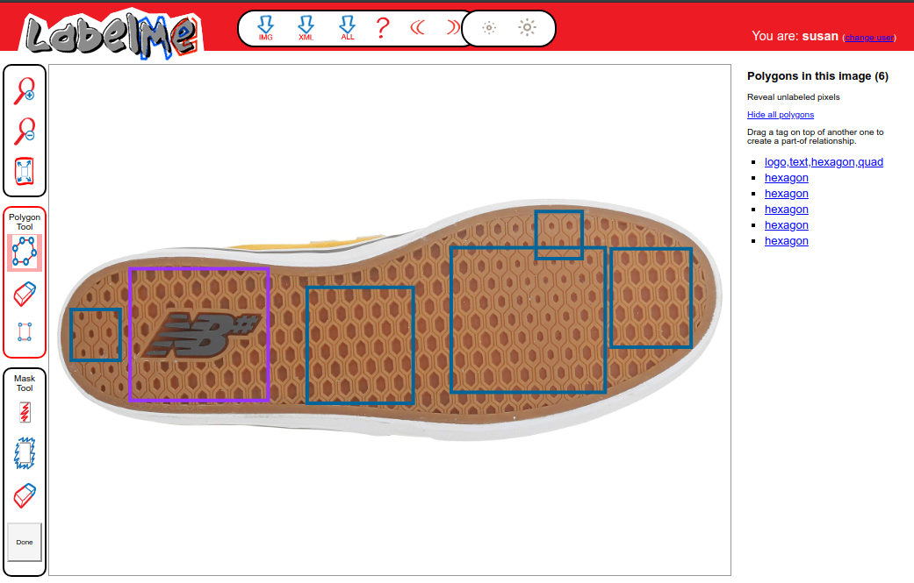
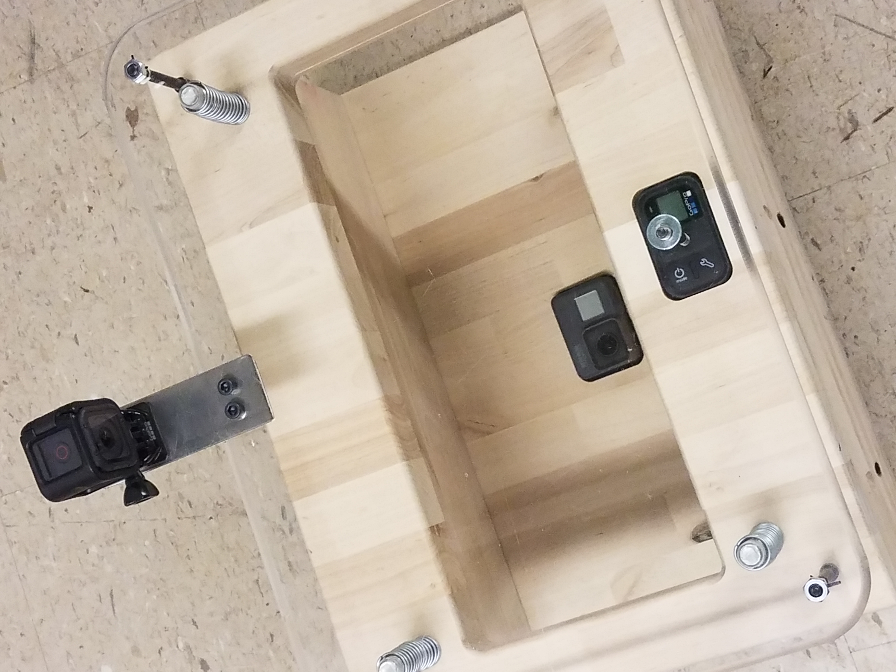
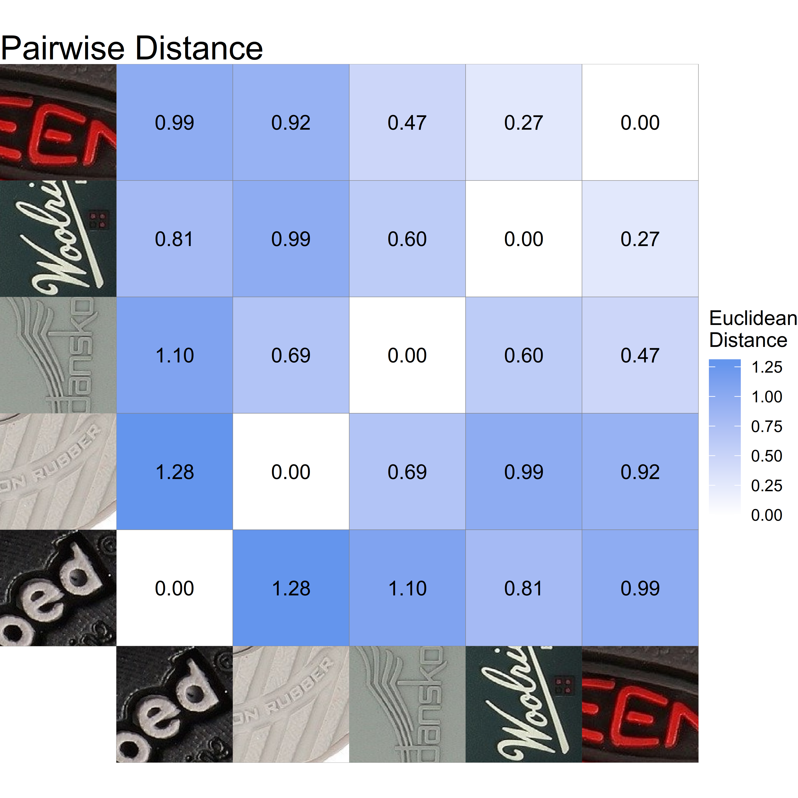

## Automatic Footwear Forensics Analysis

.pull-left[
- __Practical Goal__: Automate collection of footwear images from local population

- __Engineering__ (Dr. Stone): Build passive scanning device

- __Data Science__: Recognize geometric shapes, brands, styles from images

- __Statistics__: Estimate random match probability from collected images and identified features

]
.pull-right[

]
